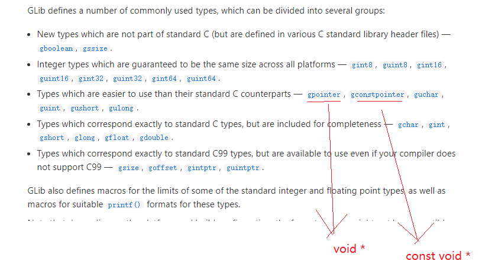
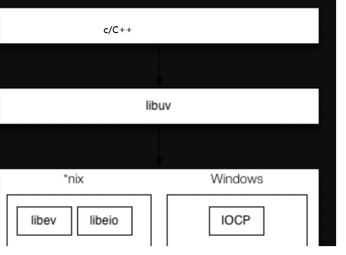
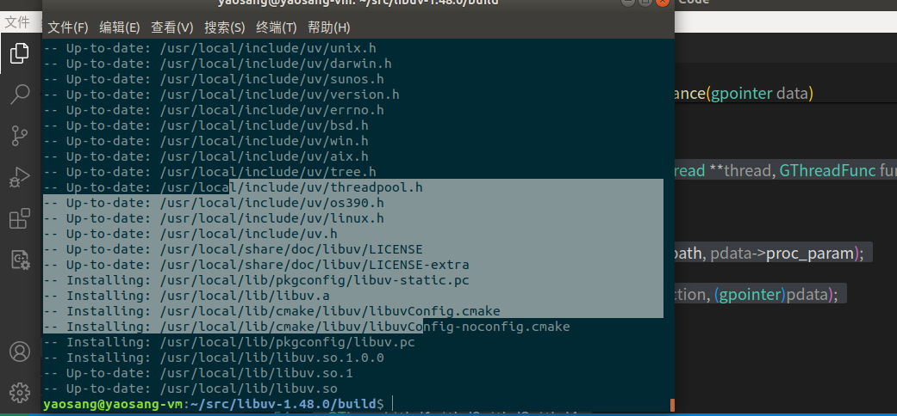

# c一些跨平台库-glib，libuv

## 一 课程介绍

- 讲过的一些库的复习
- glib使用
- libuv使用

## 二 讲过的库的总结&跨平台处理

   基本库：  glib

​        string.h:字符串的相关操作-难用

​        stdio.h: fio--->posix io(fopen/open)

​        stdlib: 

 进程与线程（posix）--不能夸平台，  glib

​     进程： 操作，通讯

​    线程： 操作，通讯，安全（互斥锁），线程池(需要自己封装,glib）

 网络io操作： posix--不能夸平台  libevent libev **libuv**


   ========================

​    glib: glib是Gtk +库和Gnome的基础。glib可以在多个平台下使用，比如Linux、Unix、Windows等。glib为许多标准的、常用的C语言结构提供了相应的替代物。

libuv:

```
libevent,libev,libuv
libevent,libev,libuv都是c实现的异步事件库，注册异步事件，检测异步事件，根据事件的触发先后顺序，调用相对应回调函数处理事件。处理的事件包括：网络 io 事件、定时事件以及信号事件。这三个事件驱动着服务器的运行。

1. 网络io事件：
    linux：epoll、poll、select
    mac：kqueue
    window：iocp
2. 定时事件：
    红黑树
    最小堆：二叉树、四叉树
    跳表
    时间轮
3. 信号事件
libevent 和 libev 主要封装了异步事件库与操作系统的交互简单的事件管理接口，让用户无需关注平台检测处理事件的机制的差异，只需关注事件的具体处理。

从设计理念出发，libev 是为了改进 libevent 中的一些架构决策；例如：全局变量的使用使得在多线程环境中很难安全地使用 libevent；event 的数据结构设计太大，它包含了 io、时间以及信号处理全封装在一个结构体中，额外的组件如 http、dns、openssl 等实现质量差（容易产生安全问题），计时器不精确，不能很好地处理时间事件；

libev 通过完全去除全局变量的使用，而是通过回调传参来传递上下文(后面libevent也这样做了)；并且根据不同事件类型构建不同的数据结构，以此来减低事件耦合性；计时器使用最小四叉堆。libev 小而高效；只关注事件处理。

libevent 和 libev 对 window 支持比较差，由此产生了 libuv 库；libuv 基于 libev，在window 平台上更好的封装了 iocp；node.js 基于 libuv；

```


 

以后服务端一般是Linux下面跑。一般不会在windows。客户端都是带界面（mfc，QT（跨平台，线程库））

##   三  glib使用

glib是Gtk +库和Gnome的基础。glib可以在多个平台下使用，比如Linux、Unix、Windows等。glib为许多标准的、常用的C语言结构提供了相应的替代物。

如果在程序中要使用到glib库中的函数，则应该包含glib.h头文件（在gtk.h和gnome.h头文件中已经包含了glib.h了）

### 1 为什么需要

blib库是Linux平台下最常用的C语言函数库，它具有很好的**可移植性**和**实用性**。

### 2 主要功能

​	类型定义

   常用函数

   内存管理

  字符串处理

  数据结构

  进程与与线程

https://gitee.com/zhaozonggang100/glib?_from=gitee_search#documentation


https://docs.gtk.org/glib/

### 3 使用

#### 3.1 入门

-    安装

  sudo apt install libglib2.0-dev

-    以动态链接库的方式连入进来

  ​	task.json

  ```json
   "-I/usr/include/glib-2.0",  
   "-I/usr/lib/x86_64-linux-gnu/glib-2.0/include",  
   "-lglib-2.0", 
  ```

c_cpp_properties.json    ctrl+shift+-p c/c++配置

~~~json
  "includePath": [
                "${workspaceFolder}/**",
                "/usr/include/glib-2.0",
                "/usr/lib/x86_64-linux-gnu/glib-2.0/include"
            ],
     ```
~~~
-   导入头文件

  #include <glib.h>

-   使用

  ```c
  #include<stdio.h>
  #include <glib.h>
  int main(int argc, char const *argv[])
  {
      gint i = 18;
      g_print("%d\n",i);
      return 0;
  }
  
  ```


#### 3.2 常用语法

1. ​	类型定义

   

2. 常用函数

   ```c
   g_get_prgname：获取程序的名字
   g_set_prgname：设置程序的名字
   g_get_user_name：返回当前用户的名字
   g_get_real_name：获取用户的真实名称
   g_get_home_dir：获取用户的根目录
   g_get_current_dir：获取当前工作目录
   g_basename：获得文件名（不带前导目录部分）
   g_dirname：返回文件名的前导目录部分
   g_atexit：指定一个在正常程序中止时要执行的函数
   ```

3.  内存管理

   ```c
     // mem malloc
    int * p =  (int *)g_malloc(4);
    *p = 1;
     g_print("%d\n",*p);
   ```

   

4.   字符串处理

   ​	

   ```c
        gchar *  c = "file_1.txt";
        g_print("%d\n",g_str_has_prefix( c,"file_"));
        g_print("%d\n",g_str_has_suffix( c,".txt"));
   
       g_print("%d\n",g_str_match_string ("yaosang",c,FALSE));  //contain 
   
        g_print("%d\n",g_str_equal("yaosang","jfjjfjf")); // compare tow char list is xiangtong
   
        gchar name[20];
        g_strlcpy(name,"zs",3);
   
        g_print("%s\n",name);
   
      gchar *  file_name = "1.txt.txt";
   
   
      gchar** result = g_strsplit(file_name,".",-1);   // split 
   
      g_print("%s\n",*(result+1));
   
   
    
      g_print("%s\n",  g_strjoin("-","yao","huai","peng",NULL));// join-->yao,huai,peng
   ```

   

   

   字符串类型：

   https://blog.csdn.net/field1003/article/details/123435559

   ```c
     GString*  str1=  g_string_new("yaosang");
     g_print("%s\n",str1->str);
   
   
       GString*  str2 =  g_string_sized_new(40);
       g_string_printf(str2,"yaosang is %s","haoren!");
   
       g_print("%s\n",str2->str);
   
   
       GString*  str3 =  g_string_prepend (str1," is nbdh!");
   
       g_print("%s\n",str3->str);
   ```


#### 3.3 数据结构


```
#### 1.1、**GList** 和 **GSList**

双向链表和单向链表，用于存储元素的集合。这些链表允许在任意位置插入和删除元素。

#### 1.2、**GQueue**

基于双向链表的队列实现，支持入队（enqueue）和出队（dequeue）操作。

#### 1.3、**GArray** 和 **GPtrArray**

动态数组，用于存储固定大小元素或指针的集合。它们可以自动调整大小以适应更多的元素。

#### 1.4、**GByteArray**

用于存储字节数据的动态数组。

#### 1.5、**GHashTable**

 哈希表，允许根据键快速查找和存储值。它支持多种键和值的数据类型。

#### 1.6、**GTree**

 二叉树数据结构，用于存储排序的元素。

#### 1.7、**GString**

 可变字符串，用于动态构建和修改字符串。

#### 1.8、**GStringChunk**

 字符串块，用于高效地管理和分配字符串。
```


​    顺序表

```c
#include <stdio.h>
#include <glib.h>


int main(int argc, char const *argv[])
{
    GArray* array = g_array_new(0,0,sizeof (int)); //one element size


    
    for (int i = 0; i < 10; i++)
    {
        g_array_append_val (array, i);
    
    }
        

        for (int i = 0; i < array->len; i++)
    {
        g_print ("%d\n",g_array_index (array, int, i));
    }

     g_array_free (array, TRUE);
    return 0;
}

```


   链表：

```c
#include <stdio.h>
#include <glib.h>

int main(int argc, char const *argv[])
{
   GSList *list = NULL;
    list = g_list_append(list,"first ");
    list = g_list_append(list,"two ");
    list = g_list_prepend(list,"zero ");
    list = g_list_insert(list,"first-pre ",1);

    g_list_foreach(list, (GFunc)g_print, NULL);

    g_print("\n");
    list = g_list_reverse(list);
    g_list_foreach(list, (GFunc)g_print, NULL);
    
    g_list_free(list);
    return 0;
}

```

#### 3.4 单元测试

https://blog.csdn.net/field1003/article/details/123435207

​     测试： 和功能设计的预期是否一致。  如果一致就是测试通过，否则测试失败！

​    

​    单元测试： 小小的功能进行测试。  狭义的认为针对某一个小功能（一个函数或者多个函数），写测试用例，进行测试。**---开发做**

​    模块测试： 多个功能组成模块。

​    **集成测试： 一起集成测试。**--开发或者测试人员做


​    验收测试：  开发，测试完了以后，产品经理或者客户来做验收测试。


##### 3.4.1 glib测试框架概念

GLib 测试框架主要包含三个概念：

- 测试案例（Test Case）：由测试函数与夹具（Fixture）构成。
- 夹具（估计是从机械领域引入的概念，被测的函数被视为零件）：为测试函数准备数据，并负责测试环境的构建与销毁。
- 测试集（Test Suit）：由测试案例构成的集合。


##### 3.4.2 一些案例

案例1：

```c
#include <stdio.h>
#include <glib.h>

//测试2+3是否等于5
static void test_a (void)
{
    gint x = 2, y = 3, z = 6;

    g_print("%s \n", x+y==z ? "Equal" : "Not equal");
    
}

int main(int argc, char const *argv[])
{
    //1 初始化测试
    g_test_init(&argc,&argv,NULL);

    //2 添加测试用例
    g_test_add_func("/test/a",test_a);

    //3 运行测试
    return g_test_run();
}

```

上述程序使用GLib测试框架的三个函数实现了一个测试用例，g_test_init、g_test_add_func和g_test_run。test_case是测试用例，该测试用例的功能为，如果x+y的值和z的值相等，则输入Equal，否则输出Not equal。程序运行结果是Equal，这个是测试用例的输出。在测试用例输出之外，还有/test/aaa:OK这样的输出，这就是测试框架本身的输出。
可以看出，测试框架知道测试运行结果是否正确。那测试例是怎样得知运行结果是正确的呢，毕竟test_case是一个无返回值的函数，难道x+y==z这个表达式为真测试例就正确？将x的初始值改为3，此时输出Not Equal，但测试例仍是OK，没有达到想要的效果。
要想让测试例返回失败，就需要用到接下来要介绍的测试框架的断言函数：g_assert_xxx()系列函数。

  案例2：加入断言

```c
#include <stdio.h>
#include <glib.h>

int add(int i,int j){
    return i+j;
}
//测试2+3是否等于5
static void test_a (void)
{
    //gint x = 2, y = 3, z = 5;

   //断言是否ok
    //g_assert(x+y==z);

    g_assert(add(2,3)==5);
    
}


static void test_assert(void)
{
    g_assert( TRUE );
}

static void test_assert_not_reached(void)
{
    //断言不可达到
    //g_assert_not_reached();
    g_assert_true(TRUE);
}

static void test_assert_cmpstr(void)
{
    gchar *s1 = "abcd";
    g_assert_cmpstr(s1, ==, "abcd");
}

static void test_assert_cmpint(void)
{
    gint n1 = 100;
    g_assert_cmpint(n1, == , 100);
}

static void test_assert_cmpuint(void)
{
    guint n1 = 200;
    g_assert_cmpuint(n1, ==, 200);
}

static void test_assert_cmphex(void)
{
    guint n1 = 0xdeadbeef;
    g_assert_cmphex(n1, ==, 0xdeedbeef);
}

static void test_assert_cmpfloat(void)
{
    gfloat n1 = 0.00001;
    g_assert_cmpfloat(n1, ==, 0.00001);
}

static void test_assert_no_error(void)
{
    GDir *dir = NULL;
    GError *err = NULL;

    dir = g_dir_open("/tmp", 0, &err);
    g_assert (dir != NULL);
    g_assert_no_error(err);
    if(NULL != err) {
        g_error_free(err);
    }
}

static void test_assert_error(void)
{
    GDir *dir;
    GError *error;

    error = NULL;
    dir = g_dir_open ("/pfrkstrf", 0, &error);
    g_assert (dir == NULL);
    g_assert_error (error, G_FILE_ERROR, G_FILE_ERROR_NOENT);
    if(NULL != error) {
        g_error_free (error);
    }
}


static void test_assert_true(void)
{
    g_assert_true(TRUE);
}

static void test_assert_false(void)
{
    g_assert_false(FALSE);
}

static void test_assert_null(void)
{
    gpointer *p = NULL;

    g_assert_null(p);
}

static void test_assert_nonnull(void)
{
    gpointer *p = NULL;

    g_assert_nonnull(p);
}

int main(int argc, char const *argv[])
{
    //1 初始化测试
    g_test_init(&argc,&argv,NULL);

    //2 添加测试用例
    g_test_add_func("/test/a",test_a);
    g_test_add_func("/test/test_assert", test_assert);
    g_test_add_func("/test/test_assert_not_reached", test_assert_not_reached);
    g_test_add_func("/test/test_assert_cmpstr", test_assert_cmpstr);
    g_test_add_func("/test/test_assert_cmpint", test_assert_cmpint);
    g_test_add_func("/test/test_assert_cmpuint", test_assert_cmpuint);
    g_test_add_func("/test/test_assert_cmphex", test_assert_cmphex);
    g_test_add_func("/test/test_assert_cmpfloat", test_assert_cmpfloat);
    g_test_add_func("/test/test_assert_no_error", test_assert_no_error);
    g_test_add_func("/test/test_assert_error", test_assert_error);
    g_test_add_func("/test/test_assert_true", test_assert_true);
    g_test_add_func("/test/test_assert_false", test_assert_false);
    g_test_add_func("/test/test_assert_null", test_assert_null);
    g_test_add_func("/test/test_assert_nonnull", test_assert_nonnull);
    //3 运行测试
    return g_test_run();
}

```

 案例3：带参数的测试用例

```c
#include <glib.h>

#define TEST_CASE_USER_DATA "my test data"

void test_case_func(void)
{
    return;
}

void test_case_func_with_data(gconstpointer user_data)
{
    g_assert_cmpstr((gchar *)user_data, ==, TEST_CASE_USER_DATA);
}

void _func_with_data_full_free_func(gpointer data)
{
    GList *l = (GList *)data;

    if (NULL != l)
    {

        if (NULL != l->data)
        {
            g_free(l->data);
        }

        g_free(l);
    }
}

void test_case_func_with_data_full(gconstpointer user_data)
{
    GList *l = (GList *)user_data;

    g_assert(l);

    g_assert_cmpstr((gchar *)l->data, ==, TEST_CASE_USER_DATA);
}

int main(int argc, char **argv)
{
    GList *l = NULL;

    l = g_new0(GList, 1);
    l->data = (gpointer)g_strdup(TEST_CASE_USER_DATA);

    g_test_init(&argc, &argv, NULL);

    g_test_add_func("/test/testcase", test_case_func);

    g_test_add_data_func("/test/func_with_data", (gconstpointer)TEST_CASE_USER_DATA, test_case_func_with_data);

    g_test_add_data_func_full("/test/func_with_data_full", (gpointer)l, test_case_func_with_data_full, _func_with_data_full_free_func);

    return g_test_run();
}

```

GLib测试框架提供了夹具的功能。下述夹具示例演示的是将一个素数转换成无符号长整形。从例子中我们可以看出，夹具由左夹具和右夹具两个函数组成，左边的我们一般叫做fixture_setup函数，右边的叫做fixture_teardown函数。左夹具负责对测试例的初始化准备工作，右夹具负责测试例运行后的清理工作。


```c
#include <glib.h>

//将一个素数转换成无符号长整形
typedef struct
{
    guint seed; 
    guint prime; //素数
    gchar *msg;
} Fixturetest;
static void
fixturetest_setup(Fixturetest *fix,
                  gconstpointer test_data)
{
    g_assert(test_data == (void *)0xc0cac01a);
    fix->seed = 18;
    fix->prime = 17;
    fix->msg = g_strdup_printf("%d", fix->prime);
}
static void
fixturetest_test(Fixturetest *fix,
                 gconstpointer test_data)
{
    guint prime = g_spaced_primes_closest(fix->seed);
    g_assert_cmpint(prime, ==, fix->prime);
    prime = g_ascii_strtoull(fix->msg, NULL, 0);
    g_assert_cmpint(prime, ==, fix->prime);
    g_assert(test_data == (void *)0xc0cac01a);
}
static void
fixturetest_teardown(Fixturetest *fix,
                     gconstpointer test_data)
{
    g_assert(test_data == (void *)0xc0cac01a);
    g_free(fix->msg);
}

int main(int argc, char **argv)
{
    g_test_init(&argc, &argv, NULL);

    g_test_add("/misc/primetoul", Fixturetest, (void *)0xc0cac01a, fixturetest_setup, fixturetest_test, fixturetest_teardown);

    return g_test_run();
}

```


#### 3.5 日志处理

##### 3.5.1 为什么需要日志-调试定位问题

​      以前我们写程序，经常print("程序到这儿?i=jjjjj"),输出到控制台。   有时候，我们的程序是在后台默默执行了。没有控制台。----可以把输出的东西写到日志文件中。查看日志文件就OK

​    在开发的时候，有可能需要看很多调试日志。。。但是我们上线后不需要输出这个多。  有报错才输出日志。---控制日志级别

​      开发：log_level(debug)  全部输出

​     上线：  log_level(warn)

​      log_deg()  log_info（） **log_warn()  log_error();**   debug<info<warn<error


   可以自己实现日志框架，当然也可以用别人实现好的。  glib日志框架讲


​       怎么定位线问题？？？ 查看日志。。。cat tail...   下载下来再本地找error。。。

##### 3.5.2 使用

```c
#include <stdio.h>
#include <glib.h>
//日志文件路径
# define LOG_FILE_PATH  "app.log"
// 哪个程序输出
#define MY_LOG_DOMAIN "my-app"  

// 自定义日志处理器函数  
static void my_log_handler(const gchar *log_domain, GLogLevelFlags log_level, const gchar *message, gpointer user_data) {  
    // 输出到控制台
    //g_print("%s: %s\n", log_domain, message);  
    // 打开日志文件，追加方式写入
    FILE *log_file = fopen(LOG_FILE_PATH, "a");
    if (log_file == NULL) {
        perror("fopen");
        return;
    }

    if (log_level==G_LOG_LEVEL_INFO)
    {
        // 将日志信息写入到文件
        fprintf(log_file, "%s: %s\n", log_domain, message);
    }

    // 关闭日志文件
    fclose(log_file);
} 

int main(int argc, char *argv[]) {  
    // 初始化 GLib  
    //g_type_init();  
  
    // 添加自定义的日志处理器  
    g_log_set_handler(MY_LOG_DOMAIN, G_LOG_LEVEL_INFO, my_log_handler, NULL);  
  
    // 设置日志的默认输出函数（可选）  
     g_log_set_default_handler(my_log_handler, NULL);   //如果不设置输出拿到控制台
  
    // 记录不同级别的日志消息  
    g_log(MY_LOG_DOMAIN, G_LOG_LEVEL_DEBUG, "This is an debug message");  //调试
    g_log(MY_LOG_DOMAIN, G_LOG_LEVEL_INFO, "This is an info message");  //提示
    g_log(MY_LOG_DOMAIN, G_LOG_LEVEL_WARNING, "This is a warning message");  //警告
    //g_log(MY_LOG_DOMAIN, G_LOG_LEVEL_ERROR, "This is an error message");   //错误
  
    // 也可以使用宏来简化日志记录  
    g_debug("This is an info message");
    g_message("This is a message with g_message");  
    g_warning("This is a warning with g_warning");  
    //g_error("This is an error with g_error()"); // 这通常会终止程序，因为它调用 g_assert_not_reached()  
  
    // 注意：g_error() 在非调试模式下可能会导致程序终止，因为它内部调用了 g_assert_not_reached()。  
    // 在生产代码中，你可能想要避免使用 g_error()，或者确保它不会导致程序意外终止。  
  
    return 0;  
}
```


#### 3.6 进程与线程


https://blog.csdn.net/field1003/article/details/123435539

进程简单操作

```c
#include <stdio.h>
#include <glib.h>
#include <glib.h>

static void test_glib_spawning_proc_sync(void)
{
    GPtrArray *argv = NULL;
    gchar *stdout_str;
    gchar *stderr_str;
    gint estatus;
    GError *error = NULL;

    argv = g_ptr_array_new();
    g_ptr_array_add(argv, (gpointer) "/bin/ls");
    g_ptr_array_add(argv, (gpointer) "-a");
    g_ptr_array_add(argv, (gpointer) "-l");
    g_ptr_array_add(argv, (gpointer) ".");
    g_ptr_array_add(argv, (gpointer) "file_not_exist");
    g_ptr_array_add(argv, NULL);

    g_spawn_sync(NULL, (char **)argv->pdata, NULL, G_SPAWN_DEFAULT, NULL, NULL, &stdout_str, &stderr_str, &estatus, &error);
g_assert_no_error(error);

    g_print("%s \n", stdout_str);
    g_print("%s \n", stderr_str);

    g_free(stdout_str);
    g_free(stderr_str);
    g_ptr_array_free(argv, TRUE);

    return;
}

gint main(gint argc, gchar **argv)
{
    test_glib_spawning_proc_sync();
    return 0;
}
```


线程简单操作

```c
#include <glib.h>

struct proc_data
{
    const gchar *proc_path;
    const gchar *proc_param;
};

static gpointer td_spawn_sync_multi_thread_instance(gpointer data)
{
    GError *error = NULL;
    GPtrArray *argv;
    char *stdout_str;
    char *stderr_str;
    int estatus;

    struct proc_data *pdata = (struct proc_data *)(data);
    g_return_val_if_fail((NULL != data), NULL);

    argv = g_ptr_array_new();
    g_ptr_array_add(argv, (gpointer)pdata->proc_path);
    g_ptr_array_add(argv, (gpointer)pdata->proc_param);
    g_ptr_array_add(argv, NULL);

    g_printf("before spawn sync [%s %s]======================= \n", pdata->proc_path, pdata->proc_param);
    g_spawn_sync(NULL, (char **)argv->pdata, NULL, G_SPAWN_DEFAULT, NULL, NULL, &stdout_str, &stderr_str, &estatus, &error);
    g_assert_no_error(error);
    g_printf("stdout_str=\n%s \n", stdout_str);
    g_printf("stderr_str=\n%s \n", stderr_str);
    g_printf("after spawn sync [%s %s]======================= \n", pdata->proc_path, pdata->proc_param);

    g_free(stdout_str);
    g_free(stderr_str);
    g_ptr_array_free(argv, TRUE);

    gchar c = (char)(pdata->proc_param[strlen(pdata->proc_param) - 1]);
    g_printf("c=%c \n", c);

    return GINT_TO_POINTER(c);
}

static void td_multithreaded_test_single_run(GThread **thread, GThreadFunc function, struct proc_data *pdata)
{
    g_return_if_fail(NULL != pdata);
    g_return_if_fail(NULL != thread);
    g_printf("path=%s param=%s\n", pdata->proc_path, pdata->proc_param);

    *thread = g_thread_new(pdata->proc_path, function, (gpointer)pdata);
    g_return_if_fail(NULL != thread);
}

static void td_spawn_sync_multi_thread(void)
{
    GThread *thd1, *thd2, *thd3, *thd4;
    gpointer ret1, ret2, ret3, ret4;

    struct proc_data pdata1 = {"/bin/ls", "-a"};
    td_multithreaded_test_single_run(&thd1, td_spawn_sync_multi_thread_instance, &pdata1);

    struct proc_data pdata2 = {"/usr/bin/sleep", "2"};
    td_multithreaded_test_single_run(&thd2, td_spawn_sync_multi_thread_instance, &pdata2);

    struct proc_data pdata3 = {"/usr/bin/top", "-n 3"};
    td_multithreaded_test_single_run(&thd3, td_spawn_sync_multi_thread_instance, &pdata3);

    struct proc_data pdata4 = {"/bin/echo", "hello world"};
    td_multithreaded_test_single_run(&thd4, td_spawn_sync_multi_thread_instance, &pdata4);

    ret1 = g_thread_join(thd1);
    ret2 = g_thread_join(thd2);
    ret3 = g_thread_join(thd3);
    ret4 = g_thread_join(thd4);

    g_printf("ret1=%c ret2=%c ret3=%c ret4=%c \n", ret1, ret2, ret3, ret4);

    return;
}

gint main(gint argc, gchar *argv[])
{
    gint ret;

    g_test_init(&argc, &argv, NULL);

    g_test_add_func("/gthread/spawn-sync", td_spawn_sync_multi_thread);

    ret = g_test_run();

    return ret;
}

```


## 四 libuv

https://docs.libuv.org/en/v1.x/

### 1 概述

​	Libuv是一个高性能的，事件驱动的异步I/O库，它本身是由C语言编写的，具有很高的可移植性。libuv封装了不同平台底层对于异步IO模型的实现，所以它还本身具备着Windows, Linux都可使用的跨平台能力。

Libuv专为Node.js而设计，但是后来因为它这种事件驱动的异步IO的高效模型逐步被很多语言和项目都采纳而作为自身的底层库而使用，像 Luvit, Julia, pyuv, 还有很多基于它的项目[1]

### 2 历史

​	Nodejs刚出来的时候，底层并不是使用libuv，而是libev，libev本身也是一个异步IO的库，但是它只能在POSIX[2]系统下使用。随着nodejs被越来越多人使用，由于windows的用户量巨大，所以开始考虑Nodejs的跨平台能力。

​	这时候Nodejs提供了libuv来作为抽象封装层，在Unix系统上，通过封装libev和libio调用linux的epoll 或 kqueue，在Windows 平台上的IOCP[3]进行封装，自此之后Nodejs具备了跨平台能力，由Libuv作为中间层本身提供的跨平台的抽象，来根据系统决定使用libev/libio或IOCP，后来在node-v0.9.0版本中，libuv移除了libev的内容。



•全功能的事件循环基于epoll、kqueue、IOCP、event ports•异步的TCP和UDP套接字•异步的DNS解析•异步的文件和文件系统操作•文件系统事件•ANSI转义代码控制的TTY•PC包括套接字共享，使用Unix域套接字或有名管道（Windows）•子进程•线程池•信号处理•高分辨率时钟•线程和同步原语


### 3 入门

1. 安装

   下载： https://github.com/libuv/libuv/archive/refs/tags/v1.48.0.tar.gz  手动下载拷贝进去

   解压： tar -zxvf ./v1.48.0.tar.gz

   安装：

    mkdir build

   cd build

   cmake ..

   sudo make install

   

2. vscode

   task.json

   ```c
   {
       "tasks": [
           {
               "type": "cppbuild",
               "label": "C/C++: gcc 生成活动文件",
               "command": "/usr/bin/gcc",
               "args": [
                   "-fdiagnostics-color=always",
                   "-g",
                   "${file}",
                   "-o",
                   "${fileDirname}/${fileBasenameNoExtension}",
                   "-I/usr/include/glib-2.0",  
                   "-I/usr/lib/x86_64-linux-gnu/glib-2.0/include",  
                   "-lglib-2.0",
                   "-luv"
               ],
               "options": {
                   "cwd": "${fileDirname}"
               },
               "problemMatcher": [
                   "$gcc"
               ],
               "group": {
                   "kind": "build",
                   "isDefault": true
               },
               "detail": "调试器生成的任务。"
           }
       ],
       "version": "2.0.0"
   }
   ```

   

3. 代码书写

   案例1：

   ```c
   // main.c
   #include <stdlib.h>
   #include <stdio.h>
   #include <stdlib.h>
   #include <uv.h>
   
   int main() {
    uv_loop_t *loop = malloc(sizeof(uv_loop_t));
    uv_loop_init(loop);
   
    printf("Now quitting.\n");
    uv_run(loop, UV_RUN_DEFAULT);
   
    uv_loop_close(loop);
    free(loop);
    return 0;
   }
   ```

   

​     案例2：


server

```c
#include <stdio.h>
#include <stdlib.h>
#include <string.h>
#include <uv.h>
#define DEFAULT_PORT 7000
typedef struct
{
    uv_write_t req;
    uv_buf_t buf;
} write_req_t;
static void on_alloc(uv_handle_t *handle, size_t suggested_size, uv_buf_t *buf);
static void on_connection(uv_stream_t *server, int status);
static void on_close(uv_handle_t *handle);
static void on_read(uv_stream_t *client, ssize_t nread, const uv_buf_t *buf);
int main()
{
    uv_loop_t *loop = uv_default_loop();
    uv_tcp_t server;
    uv_tcp_init(loop, &server);
    struct sockaddr_in addr;
    uv_ip4_addr("0.0.0.0", DEFAULT_PORT, &addr);
    uv_tcp_bind(&server, (const struct sockaddr *)&addr, 0);
    int r = uv_listen((uv_stream_t *)&server, SOMAXCONN, on_connection);
    if (r)
    {
        fprintf(stderr, "Listen error %s\n", uv_strerror(r));
        return 1;
    }
    uv_run(loop, UV_RUN_DEFAULT);
    return 0;
}
static void on_alloc(uv_handle_t *handle, size_t suggested_size, uv_buf_t *buf)
{
    buf->base = (char *)malloc(suggested_size);
    buf->len = suggested_size;
}
static void on_connection(uv_stream_t *server, int status)
{
    if (status < 0)
    {
        fprintf(stderr, "New connection error %s\n", uv_strerror(status));
        return;
    }
    uv_tcp_t *client = (uv_tcp_t *)malloc(sizeof(uv_tcp_t));
    uv_tcp_init(server->loop, client);
    if (uv_accept(server, (uv_stream_t *)client) == 0)
    {
        uv_read_start((uv_stream_t *)client, on_alloc, on_read);
    }
    else
    {
        uv_close((uv_handle_t *)client, on_close);
    }
}
static void on_close(uv_handle_t *handle)
{
    free(handle);
}
static void on_read(uv_stream_t *client, ssize_t nread, const uv_buf_t *buf)
{
    if (nread < 0)
    {
        if (nread != UV_EOF)
        {
            fprintf(stderr, "Read error %s\n", uv_err_name(nread));
        }
        uv_close((uv_handle_t *)client, on_close);
    }
    else if (nread > 0)
    {
        if (strncmp(buf->base, "SEND", strlen("SEND")) == 0)
        {
            printf("Receiving file...\n");
            /* Get file name */
            char file_name[256];
            sprintf(file_name, "%d.txt", rand() % 100);
            printf("File name: %s\n", file_name);
            FILE *fp = fopen(file_name, "wb");
            if (!fp)
            {
                perror("fopen");
                return;
            }
            /* Write received data to file */
            fwrite(buf->base, sizeof(char), nread, fp);
            fclose(fp);
        }
        else
        {
            fprintf(stderr, "Unknown command\n");
        }
    }
    free(buf->base);
}
```

client

```c
#include <stdio.h>
#include <stdlib.h>
#include <string.h>
#include <uv.h>
#define DEFAULT_PORT 7000
typedef struct
{
    uv_write_t req;
    uv_buf_t buf;
} write_req_t;
static void on_write(uv_write_t *req, int status);
static void alloc_buffer(uv_handle_t *handle, size_t suggested_size, uv_buf_t *buf);
static void on_connect(uv_connect_t *req, int status);
static void on_read(uv_stream_t *client, ssize_t nread, const uv_buf_t *buf);
static void on_send(uv_udp_send_t *req, int status);
int main(int argc, char **argv)
{
    // if (argc != 2)
    // {
    //     printf("Usage: %s <file_path>\n", argv[0]);
    //     return 1;
    // }
    const char *file_path = "1.txt";
    FILE *fp = fopen(file_path, "rb");
    if (!fp)
    {
        perror("fopen");
        return 1;
    }
    fseek(fp, 0L, SEEK_END);
    size_t file_size = ftell(fp);
    rewind(fp);
    char *buffer = (char *)malloc(file_size);
    if (!buffer)
    {
        perror("malloc");
        return 1;
    }
    size_t bytes_read = fread(buffer, 1, file_size, fp);
    if (bytes_read != file_size)
    {
        perror("fread");
        return 1;
    }
    fclose(fp);
    uv_loop_t *loop = uv_default_loop();
    uv_tcp_t socket;
    uv_tcp_init(loop, &socket);
    struct sockaddr_in dest;
    uv_ip4_addr("0.0.0.0", DEFAULT_PORT, &dest);
    uv_connect_t connect_req;
    uv_tcp_connect(&connect_req, &socket, (const struct sockaddr *)&dest, on_connect);
    write_req_t req;
    req.buf = uv_buf_init(buffer, bytes_read);
    uv_run(loop, UV_RUN_DEFAULT);
    free(buffer);
    return 0;
}
static void on_write(uv_write_t *req, int status)
{
    if (status)
    {
        fprintf(stderr, "Write error %s\n", uv_strerror(status));
    }
    write_req_t *wr = (write_req_t *)req;
    free(wr->buf.base);
    free(wr);
}
static void alloc_buffer(uv_handle_t *handle, size_t suggested_size, uv_buf_t *buf)
{
    buf->base = (char *)malloc(suggested_size);
    buf->len = suggested_size;
}
static void on_connect(uv_connect_t *req, int status)
{
    if (status)
    {
        fprintf(stderr, "Connect error %s\n", uv_strerror(status));
        return;
    }
    uv_stream_t *stream = req->handle;
    write_req_t *write_req = (write_req_t *)malloc(sizeof(write_req_t));
    uv_buf_t buffer = uv_buf_init("SEND", strlen("SEND"));
    uv_write(&write_req->req, stream, &buffer, 1, on_write);
    uv_write(&write_req->req, stream, &write_req->buf, 1, on_write);
    uv_read_start(stream, alloc_buffer, on_read);
}
static void on_read(uv_stream_t *client, ssize_t nread, const uv_buf_t *buf)
{
    if (nread < 0)
    {
        if (nread != UV_EOF)
        {
            fprintf(stderr, "Read error %s\n", uv_err_name(nread));
        }
        uv_close((uv_handle_t *)client, NULL);
    }
    else if (nread > 0)
    {
        printf("Received %ld bytes: %.*s\n", nread, (int)nread, buf->base);
    }
    free(buf->base);
}
static void on_send(uv_udp_send_t *req, int status)
{
    if (status)
    {
        fprintf(stderr, "Send error %s\n", uv_strerror(status));
    }
    uv_udp_send_t *send_req = (uv_udp_send_t *)req;
    free(send_req->data);
    free(send_req);
}
```

