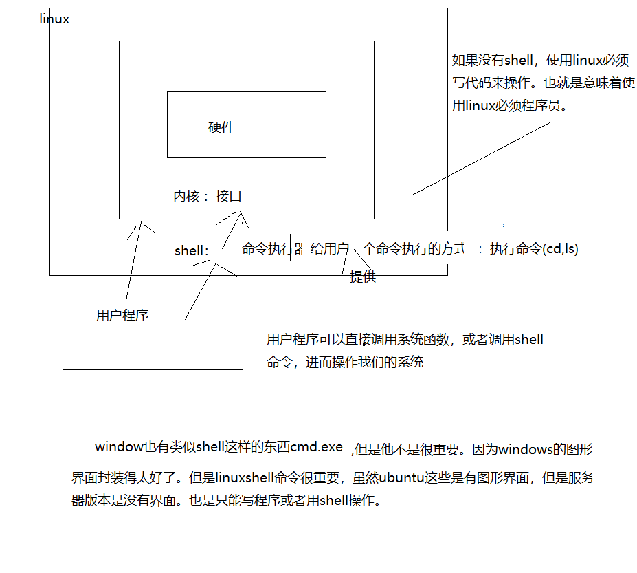
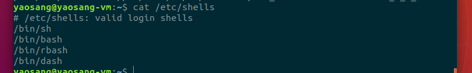
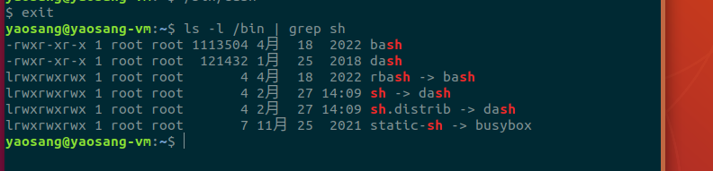

# Linux Shell编程

## 一、课程介绍

- Linux Shell介绍
- 变量
- 功能语句
- 控制语句：顺序，条件，循环
- 数组
- 函数
- 综合案例

## 二、Linux Shell介绍

### 1、是什么 重要

​	Shell是一个`命令行解释器`**程序**规范，他接受应用程序/用户命令，然后调用操作系统内核完成相关的功能。它是用户使用 Linux 的桥梁。简单来说Shell 是指一种应用程序，这个应用程序提供了一个界面，用户通过这个界面访问操作系统内核的服务。也可以这样认为，linux中的shell就是linux内核的一个外层保护工具，并负责完成用户与内核之间的交互

​	Shell还是一个功能相当强大的编程语言，易编写、易调试、灵活性强。	shell脚本就是一种专门使用shell编写的脚本程序，以.sh结尾的文件（xxx.c）。它虽然没有C++、Java、Python等一系列高级语言功能强大，但是在服务器运维领域以及嵌入式开发领域，shell脚本具有举足轻重的地位。

​	shell脚本编程如同其他编程语言的一样，只要有一个能编写代码的文本编辑器和一个能解释执行的脚本解释器()(shell成熟性)就可以运行了。



​     shell是一个linux程序，我们使用这个程序，可以输入一些命令，完成一些系统操作。当然shell也是一种语言，编写的shell脚本（.sh）,可以放到shell程序中运行。


### 2  Linux常见的shell程序

1. 常见的shell

     linux有很多shell的实现，常见的有**/bin/bash /bin/sh /bin/dash** bin/rbash

   

2.  ubuntu默认的shell是那个

​		cat /etc/shells


​		

3.sh与shell的关系： sh是链接到dash shell程序上面

​		ls -l /bin/ | grep sh

​       ls -l /bin/ | grep rbash



### 3、shell语言怎么用

#### ⽅法 1：

##### 1、建⽴XX.sh⽂件（shell脚本）

##### 2、赋予我们shelll⽂件执⾏权限 chmod 744 hello.sh

##### 3、执⾏shell⽂件。  ./hello.sh

#### ⽅法 2：

##### 1、建⽴.sh⽂件

##### 2、bash + XX.sh  /sh + xx.sh


```
#!/bin/bash
echo “hello,world”    #Shell 的 echo 指令是用于字符串的输出。命令格式：echo str

指定解释器：#!/bin/bash 指定了使用 Bash 作为脚本的解释器。Bash 是 Unix-like 系统中常见的一种 Shell 解释器。在执行脚本时，操作系统会根据 shebang 语句中的路径找到 Bash 解释器，并使用它来解释执行脚本内容；

特定语法支持：Bash 解释器相比其他 Shell 解释器，例如sh、dash 等，提供了更多的功能和语法扩展。因此，通过使用 #!/bin/bash，可以确保脚本中使用的特定 Bash 语法和功能能够被正确解释和执行；

兼容性：在大多数 Unix-like 系统中，Bash 解释器都是默认安装的，并且脚本中使用的许多常见 Shell 语法和命令都是基于 Bash 的。使用 #!/bin/bash 可以提高脚本的可移植性，并确保在不同系统上都能正确执行；
```


**后面要讲的都是shell语言。**

## 三、变量

### 1、预定义变量与位置变量  重要

```c
$0 : shell 脚本的名字
$# : 位置参数的个数[不包括shell脚本本身]
$？：上⼀条命令的执⾏状态或获取shell函数的返回值
	注：0代表状态为真，⾮0代表状态为假
$$:获得我们shell脚本的进程号

$1-$9 : 第⼀个参数~第九个参数，空格做为分隔符
$*：所有的位置参数
$@：所有的位置参数

#!/bin/bash
# 系统定义好的一些变量，直接使用，不用定义
echo "获取脚本的名称$0"
echo "获取脚本的个数$#"
echo "获取上一个命令的执行结果$?"
echo "获取执行shell脚本的进程号$$:"
echo "获取第一个位置的参数$1"
echo "获取第5个位置的参数$5"
echo "获取第9个位置的参数$9"
echo "获取所有位置的参数$*"
echo "获取所有位置的参数$@"

```


### 2、⽤户⾃定义变量

​	

```c
只包含字母、数字和下划线： 变量名可以包含字母（大小写敏感）、数字和下划线 _，不能包含其他特殊字符。
不能以数字开头： 变量名不能以数字开头，但可以包含数字。
避免使用 Shell 关键字： 不要使用Shell的关键字（例如 if、then、else、fi、for、while 等）作为变量名，以免引起混淆。
使用大写字母表示常量： 习惯上，常量的变量名通常使用大写字母，例如 PI=3.14。
避免使用特殊符号： 尽量避免在变量名中使用特殊符号，因为它们可能与 Shell 的语法产生冲突。
避免使用空格： 变量名中不应该包含空格，因为空格通常用于分隔命令和参数。
```


- 特点：

  - 变量没有类型，不需要定义，直接使⽤，所有的内容被解释为**字符串**

    name="zs"

- 说明：

  - 在shell中引⽤⼀个变量必须要加$,

    $name

  - 在shell中，对变量赋值的时候，"="两边不能有空格

  - 单引号引⽤的数据全部会转换为字符串

- 示例:

  ```shell
  str="hello world"
  my_data=$str
  echo "my_data = $my_data"
  ```


​	

### 	3、字符串操作  重要

字符串是shell编程中最常用最有用的数据类型（除了数字和字符串，也没啥其它类型好用了），字符串可以用单引号，也可以用双引号，也可以不用引号。

```sh
#!/bin/bash
#字符串是shell编程中最常用最有用的数据类型（除了数字和字符串，也没啥其它类型好用了），
#字符串可以用单引号，也可以用双引号，也可以不用引号。
jsn=jsn
str="wbd$jsn"
echo $str

#单引号里的任何字符都会原样输出，单引号字符串中的变量是无效的；
#单引号字符串中不能出现单独一个的单引号（对单引号使用转义符后也不行），但可成对出现，作为字符串拼接使用。
str2='wdb''$jsn'
echo $str2

#双引号里可以有变量
#双引号里可以出现转义字符
your_name="runoob"
# 使用双引号拼接
greeting="hello, "$your_name" !"
greeting_1="hello, ${your_name} !"
echo $greeting  $greeting_1
# 使用单引号拼接
greeting_2='hello, '$your_name' !'
greeting_3='hello, ${your_name} !'
echo $greeting_2  $greeting_3

#获取字符串长度
string1="abcd"
echo ${#string1}   # 输出 4

#提取子字符串 从0开始
string2="runoob is a great site"
echo ${string2:1:4} # 输出 unoo

#查找子字符串
#查找字符 i 或 o 的位置(哪个字母先出现就计算哪个)： 从1
string3="runoob is a great site"
echo `expr index "$string3" io`  # 输出 4
```


## 四、功能语句 

### 1、echo

​	Shell 的 echo 指令与 PHP 的 echo 指令类似，都是用于字符串的输出。命令格式：

```shell
#!/bin/bash
#显示转义字符
str=wbdjsn
echo \"It is a test$str\"
#换行  必须用“”
echo -e "\"It is a \n test $str\""

echo "you are gay!" > 1.txt
```

### 2、printf(类似于c标准io中printf)

printf 命令模仿 C 程序库（library）里的 printf() 程序。

printf 由 POSIX 标准所定义，因此使用 printf 的脚本比使用 echo 移植性好。

printf 使用引用文本或空格分隔的参数，外面可以在 **printf** 中使用格式化字符串，还可以制定字符串的宽度、左右对齐方式等。默认的 printf 不会像 **echo** 自动添加换行符，我们可以手动添加 **\n**。

printf 命令的语法：

```shell
printf  format-string  [arguments...]
```


**%s %c %d %f** 都是格式替代符，**％s** 输出一个字符串，**％d** 整型输出，**％c** 输出一个字符，**％f** 输出实数，以小数形式输出。

**%-10s** 指一个宽度为 10 个字符（**-** 表示左对齐，没有则表示右对齐），任何字符都会被显示在 10 个字符宽的字符内，如果不足则自动以空格填充，超过也会将内容全部显示出来。

**%-4.2f** 指格式化为小数，其中 **.2** 指保留2位小数

```shell
#!/bin/bash
printf "%-10s %-8s %-4s\n" 姓名 性别 体重kg  
printf "%-10s %-8s %-4.2f\n" 郭靖 男 66.1234
printf "%-10s %-8s %-4.2f\n" 杨过 男 48.6543
# 格式只指定了一个参数，但多出的参数仍然会按照该格式输出，format-string 被重用
printf %s abc def

printf "%s\n" abc def
```


### 3 输⼊功能——read

#### 格式

 read 变量1 变量2 变量3 。

#### 功能

 从键盘标准读⼊⼀⾏，并赋值给后⾯的变量

#### 示例

read var1 var2

#### 特点

shell编程中若是利⽤read函数读取参数的时候，若是输⼊>⼤于当前参数，则当前参数前⾯依次对⻬，最后⼀个把所有输入之后的参若是输⼊=当前参数，正常输⼊

若是输⼊<当前参数，取输⼊的个数与当前参数对⻬，不⾜者补空格。

#### 示例

test-01.sh

```shell
#!/bin/bash
echo -n "Input var : "
read var1 var2
echo $var1   #命令行执行后，输入多个参数，中间用空格分隔
echo $var2
```

### 4、算数计算——expr 重要

#### 格式1

expr 第⼀个操作数 运算符 第⼆个操作数

#### 格式2

((C语⾔语句))

#### 示例

```shell
var=`expr 1 + 3`
echo "var = $var"

((var=1 + 3))
echo "var = $var"
```

expr.sh

```shell
#！ /bin/bash
echo -n "Input two num : "
read DAT1 DAT2
RES=`expr $DAT1 + $DAT2`
echo "$DAT1 + $DAT2 = $RES"
RES=`expr $DAT1 - $DAT2`
echo "$DAT1 - $DAT2 = $RES"
RES=`expr $DAT1 \* $DAT2`
echo "$DAT1 * $DAT2 = $RES"
RES=`expr $DAT1 / $DAT2`
echo "$DAT1 / $DAT2 = $RES"
```

### 5、测试——test(判断) 重要

 注：test 测试的时候，若是⽤到 =，= 两边要有空格

- 字符串

  ```
  = 测试两个字符串是否相等
  != 测试两个字符串是否不相等
  -z 测试字符串⻓度是否为0
  -n 测试字符串是否不为0
  ```

  - 示例1

  ```
  #!/bin/bash
  test 123 = 321
  echo $?   #1是假
  test -z 456  #长度是否为0
  echo $? #1 假
  STR=123
  test $STR = 123 #0 真
  echo $?
  
  echo =====================================
  # -n 代表输出不换⾏
  echo -n "Input str1 str2 : "
  read STR1 STR2
  #test测试命令字符串的时候，建议被⼦字符串⽤""引⽤起来
  test "$STR1" = "$STR2"
  echo "|$STR1| = |$STR2|" : $?  #|就是|，没啥意思
  test "STR1" != "STR2"
  test -n "$STR1"
  echo "|$STR1| len is no zeor : $?"
  test -z "$STR2"
  echo "|$STR2| len is zero : $?"
  ```

- 整数

  ```
  -eq 等于
  -ne 不等于
  -ge ⼤于等于
  -le ⼩于等于
  -gt ⼤于
  -lt ⼩于
  -a 且的关系连接多个命令
  -o 或的关系连接多个命令
  ```

  - 示例

    ```shell
    echo -n "please input two int data : "
    read VAR1 VAR2
    test $VAR1 -eq $VAR2
    echo "$VAR1 -eq $VAR2 : $?"
    test $VAR1 -ne $VAR2
    echo "$VAR1 -ne $VAR2 : $?"
    test $VAR1 -gt $VAR2
    echo "$VAR1 -gt $VAR2 : $?"
    test $VAR1 -ge $VAR2
    echo "$VAR1 -ge $VAR2 : $?"
    test $VAR1 -lt $VAR2
    echo "$VAR1 -lt $VAR2 : $?"
    test $VAR1 -le $VAR2
    echo "$VAR1 -le $VAR2 : $?"
    echo -n "Input on number : "
    read x
    #(( x > 8 && x < 100))
    test $x -gt 8 -a $x -lt 100
    echo $?
    ```

### 6、⽂件c测试 [ -f jjfjfjfjj]

```shell
-d : 测试是否是⼀个⽬录⽂件
-f : 测试是否是⼀个普通⽂件
-w : 测试是否可写
-r : 测试是否可读
-x : 测试是否可执⾏
```

- ​	示例

```shell
echo -n "please input a filename : "
read filename
#test -f $filename
[ -f $filename ]
echo "$filename : $?"
#test -d /home/linux
[ -d /home/linux ]
echo "/home/linux : $?"
```

- ​	课后练习

```
写⼀个 shell 脚本，要求从键盘输⼊ 2 个数，输出这两个数的 +,-,*,/,%
```

## 五、 流程控制 重要

​    三大流程控制：  顺序（默认），选择（if case），循环（while,for）

#### 1、**if** 语句

##### 格式1

```shell
if [ 表达式 ]
then
 命令1
else
 命令2
fi
```

- #### 功能

```
表达式为真，执⾏命令1和命令2，否则不执⾏
```

- #### 常⽤

```
-a 且的关系连接多个表达式
-o 或的关系连接多个表达式
```

- #### 示例

```shell
#! /bin/bash
echo -n "Please input a dirname : "
read dirname
#if test -d $dirname
if [ -d $dirname ]
then
 ls $dirname
fi
#exit 退出shell脚本的执⾏
exit
echo "123456"
```

##### 格式2

```shell
if [ 表达式 ]
then 
 命令1 
 ... 
else
 命令n 
 ... 
fi
```

- 功能

  表达式为真执⾏命令1，否则执⾏命令n

- 示例

```shell
echo -n "Input data : "
read STR
if [ -d "$STR" ]
then
 ls $STR
 echo "This is a dir"
else
 if [ -f "$STR" ]
 then
 ls -l $STR
 echo "This is a file"
 else 
 echo "Other type!"
 fi
 fi
```

##### 格式3

```shell
if [ 表达式 1 ]
then 
 命令1 
 ... 
elif [ 表达式2 ]
then
 命令2 
 ... 
elif [ 表达式n ]
then
 命令n
 ...
fi
```

- 功能

```
 若是表达式1为真，执⾏对应的命令1，否则判断 表达式2，
 若是表达式2为真，执⾏对应的命令2，否则判断 表达式3，
 ....
 若是表达式n为真，执⾏对应的命令n
```

- 示例

```shell
#! /bin/bash
echo -n "please input two data : "
read VAR1 VAR2
SUM=`expr $VAR1 + $VAR2`
if [ $SUM -ge 0 -a $SUM -le 100 ] #[0,100]
then
 echo "$SUM is [0,100]" 
elif [ $SUM -gt 100 -a $SUM -le 500 ] #(0,500]
then
 echo "$SUM is (0,500]" 
elif [ $SUM -gt 500 ] #sum > 500
then
 echo "$SUM is greater 500" 
fi
```

#### 2、**case** 语句

##### 格式1

```
case 字符串变量 in
 模式1)
 命令列表1
 ;;
 模式2)
 命令列表2
 ;;
 模式3)
 命令列表3
 ;;
 *)
 命令列表n
esac
```

- 功能

  查看字符串变量和下列哪个模式匹配，找到对应的模式后，执⾏对应的命令列表。

  若是所有模式都不匹配，则默认执⾏ *下⾯的命令列表n。

- 示例

```shell
#! /bin/bash
echo -n "Input String : "
read STR
case $STR in
 "ABC") #单个常量
 echo "ABC" 
 ;;
 "123")
 echo "123"
 ;;
 "AC" | "BC" | "1") #多个常量
 echo "AC or BC or 1"
 ;;
 *)
 echo "Other"
esac
```


```shell
#!/bin/bash
str1=zs
str2=ls
if test $str1 = $str2   # test -d eq
then
    echo eq
else
    echo neq
fi


sex=0
if test $sex = 1 #=两边要空格
then
    echo 男
elif [ $sex=0 ]  #两个要空格，中间可以不用空格
then
    echo 女
else
    echo gay
fi

echo ===================================
case $sex in
    1)
        echo 男
        ;;
    0)
        echo 女
        ;;
    *)
      echo gay
esac
```


#### 3、循环语句

##### 格式1

```shell
while 判断条件
do
 命令列表
done
```

##### 示例

```shell
#! /bin/bash
sum=0
i=1
while [ $i -le 100 ]
do
 sum=`expr $sum + $i`
 i=`expr $i + 1`
done
echo "sum = $sum i = $i"
```

##### 格式2

```shell
for 变量名 in 单词表
do
 命令
done
```

- ⼯作原理

  (1)循环的次数由单词的个数来决定

  (2)每次从单词表中取⼀个单词给变量，然后执⾏命令，直到所有的单词全部被取出来。

- 构造单词表的⽅法

  (1)直接在in后⾯逐个单词写出来

  (2)通过变量来获得——命令置换

- 示例

```shell
#! /bin/bash
list=`ls /`
i=1
echo $list | wc -w
for var in $list
do
 echo $i : $var
 i=`expr $i + 1`
done
```

##  六、数组

- 数组的定义有两种⽅式，可分为直接定义和单元素定义。

- 数组类似于变量定义，只不过将⾥⾯的值⽤**⼩括号括起来**，**其中每个元素使⽤空格分隔**。shell 数组中

元素的类型可以不⼀样，例如其中可以包含数字与字符串。 

- 数组下标从 0 开始，利⽤单个元素来定义数组
- 获取数组全部元素使⽤ **${SHELL_ARRAY[*]} 或 ${SHELL_ARRAY[@]}** 

- 数组⻓度及数组中元素的个数，可以利⽤ ${**#**SHELL_ARRAY[*]} 或 ${#SHELL_ARRAY[@]} ，我们

发现其实就是在获取数组全部元素前添加 # 来获取数组个数。

- ${**#**SHELL_ARRAY[**num**]}获取单个元素的⻓度

- 对数组元素的增加，直接对单个位置元素增加即可

- 利⽤ ${SHELL_ARRAY[num]}获取单个位置的元素

- 删除数组可以使⽤ unset， unset SHELL_ARRAY[num] 可以删除对应下标的数组元素，如果不带

  下标则删除数组的全部元素

- 关联数组

  在使⽤关联数组前，必须先使⽤ declare -A 声明它。

- 示例

  ```shell
  #!/bin/bash
  #定义数组
  #employees=() #(zs ls wbd)
  #declare -A employees #申明数组
  employees[0]=zs #一个一个元素的赋值
  employees[1]=ls
  employees[2]=ww
  
  #获取数组的元素${名字[index]}
  echo ${employees[0]}
  #获取数组的元素长度${#名字[index]}
  echo ${#employees[2]}
  
  #获取所有元素${名字[*]}
  echo ${employees[*]}
  #获取所有元素的个数就是长度${#名字[*]}
  echo ${#employees[@]}
  
  echo =========================
  for var in ${employees[*]}
  do
     echo -e "$var\c"  #不换行
  done
  
  echo ============下标不是数子=============
  declare -A ARGLIST
  ARGLIST[key1]=1
  ARGLIST[key2]=2
  ARGLIST[key3]="shell"
  for item in ${!ARGLIST[@]}
  do
   echo "${item} ---> ${ARGLIST[$item]}"
  done
  
  ```

## 七、函数

把多个操作封装起来，可以多次调用

### 1、系统函数

​    能够直接执行shell命令

```
一、basename函数
basename：该函数为截取参数最后一个/后面的内容，包括/也不返回。
basename [参数] [选项]
选项：
suffix：为后缀，如果加上该选项，则符合suffix的后缀也不返回。
eg：basename /home/ronghuanet/banzhang.txt
返回：banzhang

   basename /usr/bin/sort          -> "sort"
  basename include/stdio.h .h     -> "stdio"
  basename -s .h include/stdio.h  -> "stdio"
  basename -a any/str1 any/str2   -> "str1" followed by "str2"


二、dirname函数
dirname：从给定的文件路径中去除文件名，即返回最后一个/前面的内容，包括/也不返回
eg：dirname /home/ronghuanet/banzhang.txt
返回：/home/ronghuanet

三、grep函数
grep：该函数是一个搜索函数。
grep [选项] [要搜索的字符串] [文件]
或与通道一起使用
cat test.txt | grep 要搜索的字符
选项：
-c：计算找到字符串的次数
-i：忽略大小写
-n：顺带输出行号
-v：反向输出，即输出没有包含该字符串的行。

四、cut函数
cut：剪切
cut [选项] [文件]
选项：
-f：要提取的列。首列为1
-d：分割符，分割每行

cut.txt yao huai peng
eg：cut -d " " -f 1 cut.txt


五、sed函数
sed：sed是一种流编辑器，它一次处理一行内容。处理时，把当前处理的行存储在临时缓冲区中，称为“模式空间”，接着用sed命令处理缓冲区中的内容，处理完成后，把缓冲区的内容输
出。接着处理下一行，这样不断重复，直到文件末尾。
注意：这个命令不会改变文件的内容，如果要则要加重定向存储输出。
sed [选项] [命令] 文件
选项：

-e：按顺序进行sed编辑
-i： 直接修改文件内容
-f： 将sed的动作写入一个文件内，即 -f 文件名
-n：仅显示命令处理的结果，例如：sed -n "5p"　　显示第5行
命令：

a：新增，在下一行新增
i： 新增，在上一行新增
d：删除，sed "2,5d"　　表示删除2-5行
s：替换
s：替换
eg：sed "2a 第三行 新增内容" sed.txt 2a表示在第二行后面新增
eg：sed "/删除/d" sed.txt 删除所有包含"删除"两个字的行
eg：sed "s/我/你/g" sed.txt 把文件中所有"我"替换为"你"，这里的"g"表示全局替换
eg：sed -e "/删除/d" -e "s/我/你/g" sed.txt 先删除，再替换。
eg：sed -i -e "/删除/d" -e "s/我/你/g" sed.txt 先删除，再替换。并在sed.txt中直接修改内容。

六、sord函数
sort：排序
sort [选项] [参数] 文件
选项：
-n：依照数值的大小排序，默认正序
-r：以相反顺序排序，与n结合为降序
-t：设置排序时所用的分隔字符
-k：指定需要排序的列
eg：sort -t ":" -nrk 2 sord.txt

七、| 管道
| ：这是一个管道，作用是把多个命令连接再一起，用前一个命令的输出作为后一个命令的输入。
eg：cat text.txt | grep = 把cat text.txt的输入作为grep搜索函数的输入
```


### 2 自定义函数

#### 格式1

```shell
函数名()
{
 命令1
 命令2
 ...
}
```

通过$?获得函数的返回值

#### 示例

```shell
#! /bin/bash
myls()
{
 echo "myls is call"
 value=20
 return $value
}
myls
ret=$?
echo $ret

mycd()
{
    echo "mycd is call"
    echo '$#' : $# # 获得函数参数的个数
    echo '$1' : $1 # 获得第⼀个参数
    echo '$0' : $0 # $0获得脚本名
    #调用系统函数
    cd $1
    pwd
}
mycd /home

```


**shell脚本的用途就是把很复杂操作，封装为一个脚本，直接调用脚本。简化操作。**

## 八、Shell 编程综合案例

1) 每天凌晨 2:30 备份 数据库 hspedu 到 /home/date

2) 备份开始和备份结束能够给出相应的提示信息

3) 备份后的文件要求以备份时间为文件名，并打包成 .tar.gz 的形式。比如：2021-03-12_230201.tar.gz

4) 在备份的同时，检查是否有 10 天前备份的数据库文件，如果有就将其删除。

```shell
/usr/sbin/mysql_db.backup.sh 
 #备份目录
 BACKUP=/data/backup/db 
 #当前时间 
 DATETIME=$(date +%Y-%m-%d_%H%M%S) 
 echo $DATETIME
 #数据库的地址 
 HOST=localhost 
 #数据库用户名 
 DB_USER=root 
 #数据库密码 
 DB_PW=hspedu100 
 #备份的数据库名 
 DATABASE=hspedu 
 #创建备份目录, 如果不存在，就创建 
 [ ! -d "${BACKUP}/${DATETIME}" ] && mkdir -p "${BACKUP}/${DATETIME}"
 #备份数据库
 mysqldump -u${DB_USER} -p${DB_PW} --host=${HOST} -q -R --databases ${DATABASE} | gzip > ${BACKUP}/${DATETIME}/$DATETIME.sql.gz 
 #将文件处理成 tar.gz 
 cd ${BACKUP} 
 tar -zcvf $DATETIME.tar.gz ${DATETIME} 
 #删除对应的备份目录 
 rm -rf ${BACKUP}/${DATETIME} 
 #删除 10 天前的备份文件 
 find ${BACKUP} -atime +10 -name "*.tar.gz" -exec rm -rf {} \; 
 echo "备份数据库${DATABASE} 成功~"
```