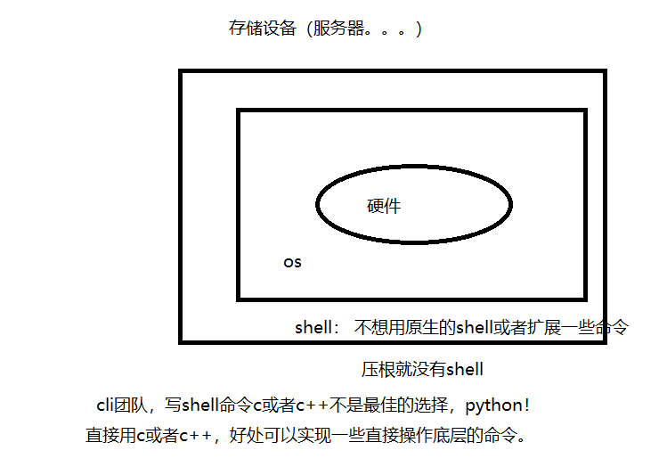
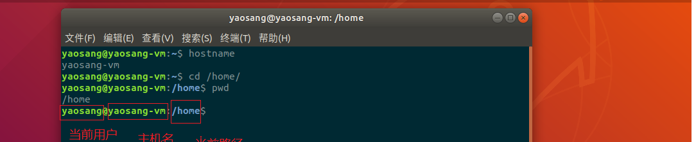
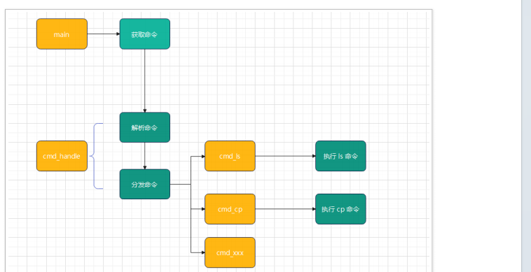
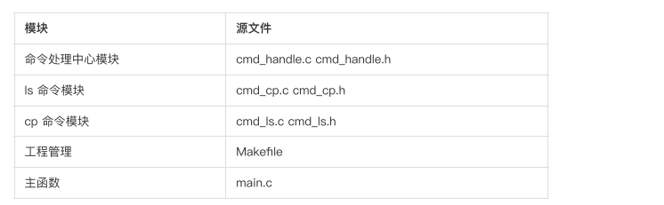
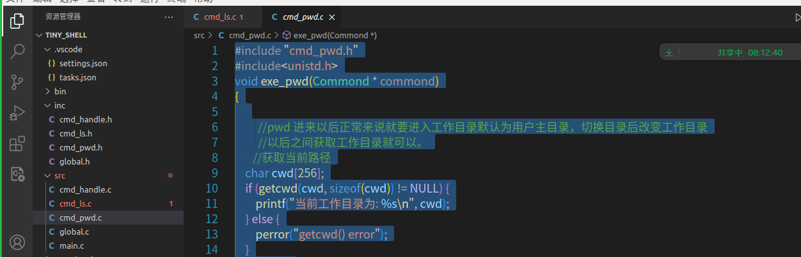

# tiny-shell

## 一 课程简介

- 项目背景
- 需求分析
- 需求设计
- 项目搭建搭建
- 功能实现-pwd
- 功能实现cp/ls

## 二 项目背景

​     虽然像linux这些是有shell，但是有的设备os是没有shell。或者需要扩展shell的命令。所以我们就写这个项目。



## 三 需求分析

实现⼀个基础的 shell 程序，主要完成两三个命令的功能pwd， cp 和 ls 



pwd： 输出当前目录

ls 命令主要实现: 

​	ls -l 命令的功能

cp 命令主要实现: 

​	⽂件复制 

​	⽬录复制 


其他命令1000。。。。。


**自定义一个shell**      


 **不是自定义一个shell命令(扩展一个shell命令)**

```
方案1：写一个shell脚本，里面通过shell命令完成相应的操作（采纳）
   1 编写shell脚本 /home/yaosang/bin/yaosang_ls.sh
   #!/bin/bash
    ls /
    #调用shell命令

   2 软连接
     ln -s /home/yaosang/bin/yaosang_ls.sh yaosang_ls
   3 配置path
    vi /etc/profile
   在/etc/profile的最下面添加： export PATH=”$PATH:/home/yaosang/bin/”
     重启虚拟机
     
方案2： 写一个c或者c++可执行程序，加入path （采纳）
方案3： 方案1和方案2:混合起来
   1 编写shell脚本 /home/yaosang/bin/yaosang_ls.sh
   #!/bin/bash
    ls /
    #调用shell命令
    #调用c写好的东西

   2 软连接
     ln -s /home/yaosang/bin/yaosang_ls.sh yaosang_ls
   3 配置path
    vi /etc/profile
   在/etc/profile的最下面添加： export PATH=”$PATH:/home/yaosang/bin/”
     重启虚拟机
```


## 四 需求设计

在框架设计上，采⽤模块化设计思想，并具备⼀定的可扩展性, 具体框架如下:



main模块：是程序入口

cmd_handle 模块: ⽤于解析命令相关信息，并进⾏命令的分发执⾏ 

cmd_ls 命令模块 : ⽤于实现 ls 命令 功能

cmd_cp 命令模块 : ⽤于实现 cp 命令 功能

cmd_xxx 命令模块 : ⽤于扩展



## 五 整体架构搭建



```c
项⽬的主循环主要完成的功能:
step 1 : 循环获取⽤户输⼊ main.c
#include <stdio.h>
#include <string.h>
#include <unistd.h>

// 命令字符串的长度
#define COMMAND_LEN 64
/**
 *     一直读命令,读到后交给命令解析模块去做
 */
int main(int argc, char const *argv[])
{
    char command[COMMAND_LEN] = {0};
    for (;;)
    {
        printf("Tiny Shell >");
        //fflush(NULL);

        // 从指定的流 stream 读取一行，并把它存储在 str 所指向的字符串内。
        // 当读取 (n-1) 个字符时，或者读取到换行符时，
        // 或者到达文件末尾时，它会停止，具体视情况而定。
        fgets(command, COMMAND_LEN, stdin); // ls -l\n

        // 把最后一个换行符设置为空白,有换行符号不太好比较  strlen获取数组的有效长度
        command[strlen(command) - 1] = '\0';


        printf("%s------------------\n",command);
        // 如果用户输入的是quit，结束程序
        if (strlen(command) == 4 && strncmp(command, "quit", 4)==0)
        { // 只需要比quit长度个就行了

            printf("goodbye!");
            fflush(NULL);
            break;
        }

        //交给命令解析执行
    }
    return 0;
}

step 2 : 调⽤ cmd_handle 的 cmd_execute 接⼝执⾏相应的命令 cmd_handle.h
cmd_handle.c
    int exe_cmd(char * cmd_str);
cmd_handle.h
#include <stdio.h>
#include <string.h>
#include "cmd_handle.h"
int exe_cmd(char * cmd_str){

   // 打出调试信息cmd
   printf("[DEBUG] : cmd string : < %s >\n",cmd_str);
    //1 解析命令


    //2 分发命令

    return 1;

}
```


shell编译脚本:

新建compire.sh，并输入一下内容

```shell
#!/bin/bash
gcc ./src/*.c -I ./inc -o  ./bin/tiny_shell
```

chmod 744 compire.sh

./compire.sh 就可以编译了


   // 打出调试信息cmd
   printf("[DEBUG] : cmd string : < %s >\n",cmd_str);

在开发调试的时候可以有，但是上线就不应该有。。。条件编译

global.h

#define DEBUG
int print_str_debug(char * format,char * str);


global.c


```c
#include <stdio.h>
#include "global.h"
int print_str_debug(char * format,char * str){
    #ifdef DEBUG
          printf(format,str);
     #endif
}
```


```c
#include <stdio.h>
#include <string.h>
#include "cmd_handle.h"
#include "global.h"

int exe_cmd(char * cmd_str){

    // 打出调试信息cmd
    //    #ifdef DEBUG
    //    printf("[DEBUG] : cmd string : < %s >\n",cmd_str);
    //    #endif
    print_str_debug("[DEBUG] : cmd string : < %s >\n",cmd_str);
    //1 解析命令


    //2 分发命令

    return 1;

}
```


输⼊的命令是⼀个完整字符串，⽐如复制 “cp test.txt test1.txt” , 在实际实现业务逻辑时需要
进⾏拆分
具体在解析字符串的步骤如下:
step 1 : 设计⾃定义的数据结构存储拆分之后的命名信息
step 2 : 使⽤ strtok 函数对命令字符串进⾏拆分, 并存储到⾃定义数据结构中
step 3 : 按照命令名字分发到具体模块中执⾏
对于解析之后的字符串，需要保存到⾃定义的数据结构中
命令名称
参数个数
参数列表

```c
#define SZ_NAME 8
#define SZ_ARG 32
#define SZ_COUNT 2 
#include <stdio.h>
#include <string.h>
#define DEBUG 
typedef struct command{
 char cmd_name[SZ_NAME];   //[0,0,0,0,0,0]
 char cmd_arg_list[SZ_COUNT][SZ_ARG];  //cp xxx.txt yyy.txt  {“xxx.txt”,"yyy.txt"}
 int cmd_arg_count; 
}cmd_t;


数据结构初始化 调⽤ init_command_struct 函数, 具体实现如下:
void init_command_struct(cmd_t *pcmd) 
{ 
 int i; 
 
 memset(pcmd->cmd_name,0,SZ_NAME); 
 
 for (i = 0;i < SZ_COUNT;i++){ 
 	memset(pcmd->cmd_arg_list[i],0,SZ_ARG); 
 } 
 
 pcmd->cmd_arg_count = 0; 
} 

命令数据结构的调试打印 调⽤ print_command_info 函数，具体实现如下:
void print_command_info(cmd_t *pcmd)
{
 int i;
 printf("==================\n");
 printf("[DEBUG] cmd name : < %s >\n",pcmd->cmd_name);
 printf("[DEBUG] cmd arg count : < %d >\n",pcmd->cmd_arg_count);
 printf("[DEBUG] cmd arg list : ");
 for (i = 0;i < pcmd->cmd_arg_count;i++){
 printf(" %s ",pcmd->cmd_arg_list[i]);
 }
 printf("\n==================\n");
}

在 cmd_execute 函数中，定义命令数据结构，并进⾏初始化后，并进⾏调试
int cmd_execute( char *cmd_str)
{
     cmd_t command ;
     int ret;
     if (cmd_str == NULL)
     return -1;

     init_command_struct(&command); 

    #ifdef DEBUG 
     print_command_info(&command); 
    #endif
     return 0;
}

命令字符串通过 strtok 函数进⾏拆分后需要存储到⾃定义的数据结构

int cmd_parse(char *cmd_str,cmd_t *pcmd)
{
 char *p_cmd_name = NULL;
 char *p_cmd_arg = NULL;
 int index = 0;
 if (cmd_str == NULL || pcmd == NULL) 
 return -1;
 p_cmd_name = strtok(cmd_str," "); 
#ifdef DEBUG
 printf("[DEBUG]: cmd_name : %s\n",p_cmd_name);
#endif
 strcpy(pcmd->cmd_name,p_cmd_name); 
 for(;;){
 p_cmd_arg = strtok(NULL," "); 
 if (p_cmd_arg == NULL)
 break;
 strcpy(pcmd->cmd_arg_list[index++],p_cmd_arg); 
 }
 pcmd->cmd_arg_count = index; 
#ifdef DEBUG
 print_command_info(pcmd); 
#endif
 return 0;
}

在实现了 cmd_parse 函数后，在 cmd_execute 函数中进⾏调⽤, 具体如下:
int cmd_execute( char *cmd_str)
{
 cmd_t command ;
 int ret;
 if (cmd_str == NULL)
 return -1;
 
 init_command_struct(&command); 
 ret = cmd_parse(cmd_str,&command); 
 if (ret == -1)
 return -1;
#ifdef DEBUG 
 print_command_info(&command);
#endif
 
 return 0;
}

当命令⾏解析完成之后，则需要进⾏具体分发到各个模块具体执⾏, 这⾥调⽤ cmd_dispatch
函数, 具体实现如下:
int cmd_dispatch(cmd_t *pcmd)
{
 if (pcmd == NULL)
 return -1;
 if (strcmp(pcmd->cmd_name,"ls") == 0){
 
 }else if (strcmp(pcmd->cmd_name,"cp") == 0){
 
 }
 return 0;
}

在 cmd_execute 函数中调⽤ cmd_dispatch 函数
int cmd_execute( char *cmd_str)
{
 cmd_t command ;
 int ret;
 if (cmd_str == NULL)
 return -1;
 
 init_command_struct(&command); 
 ret = cmd_parse(cmd_str,&command); 
 if (ret == -1)
 return -1;
#ifdef DEBUG 
 print_command_info(&command); 
#endif
 ret = cmd_dispatch(&command);
 if (ret == -1)
 return -1;
 return 0;
}

```


```
令的解析需要调⽤字符串处理函数 strtok 进⾏拆分
strtok 函数具体信息如下:
函数头⽂件:
#include <string.h>
函数原型:
char *strtok(char *str, const char *delim);
函数功能:
根据指定的分割字符串进⾏分割
函数参数:
str : 分割字符串的地址
 delim : 分割符
函数返回值:
成功 : 返回分割后字符串⾸地址
 失败 : 返回 NULL
函数注意事项:
第⼀次调⽤时，需要指定字符串的地址
第⼆次调⽤时, 第⼀个参数可以填 NULL

#include <stdio.h>
#include <string.h>
int main(void)
{
 char str[] = "ABC 123 XYZ";
 char *first = NULL;
 char *other = NULL;
 first = strtok(str," ");
 
 printf(" first : %s\n",first);
 while((other = strtok(NULL," "))){
 printf(" other : %s\n",other);
 } 
 return 0;
}
输出结果为 : 
 ABC 
 123 
 XYZ
命令字符串通过 strtok 函数进⾏拆分后需要存储到⾃定义的数据结构
```


## 六 功能实现

### 1 pwd实现

```c
#include "cmd_pwd.h"
#include<unistd.h>
void exe_pwd(Commond * commond)
{
    
         //pwd 进来以后正常来说就要进入工作目录默认为用户主目录，切换目录后改变工作目录
         //以后之间获取工作目录就可以。
       //获取当前路径
    char cwd[256];
    if (getcwd(cwd, sizeof(cwd)) != NULL) {
        printf("当前工作目录为: %s\n", cwd);
    } else {
        perror("getcwd() error");
    }
    return 0;
    // 输出到控制台
    
}
```

### 2 ls 实现

```c
#include "cmd_ls.h"
#include <stdio.h>
#include <string.h>
void exe_ls(Commond * commond)
{
    char arg_list[SZ_COUNT][SZ_ARG] = commond->cmd_arg_list;
  char *dir = arg_list[0];
  char *l_param = arg_list[1]; //1 -l(列表) 2-a（隐藏文件）3 -al  4不传递 ）平铺
  if (l_param==NULL)
  {
    list_files();
  }else if (strncmp(l_param,"-l",2)==0)
  {
    list_files();
  }
  else if (strncmp(l_param,"-a",2)==0)
  {
    list_files();
  }
  else if (strncmp(l_param,"-al",2)==0)
  {
    list_files();
  }else 
  {
    print_str_debug("param invaid!");
  }
}


//list_files(char * dir,int is_need_hidden){

//}


//平铺打印

//列表打印


/*

list/array
void list_directory(const char *path) {
    DIR *dir = opendir(path);
    if (dir == NULL) {
        perror("opendir");
        return;
    }
 
    struct dirent *entry;
    while ((entry = readdir(dir)) != NULL) {
        if (strcmp(entry->d_name, ".") == 0 || strcmp(entry->d_name, "..") == 0) {
            continue; // 跳过当前目录和上级目录的引用
        }
        printf("%s/%s\n", path, entry->d_name);
    }
    closedir(dir);
}
 
int main() {
    const char *path = "."; // 设置为"."表示列出当前目录下的文件和子目录
    list_directory(path);
    return 0;
}

*/


```


## 七 总结

