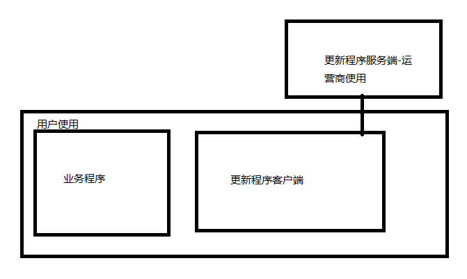
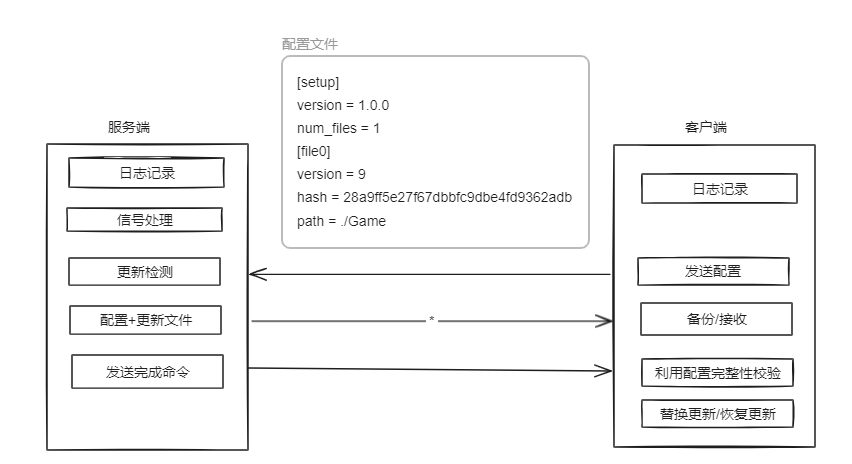
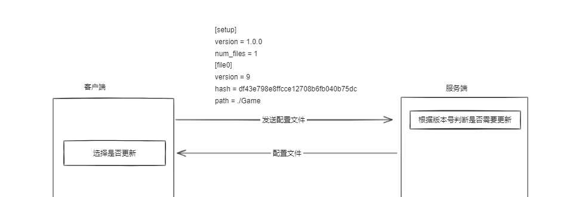

# 项目实战--更新模块的开发

## 一、课程介绍

- 为什么需要更新程序
- 需求
- 设计
- 代码实现

## 二、为什么需要更新程序

基于以下情况，我们的软件需要一个更新程序：

1、**修复漏洞和错误**

- 软件更新通常包含对已知漏洞和错误的修复。这些漏洞可能会导致安全问题，例如允许未经授权的访问或恶意攻击。通过及时更新软件，可以增强系统的安全性并防止潜在的风险。

**2、改进功能和性能**

- 更新模块通常包括新的功能、改进的性能以及用户体验的增强。这些改进可以使软件更加强大、高效，并为用户提供更好的体验。

**3、兼容性更新**

- 随着操作系统、硬件和其他软件的更新，软件开发者通常需要调整其软件以确保兼容性。因此，软件更新可以解决与新环境或平台不兼容的问题。

**4、安全更新**

- 与修复漏洞相关，安全更新可以增强软件的防护能力，防止潜在的恶意攻击和数据泄露。

**5、支持新的硬件和技术**

- 软件更新可以支持新的硬件设备或技术，例如新型处理器、图形卡、传感器等。这确保了软件在不断发展的技术环境中保持前沿。

**6、改进用户体验**

- 更新模块还可以通过改进用户界面、简化操作流程等方式，提升用户体验并增加用户满意度。

**7、提供新的内容或服务**

- 一些软件更新可能包括提供新的内容、服务或订阅。这些内容可能是针对当前需求或趋势的响应，使软件更具吸引力和实用性。

总之，软件更新模块是保持软件功能和安全性的关键方式之一。及时进行软件更新可以确保用户得到最佳的体验，并保护系统免受潜在威胁和风险。

更新程序安装完成后，软件启动后会自动检测是否有新的版本，如果有就自动更新（学完QT后，以UI方式显示是否更新、更新功能及更新进度）。

## 三、详细需求

### 1、检测更新

更新程序安装完成后，软件启动后会自动检测哪些文件有新的版本，以便后续进行自动更新（学完QT后，可以以UI方式显示是否更新、更新功能及更新进度）。

### 2、更新

- 对第一步检查到的文件进行下载。

- 完整性验证
- 替换更新
- 替换失败后的恢复

### 3、日志记录

对更新的每个过程进行日志记录。

## 三、设计

我们通过客户端服务端TCP通讯方式提高更新模块的灵活性与安全性。通过代码访问更新文件，可以根据业务增加相应逻辑。通过新增握手协议可以防止爬虫等无授权的访问，避免不必要的流量耗费。

### 1、架构图



### 2、交互图



## 五、代码实现

### 1、项目架构搭建

实现需求之前，先实现网络消息的收发，把网络通讯框架搭建好。

#### 1.1、服务端

##### 1.1.1、基础版

我们使用IO多路复用网络通讯

```c
#include <stdio.h>
#include <stdlib.h>
#include <string.h>
#include <sys/socket.h>
#include <netinet/in.h>
#include <unistd.h>
#include <errno.h>
#include <sys/select.h>

#define PORT 12345
#define MAX_CLIENTS 512

typedef struct {
    int client_socket;
    int in_use; // 0 if not in use, 1 if in use
} ClientConnection;

int g_server_socket = 0;
ClientConnection client_connections[MAX_CLIENTS];

// 接收消息
Message *receive_message(int client_socket)
{
    Message *message = (Message *)malloc(sizeof(Message));
    if (message == NULL)
    {
        perror("Failed to allocate memory for message");
        return NULL;
    }

    // 一次性接收消息头部（类型和长度）
    if (recv(client_socket, message, sizeof(Message), 0) < 0)
    {
        perror("Error receiving message header");
        free(message);
        return NULL;
    }

    // 分配消息体内存
    message->content = (char *)malloc(message->length); // +1 for null terminator
    if (message->content == NULL)
    {
        perror("Failed to allocate memory for message content");
        free(message);
        return NULL;
    }

    int bytes_received = 0;
    int remaining_length = message->length;
    // 读取消息体内容，直到完整接收
    while (remaining_length > 0)
    {
        bytes_received = recv(client_socket, message->content + (message->length - remaining_length), remaining_length, 0);
        if (bytes_received < 0)
        {
            perror("Error receiving message content");
            free(message->content);
            free(message);
            return NULL;
        }
        remaining_length -= bytes_received;
    }

    return message;
}

// 发送消息
int send_message(int client_socket, int type, const char *content, int content_length)
{
    // 构造消息
    Message message;
    message.type = type;
    message.length = content_length;
    message.content = content;

    // 发送消息
    int bytes_sent = send(client_socket, &message, sizeof(Message), 0);
    if (bytes_sent < 0)
    {
        perror("Error sending messag header");
        return -1;
    }

    // 发送消息体内容
    int remaining_length = message.length;
    while (remaining_length > 0)
    {
        bytes_sent = send(client_socket, message.content + (message.length - remaining_length), remaining_length, 0);
        if (bytes_sent < 0)
        {
            perror("Error sending message content");
            return -1;
        }
        remaining_length -= bytes_sent;
    }
    return 0;
}

int main() {
    struct sockaddr_in server_addr, client_addr;
    socklen_t client_addr_len = sizeof(struct sockaddr_in);
    fd_set readfds;
    int max_sd, activity, i, new_client_socket, client_socket, type, content_length;
    char *content;

    // 创建服务器套接字
    g_server_socket = socket(AF_INET, SOCK_STREAM, 0);
    if (g_server_socket < 0) {
        perror("Error creating socket");
        exit(EXIT_FAILURE);
    }

    // 设置服务器地址结构
    memset(&server_addr, 0, sizeof(server_addr));
    server_addr.sin_family = AF_INET;
    server_addr.sin_addr.s_addr = INADDR_ANY;
    server_addr.sin_port = htons(PORT);

    // 绑定服务器地址
    if (bind(g_server_socket, (struct sockaddr *)&server_addr, sizeof(server_addr)) < 0) {
        perror("Error binding socket");
        exit(EXIT_FAILURE);
    }

    // 监听套接字
    if (listen(g_server_socket, MAX_CLIENTS) < 0) {
        perror("Error listening on socket");
        exit(EXIT_FAILURE);
    }

    printf("Server listening on port %d...\n", PORT);

    // 初始化连接池
    for (i = 0; i < MAX_CLIENTS; i++) {
        client_connections[i].client_socket = -1;
        client_connections[i].in_use = 0;
    }

    // 主循环，使用 select() 进行多路复用
    while (1) {
        // 清空文件描述符集合
        FD_ZERO(&readfds);

        // 添加服务器套接字到文件描述符集合
        FD_SET(g_server_socket, &readfds);
        max_sd = g_server_socket;

        // 添加客户端套接字到文件描述符集合
        for (i = 0; i < MAX_CLIENTS; i++) {
            client_socket = client_connections[i].client_socket;
            if (client_socket > 0) {
                FD_SET(client_socket, &readfds);
                if (client_socket > max_sd) {
                    max_sd = client_socket;
                }
            }
        }

        // 使用 select() 监听文件描述符集合
        activity = select(max_sd + 1, &readfds, NULL, NULL, NULL);
        if ((activity < 0) && (errno != EINTR)) {
            perror("Select error");
            continue;
        }

        // 处理新的客户端连接
        if (FD_ISSET(g_server_socket, &readfds)) {
            new_client_socket = accept(g_server_socket, (struct sockaddr *)&client_addr, &client_addr_len);
            if (new_client_socket < 0) {
                perror("Error accepting connection");
                continue;
            }

            // 寻找空闲连接
            for (i = 0; i < MAX_CLIENTS; i++) {
                if (client_connections[i].in_use == 0) {
                    client_connections[i].client_socket = new_client_socket;
                    client_connections[i].in_use = 1;
                    break;
                }
            }
            if (i == MAX_CLIENTS) {
                printf("No free connection in the pool\n");
                close(new_client_socket);
                continue;
            }
        }

        // 处理客户端发送的数据
        for (i = 0; i < MAX_CLIENTS; i++) {
            client_socket = client_connections[i].client_socket;
            if (client_socket > 0 && FD_ISSET(client_socket, &readfds)) {
                // 处理客户端消息
                if (receive_message(client_socket, &type, &content, &content_length) == 0) {
                    printf("Received message from client %d, type %d, content: %s\n", client_socket, type, content);
                    // 在这里处理接收到的消息，如解析消息类型并作出响应

                    // 回复消息
                    send_message(client_socket, type, content, content_length);

                    // 释放消息内容内存
                    free(content);
                } else {
                    // 出现错误或客户端断开连接，清理连接池
                    client_connections[i].client_socket = -1;
                    client_connections[i].in_use = 0;
                    close(client_socket);
                }
            }
        }
    }

    return 0;
}
```

**信号处理**

当用户按下ctrl+c后，如果不做信号处理，程序不能正确关闭网络句柄。

- 自定义的信号处理函数

```c
void handle_sigint(int sig)
{
    printf("\n%d detected. Exiting...\n", sig);

    // 关闭服务器套接字
    close(g_server_socket);

    // 关闭日志文件
    fclose(glog_file);
    // 在这里可以进行一些清理工作
    exit(EXIT_SUCCESS);
}
```

- 注册信号处理函数

```c
if (signal(SIGINT, handle_sigint) == SIG_ERR)
    {
        perror("signal");
        return EXIT_FAILURE;
    }
```


##### 1.1.2、线程池版本

**基础版存在的问题**

**并发处理**: 使用多路复用技术可以同时监听多个文件描述符（包括服务器套接字），并在有事件发生时通知程序。但是，在处理客户端连接时，如果直接在主线程中处理，会导致主线程阻塞在 `accept()` 调用上，无法同时处理其他事件。

**非阻塞处理**: 如果将 `accept()` 放在循环中处理，主线程会阻塞等待新的连接，这样会导致无法同时处理其他请求或事件。通过创建新的线程来处理每个客户端连接，可以使每个连接都在独立的线程中运行，互不干扰，实现并发处理。

**提高并发性和响应性**: 使用线程来处理客户端连接，可以提高系统的并发处理能力和响应性。每个客户端连接都有一个独立的线程来处理，可以同时处理多个客户端请求，而不影响其他连接或主线程的执行。

基于以上原因，我们在基础版本上添加线程池：

```c
#include <stdio.h>
#include <stdlib.h>
#include <glib.h>
#include <string.h>
#include <unistd.h>
#include <sys/socket.h>
#include <netinet/in.h>
#include <arpa/inet.h>
#include <signal.h>
#include <sys/time.h>
#include "Consts.h"

#define PORT 12345
#define MAX_CLIENTS 512
#define BUFFER_SIZE 1024

#define G_LOG_DOMAIN "main"
#define LOG_FILE_PATH "./log.txt"

typedef struct
{
    int client_socket;
} ClientConnection;

FILE *glog_file = NULL;
GThreadPool *thread_pool = NULL;
GMutex* gmutex = NULL;

int g_server_socket = 0;
// 定义一个结构体用于存储文件内容和大小
typedef struct
{
    char *data; // 文件内容
    long size;  // 文件大小
} FileContent;

typedef struct
{
    int type;      // 消息类型 (int)
    int length;    // 消息体长度
    char *content; // 消息内容
} Message;

// 自定义的信号处理函数
void handle_sigint(int sig)
{
    printf("\nCtrl+C detected. Exiting...\n");

    // 关闭服务器套接字
    close(g_server_socket);

    g_mutex_free(gmutex);

    // 关闭日志文件
    fclose(glog_file);
    // 在这里可以进行一些清理工作
    exit(EXIT_SUCCESS);
}

// 接收消息
Message *receive_message(int client_socket)
{
    Message *message = (Message *)malloc(sizeof(Message));
    if (message == NULL)
    {
        perror("Failed to allocate memory for message");
        return NULL;
    }

    // 一次性接收消息头部（类型和长度）
    if (recv(client_socket, message, sizeof(Message), 0) < 0)
    {
        perror("Error receiving message header");
        free(message);
        return NULL;
    }

    // 分配消息体内存
    message->content = (char *)malloc(message->length); // +1 for null terminator
    if (message->content == NULL)
    {
        perror("Failed to allocate memory for message content");
        free(message);
        return NULL;
    }

    int bytes_received = 0;
    int remaining_length = message->length;
    // 读取消息体内容，直到完整接收
    while (remaining_length > 0)
    {
        bytes_received = recv(client_socket, message->content + (message->length - remaining_length), remaining_length, 0);
        if (bytes_received < 0)
        {
            perror("Error receiving message content");
            free(message->content);
            free(message);
            return NULL;
        }
        remaining_length -= bytes_received;
    }

    return message;
}

// 发送消息
int send_message(int client_socket, int type, const char *content, int content_length)
{
    // 构造消息
    Message message;
    message.type = type;
    message.length = content_length;
    message.content = content;

    // 发送消息
    int bytes_sent = send(client_socket, &message, sizeof(Message), 0);
    if (bytes_sent < 0)
    {
        perror("Error sending messag header");
        return -1;
    }

    // 发送消息体内容
    int remaining_length = message.length;
    while (remaining_length > 0)
    {
        bytes_sent = send(client_socket, message.content + (message.length - remaining_length), remaining_length, 0);
        if (bytes_sent < 0)
        {
            perror("Error sending message content");
            return -1;
        }
        remaining_length -= bytes_sent;
    }
    return 0;
}

// 客户端处理线程函数
void *client_handler(gpointer arg, gpointer user_data)
{
    int client_socket = GPOINTER_TO_INT(arg);

    // 接收并处理客户端消息
    Message *received_message = receive_message(client_socket);
    if (received_message == NULL)
    {
        printf("Error receiving message from client\n");
    }
    else
    {
        g_info("Client:%d,MSG_TYPE:%d", client_socket, received_message->type);        

        // 释放消息内存
        free(received_message->content);
        free(received_message);

        send_message(client_socket, MSG_END, NULL, 0); // End
    }

    // 关闭客户端套接字
    close(client_socket);

    return NULL;
}

int main()
{
    gmutex = g_mutex_new();
    // 注册信号处理函数
    if (signal(SIGINT, handle_sigint) == SIG_ERR)
    {
        perror("signal");
        fclose(glog_file);
        return EXIT_FAILURE;
    }

    struct sockaddr_in server_addr;
    socklen_t client_addr_len = sizeof(struct sockaddr_in);

    g_info("创建服务器套接字");
    g_server_socket = socket(AF_INET, SOCK_STREAM, 0);
    if (g_server_socket < 0)
    {
        g_error("Error creating socket");
        fclose(glog_file);
        return EXIT_FAILURE;
    }

    // 设置服务器地址结构
    memset(&server_addr, 0, sizeof(server_addr));
    server_addr.sin_family = AF_INET;
    server_addr.sin_addr.s_addr = INADDR_ANY;
    server_addr.sin_port = htons(PORT);

    // 绑定服务器地址
    if (bind(g_server_socket, (struct sockaddr *)&server_addr, sizeof(server_addr)) < 0)
    {
        g_error("Error binding socket");
        fclose(glog_file);
        close(g_server_socket);
        return EXIT_FAILURE;
    }

    // 开始监听套接字
    if (listen(g_server_socket, MAX_CLIENTS) < 0)
    {
        g_error("Error listening on socket");
        fclose(glog_file);
        close(g_server_socket);
        return EXIT_FAILURE;
    }

    thread_pool = g_thread_pool_new((GFunc)client_handler, NULL, MAX_CLIENTS, FALSE, NULL);
    g_info("开始监听端口:%d", PORT);

    fd_set read_fds;
    int max_fd = g_server_socket;

    while (1)
    {
        // 初始化文件描述符集合
        FD_ZERO(&read_fds);
        FD_SET(g_server_socket, &read_fds);

        // 使用 select() 监视套接字
        int ret = select(max_fd + 1, &read_fds, NULL, NULL, NULL);
        if (ret < 0)
        {
            g_error("Error in select()");
            fclose(glog_file);
            close(g_server_socket);
            return EXIT_FAILURE;
        }

        // 检查服务器套接字是否有连接请求
        if (FD_ISSET(g_server_socket, &read_fds))
        {
            // 等待新客户端连接
            int new_client_socket = accept(g_server_socket, (struct sockaddr *)&server_addr, &client_addr_len);
            if (new_client_socket < 0)
            {
                g_error("Error accepting connection");
                continue;
            }

            // 创建线程处理新客户端连接
            GError *error = NULL;
            if (!g_thread_pool_push(thread_pool, GINT_TO_POINTER(new_client_socket), &error))
            {
                g_error("Error creating client handling thread: %s", error->message);
                g_error_free(error);
                close(new_client_socket);
                continue;
            }

            // 更新最大文件描述符
            if (new_client_socket > max_fd)
                max_fd = new_client_socket;
        }
    }

    close(g_server_socket);
    return EXIT_SUCCESS;
}
```

#### 1.2、客户端

```c
#include <stdio.h>
#include <stdlib.h>
#include <string.h>
#include <unistd.h>
#include <sys/socket.h>
#include <netinet/in.h>
#include <arpa/inet.h>
#include <sys/time.h>
#include <glib.h>
#include <sys/stat.h>
#include "Consts.h"

#define SERVER_IP "127.0.0.1"
#define SERVER_PORT 12345
#define BUFFER_SIZE 4096

#define G_LOG_DOMAIN "main"
// 定义一个结构体用于存储文件内容和大小
typedef struct
{
    char *data; // 文件内容
    long size;  // 文件大小
} FileContent;
typedef struct
{
    int type;      // 消息类型 (int)
    int length;    // 消息体长度
    char *content; // 消息内容
} Message;

// 接收消息
Message *receive_message(int client_socket)
{
    Message *message = (Message *)malloc(sizeof(Message));
    if (message == NULL)
    {
        perror("Failed to allocate memory for message");
        return NULL;
    }

    // 一次性接收消息头部（类型和长度）
    if (recv(client_socket, message, sizeof(Message), 0) < 0)
    {
        perror("Error receiving message header");
        free(message);
        return NULL;
    }

    // 分配消息体内存
    message->content = (char *)malloc(message->length); // +1 for null terminator
    if (message->content == NULL)
    {
        perror("Failed to allocate memory for message content");
        free(message);
        return NULL;
    }

    int bytes_received = 0;
    int remaining_length = message->length;
    // 读取消息体内容，直到完整接收
    while (remaining_length > 0)
    {
        bytes_received = recv(client_socket, message->content + (message->length - remaining_length), remaining_length, 0);
        if (bytes_received < 0)
        {
            perror("Error receiving message content");
            free(message->content);
            free(message);
            return NULL;
        }
        remaining_length -= bytes_received;
    }

    return message;
}

// 发送消息
int send_message(int client_socket, int type, const char *content, int content_length)
{
    // 构造消息
    Message message;
    message.type = type;
    message.length = content_length;
    message.content = content;

    // 发送消息
    int bytes_sent = send(client_socket, &message, sizeof(Message), 0);
    if (bytes_sent < 0)
    {
        perror("Error sending messag header");
        return -1;
    }

    // 发送消息体内容
    int remaining_length = message.length;
    while (remaining_length > 0)
    {
        bytes_sent = send(client_socket, message.content + (message.length - remaining_length), remaining_length, 0);
        if (bytes_sent < 0)
        {
            perror("Error sending message content");
            return -1;
        }
        remaining_length -= bytes_sent;
    }
    return 0;
}

int main()
{
    int client_socket;
    struct sockaddr_in server_addr;
    FILE *config_fp;
    char buffer[BUFFER_SIZE];

    // 创建客户端套接字
    client_socket = socket(AF_INET, SOCK_STREAM, 0);
    if (client_socket < 0)
    {
        perror("Error creating socket");
        exit(EXIT_FAILURE);
    }

    // 设置服务器地址结构
    memset(&server_addr, 0, sizeof(server_addr));
    server_addr.sin_family = AF_INET;
    server_addr.sin_addr.s_addr = inet_addr(SERVER_IP);
    server_addr.sin_port = htons(SERVER_PORT);

    // 连接服务器
    if (connect(client_socket, (struct sockaddr *)&server_addr, sizeof(server_addr)) < 0)
    {
        perror("Error connecting to server");
        exit(EXIT_FAILURE);
    }

    printf("Connected to server\n");

    // 循环接收服务端消息
    while (1)
    {
        Message *received_message = receive_message(client_socket);
        // 接收消息类型
        if (received_message == NULL)
        {
            perror("Error receiving message type");
            break;
        }
        // 处理接收到的消息
        printf("Received message from server:\n");
        printf("Type: %d\n", received_message->type); // 打印消息类型 (int)
        printf("Length: %d\n", received_message->length);

        // 释放消息体内存
        free(received_message->content);
        free(received_message);
    }

    // 关闭连接和配置文件
    close(client_socket);
    return 0;
}
```

### 2、更新检测




1、客户端发送配置文件（里面包括业务程序所有文件版本号、路径、md5）到服务端并记录日志。

​	文件版本号：作为更新依据。

​	路径：文件在客户端所在位置。

​	md5:文件完整性判断依据，由于网络的各种异常导致文件接收不完整，所以我们需要对服务端要传输文件生成md5值，写入配置文件，将配置文件与相应的业务程序文件传输到客户端。客户端接收到文件后与服务端传输过来的配置文件中对应文件的md5值进行比较，如果不同则文件缺失，不作更新。

2、服务端收到配置文件后记录日志，遍历服务端与客户端配置的所有文件版本号并记录日志，如果大于客户端版本，则将服务端配置文件发送到客户端。同时将需要更新的文件作为日志记录。

3、发送完成后发送END到客户端并记录日志。客户端收到END后，如果没有收到服务端的配置文件则提示用户无需更新。

4、客户端接收到文件，作为第3步的更新依据。需要记录日志。

##### 2.1、客户端发送配置

为了完成检查更新，首先我们需要将配置文件发往服务端，由服务端判断哪些文件需要更新。如果需要更新，则将服务端的配置文件（里面记录有更新文件的hash值）及最新版本文件发给客户端。这个过程需要用到客户端服务端的文件收发功能。

**客户端调用入口**

```c
int main()
{
    int client_socket;
    struct sockaddr_in server_addr;
    FILE *config_fp;
    char buffer[BUFFER_SIZE];

    glog_file = fopen(LOG_FILE_PATH, "a");
    // 添加自定义的日志处理器
    // g_log_set_default_handler(my_log_handler, NULL);
    g_log_set_handler(G_LOG_DOMAIN, G_LOG_LEVEL_MASK, my_log_handler, NULL);

    // 创建客户端套接字
    client_socket = socket(AF_INET, SOCK_STREAM, 0);
    if (client_socket < 0)
    {
        perror("Error creating socket");
        exit(EXIT_FAILURE);
    }

    // 设置服务器地址结构
    memset(&server_addr, 0, sizeof(server_addr));
    server_addr.sin_family = AF_INET;
    server_addr.sin_addr.s_addr = inet_addr(SERVER_IP);
    server_addr.sin_port = htons(SERVER_PORT);

    // 连接服务器
    if (connect(client_socket, (struct sockaddr *)&server_addr, sizeof(server_addr)) < 0)
    {
        perror("Error connecting to server");
        exit(EXIT_FAILURE);
    }

    printf("Connected to server\n");

    // 发送配置文件内容给服务器
    FileContent* fc = read_file(CONFIG_FILE);
    if (fc == NULL)
    {
        close(client_socket);
        fclose(glog_file);
        g_error("Failed to open config file");
    }

    if (send_message(client_socket, MSG_INI, fc->data, fc->size) < 0)
    { // 消息类型改为1 (Ini)
        close(client_socket);
        fclose(glog_file);
        g_error("Error sending config file content to server\n");
    }
    free(fc->data);
    free(fc);
```


- **读取文件**

```c
//读取文件内容到缓冲区，并返回文件大小
FileContent *read_file(const char *filepath)
{
    // 打开文件
    FILE *file = fopen(filepath, "rb");
    if (file == NULL)
    {
        printf("Failed to open file: %s\n", filepath);
        return NULL;
    }

    // 获取文件大小
    fseek(file, 0, SEEK_END);
    long file_size = ftell(file);
    rewind(file);

    char *filename = g_path_get_basename(filepath);
    g_info("Read:%s", filename);
    int file_length = strlen(filename)+1;
    // 分配缓冲区
    char *buffer = (char *)malloc(file_size+file_length);
    if (buffer == NULL)
    {
        printf("Failed to allocate memory\n");
        fclose(file);
        return NULL;
    }

    memcpy(buffer, filename, file_length);
    // 读取文件内容到缓冲区
    size_t bytes_read = fread(buffer+file_length, 1, file_size, file);
    if (bytes_read != file_size)
    {
        printf("Error reading file\n");
        free(buffer);
        fclose(file);
        return NULL;
    }

    // 关闭文件
    fclose(file);

    // 分配并填充 FileContent 结构体
    FileContent *file_content = (FileContent *)malloc(sizeof(FileContent));
    if (file_content == NULL)
    {
        printf("Failed to allocate memory\n");
        free(buffer);
        return NULL;
    }

    file_content->data = buffer;
    file_content->size = file_size+file_length;

    return file_content;
}
```

##### 2.2、日志记录

由于以上更新检测及后续更新过程中需要日志记录，所以我们需要先实现日志记录功能。

**客户端、服务端调用入口**

```c

int main()
{
    glog_file = fopen(LOG_FILE_PATH, "a");
    if (glog_file == NULL)
    {
        perror("Error opening log file");
        return EXIT_FAILURE;
    }

    // 设置日志处理器
    g_log_set_handler(G_LOG_DOMAIN, G_LOG_LEVEL_MASK, my_log_handler, NULL);
```

**日志处理器函数**


```c
static void my_log_handler(const gchar *log_domain, GLogLevelFlags log_level, const gchar *message, gpointer user_data)
{
    // 输出到控制台
    // g_print("%s: %s\n", log_domain, message);
    // 打开日志文件，追加方式写入
    if (glog_file == NULL)
    {
        perror("fopen");
        return;
    }
    // 获取当前时间
    struct timeval tv;
    gettimeofday(&tv, NULL);
    // 获取当前日期和时间
    time_t now = time(NULL);
    struct tm *local_time = localtime(&now);
    char time_str[64]; // 用于存储格式化后的日期和时间字符串

    // 格式化日期和时间
    strftime(time_str, sizeof(time_str), "%Y-%m-%d %H:%M:%S", local_time);
    // 格式化日期和时间，包括微秒
    snprintf(time_str, sizeof(time_str), "%04d-%02d-%02d %02d:%02d:%02d.%ld",
             local_time->tm_year + 1900, local_time->tm_mon + 1, local_time->tm_mday,
             local_time->tm_hour, local_time->tm_min, local_time->tm_sec,
             tv.tv_usec); // 将微秒转换为两位数
    g_mutex_lock(gmutex);
    fprintf(glog_file, "[%s/%s]: %s\n", time_str, log_domain, message);
    g_mutex_unlock(gmutex);
}
```

##### 2.3、服务端检测更新

服务端收到客户端发来的配置文件后，与自己的配置文件逐个文件进行版本比较，如果高于客户端的版本，则需要更新。这时会将服务端的配置文件和更新的文件依次发往客户端。

**服务端调用入口**

```c
void *client_handler(gpointer arg, gpointer user_data)
{
    int client_socket = GPOINTER_TO_INT(arg);

    // 接收并处理客户端消息
    Message *received_message = receive_message(client_socket);
    if (received_message == NULL)
    {
        printf("Error receiving message from client\n");
    }
    else
    {
        g_info("Client:%d,MSG_TYPE:%d", client_socket, received_message->type);
        // 在这里处理接收到的消息，如解析消息类型并作出响应
        if (received_message->type == MSG_INI)
        {
            char ini_file_name[256];
            snprintf(ini_file_name, sizeof(ini_file_name), "./client_%d.ini", client_socket);
            WriteFile(ini_file_name, received_message->content, received_message->length);
            GList *list = VersionCheck("./server.ini", ini_file_name);
            for (GList *iter = list; iter != NULL; iter = g_list_next(iter))
            {
                const char *item = (const char *)iter->data;
                g_info("Send:%s", item);
                FileContent *file_content = read_file(item);
                if (file_content == NULL)
                {
                    break;
                }  
                send_message(client_socket, MSG_FILE, file_content->data, file_content->size);
                free(file_content->data);
                free(file_content);
            }
            g_list_free(list);
        }

        // 释放消息内存
        free(received_message->content);
        free(received_message);

        send_message(client_socket, MSG_END, NULL, 0); // End
    }

    // 关闭客户端套接字
    close(client_socket);

    return NULL;
}
```

**写入文件**

```c
void WriteFile(const char *file_data, int length)
{
    // 文件名的起始地址和长度
    const char *file_name = (char*)file_data;
    g_info("Recv:%s",  file_name);
    size_t file_name_length = strlen(file_name);

    // 文件内容的起始地址
    const char *file_content = file_data + file_name_length + 1;
    WriteFile(file_name, file_content, length - file_name_length - 1);
    add_execute_permission_if_elf(file_name);
}
// 函数原型：给文件添加执行权限（如果是 ELF 文件）
int add_execute_permission_if_elf(const char *filename) {
    struct stat file_stat;
    mode_t new_mode;
    int result;

    // 获取文件的状态信息
    if (stat(filename, &file_stat) == -1) {
        perror("Error getting file status");
        return -1;
    }

    // 检查文件是否为 ELF 文件
    FILE *file = fopen(filename, "r");
    if (!file) {
        perror("Error opening file");
        return -1;
    }

    char elf_magic[4] = {0x7F, 'E', 'L', 'F'};
    char buffer[4] = {0};
    fread(buffer, sizeof(char), 4, file);
    fclose(file);

    if (memcmp(buffer, elf_magic, 4) != 0) {
        printf("%s is not an ELF file. Skipping execution permission.\n", filename);
        return 0; // 不是 ELF 文件，不添加执行权限
    }

    // 添加执行权限
    new_mode = file_stat.st_mode | S_IXUSR | S_IXGRP | S_IXOTH;

    // 修改文件权限
    result = chmod(filename, new_mode);
    if (result == -1) {
        perror("Error setting file permissions");
        return -1;
    }

    printf("Execution permissions added to ELF file: %s\n", filename);

    return 0;
}
```

**版本比较**

返回所有版本大于客户端的列表及配置文件，以便增量更新。

```c
GList *VersionCheck(const char *inisrv, const char *inicli)
{
    GList *updated_files = NULL;

    // 创建 GKeyFile 实例
    GKeyFile *cli_keyfile = g_key_file_new();
    GKeyFile *srv_keyfile = g_key_file_new();

    // 加载客户端和服务器的配置文件
    GError *error = NULL;
    gboolean cli_loaded = g_key_file_load_from_file(cli_keyfile, inicli, G_KEY_FILE_NONE, &error);
    gboolean srv_loaded = g_key_file_load_from_file(srv_keyfile, inisrv, G_KEY_FILE_NONE, &error);

    if (!cli_loaded || !srv_loaded)
    {
        g_print("Failed to load configuration files: %s\n", error->message);
        g_error_free(error);
        g_key_file_free(cli_keyfile);
        g_key_file_free(srv_keyfile);
        return updated_files;
    }

    char filename[256] = {0};
    for (size_t i = 0; i < 100; i++)
    {
        sprintf(filename, "file%d", i);
        // 获取客户端和服务器的版本号
        gint client_version = g_key_file_get_integer(cli_keyfile, filename, "version", NULL);
        gint server_version = g_key_file_get_integer(srv_keyfile, filename, "version", NULL);

        if (client_version == NULL || server_version == NULL)
        {
            break;
        }

        if (server_version > client_version)
        {
            const gchar *server_filename = g_key_file_get_string(srv_keyfile, filename, "path", NULL);
            if (server_filename != NULL)
            {
                updated_files = g_list_append(updated_files, g_strdup(server_filename));
            }
        }
    }

    if(updated_files != NULL)
    {//如果有更新，则奖服务端的配置文件插入到链表前面
        updated_files = g_list_prepend(updated_files,  g_strdup(inisrv));
    }                

    // 释放资源
    g_key_file_free(cli_keyfile);
    g_key_file_free(srv_keyfile);

    return updated_files;
}
```

#### 2.4、客户端接收处理

如果有配置文件说明可以更新，然后弹框由用户选择是否更新。但是因为没有图形界面的技能，所以默认更新。

### 3、客户端更新

- 备份文件
- 接收文件

#### 3.1、实现更新

```c
int main()
{
    int client_socket;
    struct sockaddr_in server_addr;
    FILE *config_fp;
    char buffer[BUFFER_SIZE];

    glog_file = fopen(LOG_FILE_PATH, "a");
    // 添加自定义的日志处理器
    // g_log_set_default_handler(my_log_handler, NULL);
    g_log_set_handler(G_LOG_DOMAIN, G_LOG_LEVEL_MASK, my_log_handler, NULL);

    // 创建客户端套接字
    client_socket = socket(AF_INET, SOCK_STREAM, 0);
    if (client_socket < 0)
    {
        perror("Error creating socket");
        exit(EXIT_FAILURE);
    }

    // 设置服务器地址结构
    memset(&server_addr, 0, sizeof(server_addr));
    server_addr.sin_family = AF_INET;
    server_addr.sin_addr.s_addr = inet_addr(SERVER_IP);
    server_addr.sin_port = htons(SERVER_PORT);

    // 连接服务器
    if (connect(client_socket, (struct sockaddr *)&server_addr, sizeof(server_addr)) < 0)
    {
        perror("Error connecting to server");
        exit(EXIT_FAILURE);
    }

    printf("Connected to server\n");

    // 发送配置文件内容给服务器
    FileContent* fc = read_file(CONFIG_FILE);
    if (fc == NULL)
    {
        close(client_socket);
        fclose(glog_file);
        g_error("Failed to open config file");
    }

    if (send_message(client_socket, MSG_INI, fc->data, fc->size) < 0)
    { // 消息类型改为1 (Ini)
        close(client_socket);
        fclose(glog_file);
        g_error("Error sending config file content to server\n");
    }
    free(fc->data);
    free(fc);

    printf("Config file sent to server\n");

    // 循环接收服务端消息
    while (1)
    {
        Message *received_message = receive_message(client_socket);
        // 接收消息类型
        if (received_message == NULL)
        {
            perror("Error receiving message type");
            break;
        }
        // 处理接收到的消息
        printf("Received message from server:\n");
        printf("Type: %d\n", received_message->type); // 打印消息类型 (int)
        printf("Length: %d\n", received_message->length);

        // 如果接收到 "End" 消息，则退出循环
        if (received_message->type == MSG_FILE)
        {
            WriteFile(received_message->content, received_message->length);
        }
        else if (received_message->type == MSG_END)
        { // 消息类型为2表示 "End"
            if (CheckHash("NewFiles/server.ini"))
            {
                GList *glist_cpy = NULL;
                gboolean brecover = FALSE;
                // apply
                for (GList *iter = new_files; iter != NULL; iter = g_list_next(iter))
                {
                    const char *newfile = (const char *)iter->data;
                    const char *orgfile = newfile + 9;
                    if (strcmp(orgfile, "server.ini") == 0)
                    {
                        orgfile = "client_config.ini";
                    }
                    if (!force_copy_file(newfile, orgfile))
                    {
                        g_warning("Apply force_copy_file  %s  error", orgfile);
                        brecover = TRUE;
                        break;
                    }
                    else
                    {
                        glist_cpy = g_list_append(glist_cpy, orgfile);
                    }
                }
                if (!brecover)
                { // 替换失败恢复
                    for (GList *iter = glist_cpy; iter != NULL; iter = g_list_next(iter))
                    {
                        char *orgfile = iter->data;
                        char *bakfile = g_strdup_printf("backup/%s", orgfile);
                        if (!force_copy_file(bakfile, orgfile))
                        {
                            g_warning("Apply force_copy_file  %s  error", orgfile);
                            g_free(bakfile);
                            break;
                        }
                        g_free(bakfile);
                    }
                }
                g_list_free(glist_cpy);
            }
            free(received_message->content);
            break;
        }

        // 释放消息体内存
        free(received_message->content);
        free(received_message);
    }

    // 关闭连接和配置文件
    fclose(config_fp);
    close(client_socket);
    g_list_free(new_files);

    // 关闭日志文件
    fclose(glog_file);

    return 0;
}
```


#### 	3.2、验证

计算收到的文件hash并与收到的服务端配置文件中的hash进行比较，如果相等验证通过。

```c
// 读取 Ini 文件，解析文件信息并校验哈希值
gboolean CheckHash(const char *inipath) {
    GKeyFile *key_file;
    GError *error = NULL;
    gboolean result = FALSE;

    // 加载 Ini 文件
    key_file = g_key_file_new();
    if (!g_key_file_load_from_file(key_file, inipath, G_KEY_FILE_NONE, &error)) {
        g_print("Error loading ini file: %s\n", error->message);
        g_error_free(error);
        return NULL;
    }

    // 解析文件信息
    int num_files = g_key_file_get_integer(key_file, "setup", "num_files", NULL);
    for (int i = 0; i < num_files; i++) {
        gchar *group_name = g_strdup_printf("file%d", i);

        // 读取文件信息
        const char* filehash = g_key_file_get_string(key_file, group_name, "hash", NULL);
        const char* filepath = g_key_file_get_string(key_file, group_name, "path", NULL);

        // 校验文件哈希值
        gchar *computed_hash = calculate_md5(filepath);

        if (computed_hash != NULL && g_strcmp0(computed_hash, filehash) == 0) {
            // 哈希校验通过，将文件信息添加到链表中
            result = TRUE;
        }

        g_free(computed_hash);
        g_free(group_name);
    }

    g_key_file_free(key_file);

    return result;
}
gchar *calculate_md5(const char *filepath)
{
    FileContent *file_content = read_file(filepath);
    if (file_content == NULL)
    {
        return NULL;
    }

    GChecksum *checksum = g_checksum_new(G_CHECKSUM_MD5);
    g_checksum_update(checksum, (guchar *)file_content->data, file_content->size);
    // 释放分配的内存
    free(file_content->data);
    free(file_content);
    // 关闭文件、释放缓冲区和哈希计算器
    // 获取计算结果
    const gchar *hash = g_checksum_get_string(checksum);
    // 复制哈希值到新的内存区域
    gchar *result = g_strdup(hash);

    g_checksum_free(checksum);

    // 返回哈希值
    return result;
}
```

#### 3.3、替换应用更新

将保存到NewsFiles目录下的文件强制复制到当前使用中目录完成更新模块的替换应用。

```c
// 函数原型：强制复制文件，如果复制失败返回 FALSE
int force_copy_file(const char *src_filename, const char *dest_filename) {
    FILE *src_file, *dest_file;
    char buffer[BUFFER_SIZE];
    size_t bytes_read, bytes_written;

    // 打开源文件
    src_file = fopen(src_filename, "rb");
    if (!src_file) {
        perror("Error opening source file");
        return 0; // 返回 FALSE
    }

    // 创建目标文件
    dest_file = fopen(dest_filename, "wb");
    if (!dest_file) {
        perror("Error creating destination file");
        fclose(src_file);
        return 0; // 返回 FALSE
    }

    // 循环读取源文件并写入目标文件
    while ((bytes_read = fread(buffer, 1, BUFFER_SIZE, src_file)) > 0) {
        bytes_written = fwrite(buffer, 1, bytes_read, dest_file);
        if (bytes_written != bytes_read) {
            perror("Error writing to destination file");
            fclose(src_file);
            fclose(dest_file);
            return 0; // 返回 FALSE
        }
    }

    // 关闭文件
    fclose(src_file);
    fclose(dest_file);

    // 获取源文件的权限
    struct stat src_stat;
    if (stat(src_filename, &src_stat) == -1) {
        perror("Error getting source file status");
        return 0; // 返回 FALSE
    }

    // 设置目标文件的权限为源文件的权限
    if (chmod(dest_filename, src_stat.st_mode) == -1) {
        perror("Error setting destination file permissions");
        return 0; // 返回 FALSE
    }

    printf("File copied successfully: %s -> %s\n", src_filename, dest_filename);
    return 1; // 返回 TRUE
}
```

#### 3.4、应用失败后的恢复

因文件正在使用导致部分文件替换失败，这里则应该用Backup下的文件复制到原有目录，恢复到更新前的状态。

gnewfiles和gbackupfiles在MSG_FILE接收文件时插入，代码见3.1。

