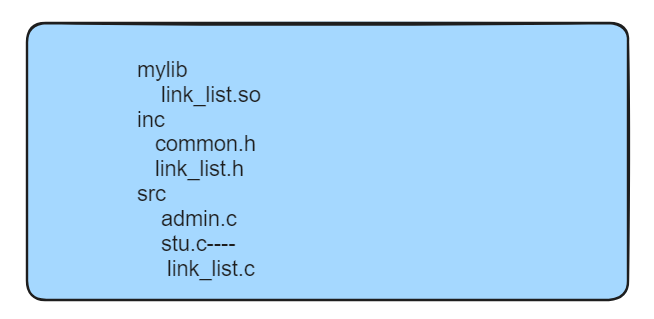
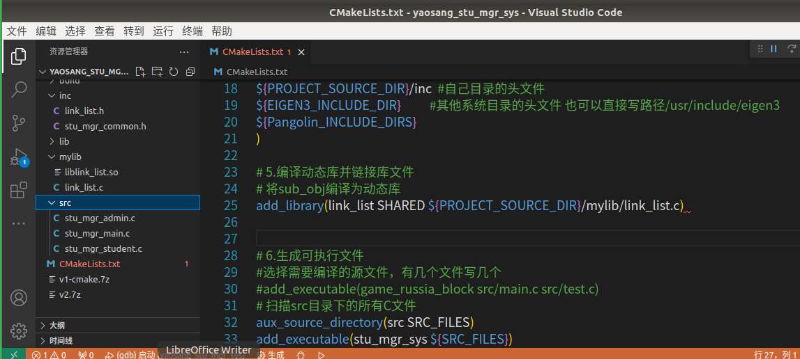

# linux库文件制作

## 一、课程介绍

- 库文件的作用（理解）

- 概念(了解)
- 分类(了解)
- 命名(理解)
- 制作与使用(熟练)

## 二、概述

### 1、为什么需要

**库文件的作用包括代码重用、提高程序效率、简化代码维护、便于模块化更新和跨平台开发。**

* 代码重用。库文件包含常用的函数、类或模块，可以方便地被不同的应用程序重复使用，从而减少代码量，提高代码的可维护性和复用性。
* 提高程序效率。库文件通常是经过高度优化和测试的，可以避免重复编写已有的功能，节省开发时间。
* 简化代码维护。将大工程划分为多个模块，每个模块作为独立的库，可以单独维护，只要库的交互头文件不改动，库内部的修改对其他部分是透明的。
* 模块化更新和跨平台开发。通过添加特定平台的库文件，可以实现跨平台的功能适配，保证程序在不同平台上的运行一致性。
* 保密作用。库文件可以封装底层函数实体，提供给用户可执行代码的二进制形式，同时保护底层实现细节。
* 加快项目开发。通过将大工程划分为多个模块，每个模块作为独立的库，可以加快开发速度，提高开发效率。

### 2、是什么

库文件一般就是编译好的二进制文件，用于在链接阶段同目标代码一起生成可执行文件，或者运行可执行文件的时候被加载，以便调用库文件中的某段代码。库文件无法直接执行，因为它的源代码中没有入口主函数，而只是一些函数模块的定义和实现，所以无法直接执行。程序库使程序更加模块化，重新编译更快，更新更容易。

### 3、分类

#### 3.1、静态库（类似于书店，只卖不借）

在编译程序的时候静态库的内容会被完成的复制到程序的内部，

* 优点
  当我们运行该程序是不会出现缺失的问题
* 缺点
  不利于更能的更新
  需要占用更多的内存

#### 3.2、动态库（类似于图书馆， 只借不买）

在编译的时候动态库并没被复制到程序中， 而是检查将否是否异常*（参数、返回值、函数名...）

* 优点
  相对于静态库来说占用更少的内存
  对程序执行的效率有一定的提升
* 缺点
  当程序执行的时候需要有动态库的支持

### 4、命名

* 使用lib作为前缀： 比如 libDeployPkg.so.0 / libhgfs.so.0 .....
* 静态库一般以 .a 为后缀 ， 动态库一般以.so为后缀
* 库文件会有不同的版本， 一般写在后缀后面， 比如 lib.a.so.0.1.2

  > 1 libc.so.1.0.3
  > 2 lib 库文件的前缀
  > 的名字（链接库文件时 ，只需要写上该名字）.so 后缀（so为动态库/共享库 a 则是静态库）
  > 5 .1 库文件的版本号
  > 6 .0.3 修正号

## 三、制作与使用

不管需要制作的是静态库还是动态库，原材料都是.o文件 （可重定位文件）
库文件内部不允许出现主函数main

> gcc -c xxx.c -o xxx.o

### 1、静态库的制作

#### 1.1、* 先获得.o文件

> gcc -c src/add.c -o obj/add.o -I inc
> gcc -c src/sub.c -o obj/sub.o -I inc
> gcc -c src/main.c -o obj/main.o -I inc

#### 1.2、* 把以上生成的两个.o文件一起编译生成静态库文件

> ar -rcs lib/libmymath.a obj/add.o obj/sub.o

#### 1.3、* 何使用静态库文件

> $ gcc obj/main.o  -I inc -L lib -l mymath -o bin/mymath


### 2、动态库的制作

#### 2.1、先获得.o文库

> gcc -c src/add.c -o obj/add.o -I inc-fPIC
> gcc -c src/sub.c -o obj/sub.o -I inc-fPIC
> gcc -c src/main.c -o obj/main.o -I inc-fPIC

#### 2.2、把.o 文件制作成动态链接库

> gcc -shared -fPIC -o lib/libmymath.so obj/add.o obj/sub.o

#### 2.3、如何使用动态链接

编译

> gcc obj/main.o -I./inc -L lib -l mymath -o bin/mymath

#### 2.4、运行

动态库一定要指定路径

> export LD_LIBRARY_PATH=/home/lee/文档/cpp/code/lib:$LD_LIBRARY_PATH

## 四、静态库动态库相结合使用

```shell
gcc -c src/add.c -o obj/add.o -I inc
gcc -c src/sub.c -o obj/sub.o -I inc -fPIC
gcc -c src/main.c -o obj/main.o -I inc
ar -rcs lib/libadd.a obj/add.o
gcc -shared -fPIC -o lib/libsub.so obj/sub.o
gcc obj/main.o -I./inc -L lib -l sub  -o bin/mymath lib/libadd.a
```

## 五、CMake编译

```cmake
 
# 添加头文件搜索路径  
include_directories(inc)  

# 将add_obj编译为静态库  
add_library(add_static src/add.c)  
  
# 将sub_obj编译为动态库  
add_library(sub_shared SHARED src/sub.c)  
  
# 编译main.c，并链接到静态库和动态库  
add_executable(main src/main.c)  

target_link_libraries(main PRIVATE add_static sub_shared)  

SET_TARGET_PROPERTIES(main PROPERTIES BUILD_RPATH ".")
```


## 六、链接库项目实战

### 1 需求

​     原来学生管理系统，其实是需要做crud，对于插入与删除，需要移动位置。来让空间利用率变高。  原因是底层用了连续空间的数组。    ----这种数据结构不行了，**换成链表**


​     **期望，把链表封装为链接库！ 对于提供方有安全保障，对于使用放不用重复造轮子。**

### 2 设计与架构



​			link_list.c挪动到mylib下面

### 3 实现

#### 3.1 集成cmake

​       一把梭哈

#### 3.2 把数组改成链表

- 原来只能存int的数据？ 现在想存Student的结构体，以后想存，不球知道的。 真个类型是不确定的。

  ```c
  list.h
  typedef struct NODE Node,*PNode;
  struct NODE
  {
      void*    data;
      Node* next;
      Node* pre;
  };
  
  // 创建节点
  Node* NewNode(void* data);
  // 删除节点，并保持链表的连续性
  void DeleteNode(Node* node);
  
  // 链表数据对象
  typedef struct LIST List,*PList;
  struct LIST
  {
      Node* header;
      Node* tail;
      int         size;
  };
  
  // 创建链表
  List* CreateList();
  
  // 销毁链表
  void DestroyList(List* list);
  
  // 添加数据
  Node* Add(List* list, void* data);
  
  // 删除数据
  int Remove(List*list, int idx);
  int RemoveTail(List*list);
  
  // 获取某个数据
  int GetData(List* list, int idx);
  
  // 获取某个节点
  Node* GetNode(List* list, int idx);
  
  // 插入
  Node* Insert(List* list, int idx, void* data);
  
  int GetLenth(List* list);
  
  
  void ReverseList(List* list);
  ```

  ```c
  list.c
  #include "link_list.h"
  #include <memory.h>
  #include <stdlib.h>
  
  /* 创建节点
      data：创建节点时节点上需要赋的值
      返回：创建好的节点
  */
  Node* NewNode(void* data)
  {
      // 创建内存空间
      Node *node = (Node*)malloc(sizeof(Node));
  
      // 赋值
      node->data = data;
      node->next = NULL;
      node->pre = NULL;
  
      // 返回
      return node;
  }
  
  /* 删除节点，并保持链表的连续性
      node : 需要删除的节点
  */
  void DeleteNode(Node *node)
  {
      // 判断合法性
      if (node == NULL)
          return;
  
      // 找到前一个节点，将他指向下一个节点
      if (node->pre != NULL)
          node->pre->next = node->next;
  
      // 找到后一个节点，将他指向前一个节点
      if (node->next != NULL)
          node->next->pre = node->pre;
  
      // 释放空间
      free(node);
  }
  
  List *CreateList()
  {
      // 申请空间
      List *list = (List*)malloc(sizeof(List));
  
      // 赋初值
      list->header = NULL;
      list->tail = NULL;
  
      // 返回创建好的链表对象
      return list;
  }
  
  void DestroyList(List *list)
  {
      // 检测合法性
      if (list == NULL)
          return;
  
      // 节点删除干净
      Node *curNode = list->header;
      while (curNode != NULL)
      {
          // 留下下一个节点指针
          Node *node = curNode->next;
  
          // 删除当前节点
          DeleteNode(curNode);
  
          // 游标指向下一个节点
          curNode = node;
      }
  
      // 释放链表对象空间
      free(list);
  }
  
  // 添加数据
  Node *Add(List *list, void* data)
  {
      // 判断合法性
      if (list == NULL)
          return NULL;
  
      // 创建节点
      Node *node = NewNode(data);
  
      // 把节点加入到链表
      //      加到尾巴
      //          判断尾巴的数据如果存在，就要把尾巴的next指向当前节点
      if (list->tail != NULL)
      {
          list->tail->next = node;
          node->pre = list->tail;
      }
      //          tail = node;
      list->tail = node;
  
      //     头指针如果是空的，也要加到头上
      if (list->header == NULL)
          list->header = node;
  
      // 返回节点
      list->size++;
      return node;
  }
  
  // 删除数据
  int Remove(List *list, int idx)
  {
      // 判断合法性
      if (list == NULL)
          return NULL;
  
      // 找到节点
      Node* node = GetNode(list, idx);
  
      // 记录节点的数据
      int ret = node->data;
  
      // 删除节点
      DeleteNode(node);
  
      return ret;
  }
  
  int RemoveTail(List *list)
  {
      // 判断合法性
      if (list == NULL)
          return NULL;
  
      //记录当前的尾巴
      Node* newTail = list->tail->pre;
  
      // 把尾巴删掉
      DeleteNode(list->tail);
  
      // 重新设置尾巴
      list->tail = newTail;
  }
  
  // 获取某个数据
  int GetData(List *list, int idx)
  {
      // 判断合法性
      if (list == NULL)
          return 0;
  
      Node *node = GetNode(list, idx);
      if(node==NULL)
          return 0;
      return node->data;
  }
  
  // 获取某个节点
  Node *GetNode(List *list, int idx)
  {
      // 判断合法性
      if (list == NULL)
          return NULL;
  
      // 从头开始找
      Node *node = list->header;
      int curIdx = 0;
      while (node != NULL)
      {
          if (curIdx >= idx)
          {
              return node;
          }
  
          node = node->next;
          ++curIdx;
      }
      return NULL;
  }
  
  
  // 插入
  Node* Insert(List* list, int idx,void* data)
  {
      // 判断合法性
      if (list == NULL)
          return NULL;
  
      int len = GetLenth(list);
      if(idx<0 || idx>len)
          return NULL;
  
      Node* newNode = NewNode(data);
  
      // 找到插入位置的节点
      Node* node = GetNode(list, idx);
  
      // 找到前一个节点
      Node* preNode = NULL;
      if(idx>0)
          preNode = GetNode(list, idx-1);//node->pre;
  
      // 找到下一个节点,如果存在,建立下一个节点的关系
      if(node!=NULL)
      {
          node->pre = newNode;
          newNode->next = node;
      }else
      {
          list->tail = newNode;
      }
      
      // 找到前一个节点,如果存在,建立与前驱的关系
      if(preNode!=NULL){
          preNode->next = newNode;
          newNode->pre = preNode;
      }else
      {
          list->header = newNode;
      }
  
      return newNode;
  }
  
  int GetLenth(List* list)
  {
      // 从头开始找
      Node *node = list->header;
      int curIdx = 0;
      while (node != NULL)
      {
          node = node->next;
          ++curIdx;
      }
      return curIdx;
  }
  
  
  void ReverseList(List* list)
  {
      // 判断合法性
      if (list == NULL)
          return NULL;
  
      Node *node = list->header;
      while (node != NULL)
      {
          Node* temp = node->next;
          node->next = node->pre;
          node->pre = temp;
  
          node = node->pre;
      }
      node = list->header;
      list->header = list->tail;
      list->tail = node;
  }
  ```

  

- 初始化和列表

  ```c
  #include "link_list.h"
  #include "stu_mgr_common.h"
  //==========存放数据的数据结构===============//
  
   List* list=NULL;
  //struct Student students[20] ;
  //int size = 0; //放了多少个，对应的位置size-1
  //==========存放数据的数据结构===============//
  //==========写函数的区域===============//
  //需要一个函数来进行模块化编程专门用来做登录
  //cant use local variable,because,function used,stack destryed!
  
      struct Student student1 = {1,"student1",1,"133","极乐世界"};
      struct Student student2 = {2,"student2",0,"134","极乐世界1"};
      struct Student student3 = {3,"student3",1,"135","极乐世界2"};
      struct Student student4 = {4,"student4",0,"136","极乐世界"};
      struct Student student5 = {5,"student5",1,"137","极乐世界"};
  
  void init_students(){
  
  
      list   = CreateList();
  
      Add(list,&student1);
      Add(list,&student2);
      Add(list,&student3);
      Add(list,&student4);
      Add(list,&student5);
  }
  
  
  //列表所有学生
  void show_students(){
      //表头
      printf("编号\t姓名\t性别\t电话\t地址\n");
      //遍历所有数据，一行一行的搞出来
  
       Node *node = list->header;
      //遍历所有数据，一行一行的搞出来
      while (node)
      {
          struct Student* stu =  node->data;
          printf("%d\t%s\t%s\t%s\t%s\n",stu->id,stu->name,stu->sex==1?"男":"女",stu->phone,stu->address);
          node = node->next;
      }
  
        //再提示它做下一个操作
          show_menus();
        
  }
  
  
  ```

  

- 添加

    尾部插入。。。

- 插入

   insert(litst,index,data)

- 删除

  ```c
  void del_stu(){
       //让用户输入学生编号
      printf("请输入要查询的学生id:");
      int id = 0;
      scanf("%d",&id);
      //遍历数组查询拿个学生,赋值为为{0}
      Node *node = list->header;
      while(node){
          struct Student *stu   =  node->data;
          int stu_id = stu->id;
          if (stu_id==id)
          {
              DeleteNode(node);
              break;
          }
          node = node->next;
          
      }
  
      //列表学员
      show_students();
  }
  ```

  

- 修改

  通过指针直接改值就OK了

- 查询

   


**注意：添加或者插入，不用在函数内  struct Student student1 = {1,"student1",1,"133","极乐世界"};，要使用maloc来开辟堆空间。**

#### 3.3封装链接库

  链接库源码和可执行程序源码的隔离




```cmake

#前提 指定版本和名称
cmake_minimum_required(VERSION 3.0.0)
project(stu_mgr_sys VERSION 0.1.0 LANGUAGES C)

include(CTest)
enable_testing()


# 2.需要的依赖库 现在没有

# 3.设置可执行文件与链接库保存的路径
set(EXECUTABLE_OUTPUT_PATH ${PROJECT_SOURCE_DIR}/bin)
set(LIBRARY_OUTPUT_PATH ${PROJECT_SOURCE_DIR}/mylib)

# 4.设置头文件目录使得系统可以找到对应的头文件
include_directories(
${PROJECT_SOURCE_DIR}/inc  #自己目录的头文件
${EIGEN3_INCLUDE_DIR}          #其他系统目录的头文件 也可以直接写路径/usr/include/eigen3
${Pangolin_INCLUDE_DIRS}
)

# 5.编译动态库并链接库文件
# 将sub_obj编译为动态库 
add_library(link_list SHARED ${PROJECT_SOURCE_DIR}/mylib/link_list.c) 


# 6.生成可执行文件
#选择需要编译的源文件，有几个文件写几个
#add_executable(game_russia_block src/main.c src/test.c)
# 扫描src目录下的所有C文件
aux_source_directory(src SRC_FILES)
add_executable(stu_mgr_sys ${SRC_FILES})


target_link_libraries(stu_mgr_sys PRIVATE link_list)  

set(CPACK_PROJECT_NAME ${PROJECT_NAME})
set(CPACK_PROJECT_VERSION ${PROJECT_VERSION})

# 设置 C 编译器为 gcc，并设置 C99 标准选项
#set(C_STANDARD 99)
set(CMAKE_C_COMPILER gcc)


include(CPack)


```


#### 3.4 测试OK

## 七 练习

1. 自行制作并使用静态库文件。
2. 自行制作并使用动态库文件。

