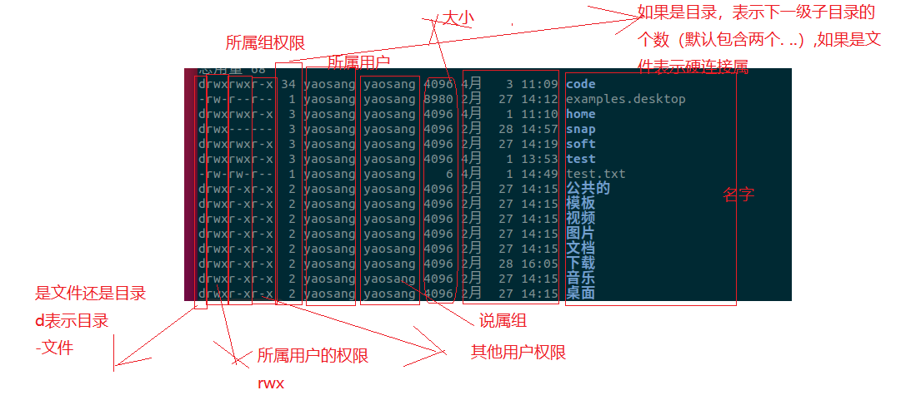
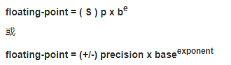

# 标准库的使用

## 一、课程介绍

- 是什么
- 为什么需要
- 使用

## 二、是什么

*C 标准库是一组 C 内置（不需要额外安装）函数、常量和头文件，比如 <stdio.h>、<stdlib.h>、<math.h>，等等。这个标准库可以作为 C 程序员的参考手册。*

## 四  为什么需要

1. **提供基本功能支持：** 标准库包含了许多常用的函数和数据结构，如字符串处理、内存分配、输入输出等。这些功能是编程过程中必不可少的，使用标准库可以避免重复编写这些功能，提高开发效率。
2. **可移植性：** 标准库的函数和数据结构在不同的操作系统和平台上通常具有相同的接口和行为，这增强了代码的可移植性。通过使用标准库，可以使得编写的代码能够在不同的系统上编译和运行，而不需要针对每个平台进行特定的调整。
3. **标准化：** 标准库是由编程社区广泛接受和认可的，其中的函数和数据结构经过了严格的测试和验证，保证了其稳定性和可靠性。因此，使用标准库可以降低出错的可能性，提高代码的质量。
4. **性能优化：** 标准库的实现通常经过了优化，能够在不同的平台上提供高性能的功能。通过使用标准库，可以充分利用这些优化，提高程序的性能。

## 五、使用场景

​	标准库的使用场景非常广泛，几乎适用于任何需要编程的领域。以下是一些常见的使用场景：

1. **命令行工具开发：** 当你需要编写命令行工具时，标准库中的输入输出函数（如 `printf()` 和 `scanf()`）可以帮助你与用户进行交互，并且标准库中还提供了文件操作函数，可以方便地读写文件。
2. **系统编程：** 在进行系统编程时，标准库提供了与操作系统交互的函数，如文件操作、进程控制、内存管理等。这些功能使得编写与操作系统交互的代码变得更加简单和可靠。
3. **应用程序开发：** 在开发应用程序时，标准库提供了丰富的功能和数据结构，如动态内存分配、字符串处理、时间日期处理、排序算法等，可以大大简化开发过程。
4. **网络编程：** 标准库中提供了一些网络编程的功能，如套接字操作、网络通信等，这些功能可以帮助你编写客户端和服务器程序。
5. **科学计算和数学应用：** 标准库中提供了许多数学函数，如三角函数、指数函数、对数函数等，以及一些常见的数学常数，这些函数可以用于科学计算、统计分析、数据处理等领域。
6. **图形界面开发：** 虽然标准库本身并不提供图形界面开发的功能，但是可以与其他库（如GTK、Qt等）配合使用，来开发图形界面应用程序。

总的来说，标准库适用于几乎所有的编程场景，它提供了丰富的功能和数据结构，可以帮助开发者更加高效地编写程序，并且具有良好的可移植性和稳定性。

## 六、使用

​	C 标准库是一组 C 内置函数、常量和头文件。这个标准库可以作为 C 程序员的参考手册。	不知道头文件在终端执行"man api"


termios.h unistd.h

#include <sys/time.h>

### 1   stdbool.h 讲过

```
#include <stdbool.h> 

int main(void)
{
	printf("%d, %d\n", true, false); // 1, 0
    return 0;
}
```


### 2 <string.h>  ---讲过

定义了一个变量类型、一个宏和各种操作字符数组的函数。

**库变量**

下面是头文件 string.h 中定义的变量类型：

| 序号 | 变量 & 描述                                                  |
| :--- | :----------------------------------------------------------- |
| 1    | **size_t** 这是无符号整数类型，它是 **sizeof** 关键字的结果。 |

**库宏**

下面是头文件 string.h 中定义的宏：

| 序号 | 宏 & 描述                             |
| :--- | :------------------------------------ |
| 1    | **NULL** 这个宏是一个空指针常量的值。 |

**库函数**

下面是头文件 string.h 中定义的函数：

| 序号 | 函数 & 描述                                                  |
| :--- | :----------------------------------------------------------- |
| 1    | [void *memchr(const void *str, int c, size_t n)](https://www.runoob.com/cprogramming/c-function-memchr.html) 在参数 *str* 所指向的字符串的前 n 个字节中搜索第一次出现字符 c（一个无符号字符）的位置。 |
| 2    | [int memcmp(const void *str1, const void *str2, size_t n)](https://www.runoob.com/cprogramming/c-function-memcmp.html) 把 *str1* 和 *str2* 的前 n 个字节进行比较。 |
| 3    | [void *memcpy(void *dest, const void *src, size_t n)](https://www.runoob.com/cprogramming/c-function-memcpy.html) 从 src 复制 n 个字符到 *dest*。 |
| 4    | [void *memmove(void *dest, const void *src, size_t n)](https://www.runoob.com/cprogramming/c-function-memmove.html) 另一个用于从 *src* 复制 n 个字符到 *dest* 的函数。 |
| 5    | [void *memset(void *str, int c, size_t n)](https://www.runoob.com/cprogramming/c-function-memset.html) 复制字符 c（一个无符号字符）到参数 *str* 所指向的字符串的前 n 个字符。 |
| 6    | [char *strcat(char *dest, const char *src)](https://www.runoob.com/cprogramming/c-function-strcat.html) 把 *src* 所指向的字符串追加到 *dest* 所指向的字符串的结尾。 |
| 7    | [char *strncat(char *dest, const char *src, size_t n)](https://www.runoob.com/cprogramming/c-function-strncat.html) 把 *src* 所指向的字符串追加到 *dest* 所指向的字符串的结尾，直到 n 字符长度为止。 |
| 8    | [char *strchr(const char *str, int c)](https://www.runoob.com/cprogramming/c-function-strchr.html) 在参数 *str* 所指向的字符串中搜索第一次出现字符 c（一个无符号字符）的位置。 |
| 9    | [int strcmp(const char *str1, const char *str2)](https://www.runoob.com/cprogramming/c-function-strcmp.html) 把 *str1* 所指向的字符串和 *str2* 所指向的字符串进行比较。 |
| 10   | [int strncmp(const char *str1, const char *str2, size_t n)](https://www.runoob.com/cprogramming/c-function-strncmp.html) 把 *str1* 和 *str2* 进行比较，最多比较前 n 个字节。 |
| 11   | [int strcoll(const char *str1, const char *str2)](https://www.runoob.com/cprogramming/c-function-strcoll.html) 把 *str1* 和 *str2* 进行比较，结果取决于 LC_COLLATE 的位置设置。 |
| 12   | [char *strcpy(char *dest, const char *src)](https://www.runoob.com/cprogramming/c-function-strcpy.html) 把 *src* 所指向的字符串复制到 *dest*。 |
| 13   | [char *strncpy(char *dest, const char *src, size_t n)](https://www.runoob.com/cprogramming/c-function-strncpy.html) 把 *src* 所指向的字符串复制到 *dest*，最多复制 n 个字符。 |
| 14   | [size_t strcspn(const char *str1, const char *str2)](https://www.runoob.com/cprogramming/c-function-strcspn.html) 检索字符串 str1 开头连续有几个字符都不含字符串 str2 中的字符。 |
| 15   | [char *strerror(int errnum)](https://www.runoob.com/cprogramming/c-function-strerror.html) 从内部数组中搜索错误号 errnum，并返回一个指向错误消息字符串的指针。 |
| 16   | [size_t strlen(const char *str)](https://www.runoob.com/cprogramming/c-function-strlen.html) 计算字符串 str 的长度，直到空结束字符，但不包括空结束字符。 |
| 17   | [char *strpbrk(const char *str1, const char *str2)](https://www.runoob.com/cprogramming/c-function-strpbrk.html) 检索字符串 *str1* 中第一个匹配字符串 *str2* 中字符的字符，不包含空结束字符。也就是说，依次检验字符串 str1 中的字符，当被检验字符在字符串 str2 中也包含时，则停止检验，并返回该字符位置。 |
| 18   | [char *strrchr(const char *str, int c)](https://www.runoob.com/cprogramming/c-function-strrchr.html) 在参数 *str* 所指向的字符串中搜索最后一次出现字符 c（一个无符号字符）的位置。 |
| 19   | [size_t strspn(const char *str1, const char *str2)](https://www.runoob.com/cprogramming/c-function-strspn.html) 检索字符串 *str1* 中第一个不在字符串 *str2* 中出现的字符下标。 |
| 20   | [char *strstr(const char *haystack, const char *needle)](https://www.runoob.com/cprogramming/c-function-strstr.html) 在字符串 *haystack* 中查找第一次出现字符串 *needle*（不包含空结束字符）的位置。 |
| 21   | [char *strtok(char *str, const char *delim)](https://www.runoob.com/cprogramming/c-function-strtok.html) 分解字符串 *str* 为一组字符串，*delim* 为分隔符。 |
| 22   | [size_t strxfrm(char *dest, const char *src, size_t n)](https://www.runoob.com/cprogramming/c-function-strxfrm.html) 根据程序当前的区域选项中的 LC_COLLATE 来转换字符串 **src** 的前 **n** 个字符，并把它们放置在字符串 **dest** 中。 |

**strlen**

**strcpy**

**strcmp**

strtok  用得不到      标准库是有确点的，不够强大。      **glib**


### 3  <stdarg.h>  讲过

定义了一个变量类型 **va_list** 和三个宏，这三个宏可用于在参数个数未知（即参数个数可变）时获取函数中的参数。

可变参数的函数通在参数列表的末尾是使用省略号(,...)定义的。

**库变量**

下面是头文件 stdarg.h 中定义的变量类型：

| 序号 | 变量 & 描述                                                  |
| :--- | :----------------------------------------------------------- |
| 1    | **va_list** 这是一个适用于 **va_start()、va_arg()** 和 **va_end()** 这三个宏存储信息的类型。 |

**库宏**

下面是头文件 stdarg.h 中定义的宏：

| 序号 | 宏 & 描述                                                    |
| :--- | :----------------------------------------------------------- |
| 1    | [void va_start(va_list ap, last_arg)](https://www.runoob.com/cprogramming/c-macro-va_start.html) 这个宏初始化 **ap** 变量，它与 **va_arg** 和 **va_end** 宏是一起使用的。**last_arg** 是最后一个传递给函数的已知的固定参数，即省略号之前的参数。 |
| 2    | [type va_arg(va_list ap, type)](https://www.runoob.com/cprogramming/c-macro-va_arg.html) 这个宏检索函数参数列表中类型为 **type** 的下一个参数。 |
| 3    | [void va_end(va_list ap)](https://www.runoob.com/cprogramming/c-macro-va_end.html) 这个宏允许使用了 **va_start** 宏的带有可变参数的函数返回。如果在从函数返回之前没有调用 **va_end**，则结果为未定义。 |

```c
#include <stdio.h>
#include <stdarg.h>


int sum(int num,...);

int sum(int num,...){ //2（有几个参数）,1,2
    //定义一个参数列表的变量
    va_list list; //

    //参数列表赋值  2 12
    va_start(list,num); //list表示前面参数，
    //num最后一个参数，在这个位置以最后一个参数代表传入数量  2 12

    //把每一个都读出来
    int sum = 0;
    for (int i = 0; i < num; i++)
    {
        sum = sum + va_arg(list,int);
    }

    //释放list
    va_end(list);
    return sum;

}


int main(int argc, char const *argv[])
{
    printf("%d\n",sum(2,1,2)); //3
    printf("%d\n",sum(4,1,2,3,4)); //0
    return 0;
}


#include <stdio.h>
#include <stdarg.h>

void my_printf(const char* format, ...) {
    va_list args;
    va_start(args, format);

    while (*format != '\0') {
        if (*format == '%') {
            format++; // 移动到占位符的下一个字符

            if (*format == 'd') {
                int value = va_arg(args, int);
                printf("%d", value);
            } else if (*format == 'f') {
                double value = va_arg(args, double);
                printf("%f", value);
            } else if (*format == 's') {
                char* value = va_arg(args, char*);
                printf("%s", value);
            } else if (*format == 'c') {
                int value = va_arg(args, int);
                printf("%c", value);
            } else {
                printf("Unsupported format specifier: %c", *format);
            }
        } else {
            printf("%c", *format);
        }

        format++; // 移动到下一个字符
    }

    va_end(args);
}

```


### 4 <math.h> ---重点讲

定义了各种数学函数和一个宏。在这个库中所有可用的功能都带有一个 **double** 类型的参数，且都返回 **double** 类型的结果。

**库宏**

下面是这个库中定义的唯一的一个宏：

| 序号 | 宏 & 描述                                                    |
| :--- | :----------------------------------------------------------- |
| 1    | **HUGE_VAL** 当函数的结果不可以表示为浮点数时。如果是因为结果的幅度太大以致于无法表示，则函数会设置 errno 为 ERANGE 来表示范围错误，并返回一个由宏 HUGE_VAL 或者它的否定（- HUGE_VAL）命名的一个特定的很大的值。如果结果的幅度太小，则会返回零值。在这种情况下，error 可能会被设置为 ERANGE，也有可能不会被设置为 ERANGE。 |

**库函数**

下面列出了头文件 math.h 中定义的函数：

| 序号 | 函数 & 描述                                                  |
| :--- | :----------------------------------------------------------- |
| 1    | [double acos(double x)](https://www.runoob.com/cprogramming/c-function-acos.html) 返回以弧度表示的 x 的反余弦。 |
| 2    | [double asin(double x)](https://www.runoob.com/cprogramming/c-function-asin.html) 返回以弧度表示的 x 的反正弦。 |
| 3    | [double atan(double x)](https://www.runoob.com/cprogramming/c-function-atan.html) 返回以弧度表示的 x 的反正切。 |
| 4    | [double atan2(double y, double x)](https://www.runoob.com/cprogramming/c-function-atan2.html) 返回以弧度表示的 y/x 的反正切。y 和 x 的值的符号决定了正确的象限。 |
| 5    | [double cos(double x)](https://www.runoob.com/cprogramming/c-function-cos.html) 返回弧度角 x 的余弦。 |
| 6    | [double cosh(double x)](https://www.runoob.com/cprogramming/c-function-cosh.html) 返回 x 的双曲余弦。 |
| 7    | [double sin(double x)](https://www.runoob.com/cprogramming/c-function-sin.html) 返回弧度角 x 的正弦。 |
| 8    | [double sinh(double x)](https://www.runoob.com/cprogramming/c-function-sinh.html) 返回 x 的双曲正弦。 |
| 9    | [double tanh(double x)](https://www.runoob.com/cprogramming/c-function-tanh.html) 返回 x 的双曲正切。 |
| 10   | [double exp(double x)](https://www.runoob.com/cprogramming/c-function-exp.html) 返回 e 的 x 次幂的值。 |
| 11   | [double frexp(double x, int *exponent)](https://www.runoob.com/cprogramming/c-function-frexp.html) 把浮点数 x 分解成尾数和指数。返回值是尾数，并将指数存入 exponent 中。所得的值是 x = mantissa * 2 ^ exponent。 |
| 12   | [double ldexp(double x, int exponent)](https://www.runoob.com/cprogramming/c-function-ldexp.html) 返回 x 乘以 2 的 exponent 次幂。 |
| 13   | [double log(double x)](https://www.runoob.com/cprogramming/c-function-log.html) 返回 x 的自然对数（基数为 e 的对数）。 |
| 14   | [double log10(double x)](https://www.runoob.com/cprogramming/c-function-log10.html) 返回 x 的常用对数（基数为 10 的对数）。 |
| 15   | [double modf(double x, double *integer)](https://www.runoob.com/cprogramming/c-function-modf.html) 返回值为小数部分（小数点后的部分），并设置 integer 为整数部分。 |
| 16   | [double pow(double x, double y)](https://www.runoob.com/cprogramming/c-function-pow.html) 返回 x 的 y 次幂。 |
| 17   | [double sqrt(double x)](https://www.runoob.com/cprogramming/c-function-sqrt.html) 返回 x 的平方根。 |
| 18   | [double ceil(double x)](https://www.runoob.com/cprogramming/c-function-ceil.html) 返回大于或等于 x 的最小的整数值。 |
| 19   | [double fabs(double x)](https://www.runoob.com/cprogramming/c-function-fabs.html) 返回 x 的绝对值。 |
| 20   | [double floor(double x)](https://www.runoob.com/cprogramming/c-function-floor.html) 返回小于或等于 x 的最大的整数值。 |
| 21   | [double fmod(double x, double y)](https://www.runoob.com/cprogramming/c-function-fmod.html) 返回 x 除以 y 的余数。 |

```c
#include <stdio.h>
#include <math.h>

int main(int argc, char const *argv[])
{
   printf("%lf\n", ceil(3.1));  //4
    printf("%lf\n", ceil(3.8));  //4
   printf("%lf\n", floor(2.9));  //2
    printf("%lf\n", floor(2.1)); //2
    return 0;
}

```


### 5 <stdio.h>  ---重点讲   *****

​	定义了三个变量类型、一些宏和各种函数来执行输入和输出。

**库变量**

下面是头文件 stdio.h 中定义的变量类型：

| 序号 | 变量 & 描述                                                  |
| :--- | :----------------------------------------------------------- |
| 1    | **size_t** 这是无符号整数类型，它是 **sizeof** 关键字的结果。 |
| 2    | **FILE** 这是一个适合存储文件流信息的对象类型。              |
| 3    | **fpos_t** 这是一个适合存储文件中任何位置的对象类型。        |

**库宏**

下面是头文件 stdio.h 中定义的宏：

| 序号 | 宏 & 描述                                                    |
| :--- | :----------------------------------------------------------- |
| 1    | **NULL** 这个宏是一个空指针常量的值。                        |
| 2    | **_IOFBF、_IOLBF** 和 **_IONBF** 这些宏扩展了带有特定值的整型常量表达式，并适用于 **setvbuf** 函数的第三个参数。 |
| 3    | **BUFSIZ** 这个宏是一个整数，该整数代表了 **setbuf** 函数使用的缓冲区大小。 |
| 4    | **EOF** 这个宏是一个表示已经到达文件结束的负整数。           |
| 5    | **FOPEN_MAX** 这个宏是一个整数，该整数代表了系统可以同时打开的文件数量。 |
| 6    | **FILENAME_MAX** 这个宏是一个整数，该整数代表了字符数组可以存储的文件名的最大长度。如果实现没有任何限制，则该值应为推荐的最大值。 |
| 7    | **L_tmpnam** 这个宏是一个整数，该整数代表了字符数组可以存储的由 tmpnam 函数创建的临时文件名的最大长度。 |
| 8    | **SEEK_CUR、SEEK_END** 和 **SEEK_SET** 这些宏是在 **fseek** 函数中使用，用于在一个文件中定位不同的位置。 |
| 9    | **TMP_MAX** 这个宏是 tmpnam 函数可生成的独特文件名的最大数量。 |
| 10   | **stderr、stdin** 和 **stdout** 这些宏是指向 FILE 类型的指针，分别对应于标准错误、标准输入和标准输出流。 |

**库函数**

下面是头文件 stdio.h 中定义的函数：

> 为了更好地理解函数，请按照下面的序列学习这些函数，因为第一个函数中创建的文件会在后续的函数中使用到。

| 序号 | 函数 & 描述                                                  |
| :--- | :----------------------------------------------------------- |
| 1    | [int fclose(FILE *stream)](https://www.runoob.com/cprogramming/c-function-fclose.html) 关闭流 stream。刷新所有的缓冲区。 |
| 2    | [void clearerr(FILE *stream)](https://www.runoob.com/cprogramming/c-function-clearerr.html) 清除给定流 stream 的文件结束和错误标识符。 |
| 3    | [int feof(FILE *stream)](https://www.runoob.com/cprogramming/c-function-feof.html) 测试给定流 stream 的文件结束标识符。 |
| 4    | [int ferror(FILE *stream)](https://www.runoob.com/cprogramming/c-function-ferror.html) 测试给定流 stream 的错误标识符。 |
| 5    | [int fflush(FILE *stream)](https://www.runoob.com/cprogramming/c-function-fflush.html) 刷新流 stream 的输出缓冲区。 |
| 6    | [int fgetpos(FILE *stream, fpos_t *pos)](https://www.runoob.com/cprogramming/c-function-fgetpos.html) 获取流 stream 的当前文件位置，并把它写入到 pos。 |
| 7    | [FILE *fopen(const char *filename, const char *mode)](https://www.runoob.com/cprogramming/c-function-fopen.html) 使用给定的模式 mode 打开 filename 所指向的文件。 |
| 8    | [size_t fread(void *ptr, size_t size, size_t nmemb, FILE *stream)](https://www.runoob.com/cprogramming/c-function-fread.html) 从给定流 stream 读取数据到 ptr 所指向的数组中。 |
| 9    | [FILE *freopen(const char *filename, const char *mode, FILE *stream)](https://www.runoob.com/cprogramming/c-function-freopen.html) 把一个新的文件名 filename 与给定的打开的流 stream 关联，同时关闭流中的旧文件。 |
| 10   | [int fseek(FILE *stream, long int offset, int whence)](https://www.runoob.com/cprogramming/c-function-fseek.html) 设置流 stream 的文件位置为给定的偏移 offset，参数 *offset* 意味着从给定的 *whence* 位置查找的字节数。 |
| 11   | [int fsetpos(FILE *stream, const fpos_t *pos)](https://www.runoob.com/cprogramming/c-function-fsetpos.html) 设置给定流 stream 的文件位置为给定的位置。参数 *pos* 是由函数 fgetpos 给定的位置。 |
| 12   | [long int ftell(FILE *stream)](https://www.runoob.com/cprogramming/c-function-ftell.html) 返回给定流 stream 的当前文件位置。 |
| 13   | [size_t fwrite(const void *ptr, size_t size, size_t nmemb, FILE *stream)](https://www.runoob.com/cprogramming/c-function-fwrite.html) 把 ptr 所指向的数组中的数据写入到给定流 stream 中。 |
| 14   | [int remove(const char *filename)](https://www.runoob.com/cprogramming/c-function-remove.html) 删除给定的文件名 filename，以便它不再被访问。 |
| 15   | [int rename(const char *old_filename, const char *new_filename)](https://www.runoob.com/cprogramming/c-function-rename.html) 把 old_filename 所指向的文件名改为 new_filename。 |
| 16   | [void rewind(FILE *stream)](https://www.runoob.com/cprogramming/c-function-rewind.html) 设置文件位置为给定流 stream 的文件的开头。 |
| 17   | [void setbuf(FILE *stream, char *buffer)](https://www.runoob.com/cprogramming/c-function-setbuf.html) 定义流 stream 应如何缓冲。 |
| 18   | [int setvbuf(FILE *stream, char *buffer, int mode, size_t size)](https://www.runoob.com/cprogramming/c-function-setvbuf.html) 另一个定义流 stream 应如何缓冲的函数。 |
| 19   | [FILE *tmpfile(void)](https://www.runoob.com/cprogramming/c-function-tmpfile.html) 以二进制更新模式(wb+)创建临时文件。 |
| 20   | [char *tmpnam(char *str)](https://www.runoob.com/cprogramming/c-function-tmpnam.html) 生成并返回一个有效的临时文件名，该文件名之前是不存在的。 |
| 21   | [int fprintf(FILE *stream, const char *format, ...)](https://www.runoob.com/cprogramming/c-function-fprintf.html) 发送格式化输出到流 stream 中。 |
| 22   | [int printf(const char *format, ...)](https://www.runoob.com/cprogramming/c-function-printf.html) 发送格式化输出到标准输出 stdout。 |
| 23   | [int sprintf(char *str, const char *format, ...)](https://www.runoob.com/cprogramming/c-function-sprintf.html) 发送格式化输出到字符串。 |
| 24   | [int vfprintf(FILE *stream, const char *format, va_list arg)](https://www.runoob.com/cprogramming/c-function-vfprintf.html) 使用参数列表发送格式化输出到流 stream 中。 |
| 25   | [int vprintf(const char *format, va_list arg)](https://www.runoob.com/cprogramming/c-function-vprintf.html) 使用参数列表发送格式化输出到标准输出 stdout。 |
| 26   | [int vsprintf(char *str, const char *format, va_list arg)](https://www.runoob.com/cprogramming/c-function-vsprintf.html) 使用参数列表发送格式化输出到字符串。 |
| 27   | [int fscanf(FILE *stream, const char *format, ...)](https://www.runoob.com/cprogramming/c-function-fscanf.html) 从流 stream 读取格式化输入。 |
| 28   | [int scanf(const char *format, ...)](https://www.runoob.com/cprogramming/c-function-scanf.html) 从标准输入 stdin 读取格式化输入。 |
| 29   | [int sscanf(const char *str, const char *format, ...)](https://www.runoob.com/cprogramming/c-function-sscanf.html) 从字符串读取格式化输入。 |
| 30   | [int fgetc(FILE *stream)](https://www.runoob.com/cprogramming/c-function-fgetc.html) 从指定的流 stream 获取下一个字符（一个无符号字符），并把位置标识符往前移动。 |
| 31   | [char *fgets(char *str, int n, FILE *stream)](https://www.runoob.com/cprogramming/c-function-fgets.html) 从指定的流 stream 读取一行，并把它存储在 str 所指向的字符串内。当读取 **(n-1)** 个字符时，或者读取到换行符时，或者到达文件末尾时，它会停止，具体视情况而定。 |
| 32   | [int fputc(int char, FILE *stream)](https://www.runoob.com/cprogramming/c-function-fputc.html) 把参数 char 指定的字符（一个无符号字符）写入到指定的流 stream 中，并把位置标识符往前移动。 |
| 33   | [int fputs(const char *str, FILE *stream)](https://www.runoob.com/cprogramming/c-function-fputs.html) 把字符串写入到指定的流 stream 中，但不包括空字符。 |
| 34   | [int getc(FILE *stream)](https://www.runoob.com/cprogramming/c-function-getc.html) 从指定的流 stream 获取下一个字符（一个无符号字符），并把位置标识符往前移动。 |
| 35   | [int getchar(void)](https://www.runoob.com/cprogramming/c-function-getchar.html) 从标准输入 stdin 获取一个字符（一个无符号字符）。 |
| 36   | [char *gets(char *str)](https://www.runoob.com/cprogramming/c-function-gets.html) 从标准输入 stdin 读取一行，并把它存储在 str 所指向的字符串中。当读取到换行符时，或者到达文件末尾时，它会停止，具体视情况而定。 |
| 37   | [int putc(int char, FILE *stream)](https://www.runoob.com/cprogramming/c-function-putc.html) 把参数 char 指定的字符（一个无符号字符）写入到指定的流 stream 中，并把位置标识符往前移动。 |
| 38   | [int putchar(int char)](https://www.runoob.com/cprogramming/c-function-putchar.html) 把参数 char 指定的字符（一个无符号字符）写入到标准输出 stdout 中。 |
| 39   | [int puts(const char *str)](https://www.runoob.com/cprogramming/c-function-puts.html) 把一个字符串写入到标准输出 stdout，直到空字符，但不包括空字符。换行符会被追加到输出中。 |
| 40   | [int ungetc(int char, FILE *stream)](https://www.runoob.com/cprogramming/c-function-ungetc.html) 把字符 char（一个无符号字符）推入到指定的流 stream 中，以便它是下一个被读取到的字符。 |
| 41   | [void perror(const char *str)](https://www.runoob.com/cprogramming/c-function-perror.html) 把一个描述性错误消息输出到标准错误 stderr。首先输出字符串 str，后跟一个冒号，然后是一个空格。 |
| 42   | [int snprintf(char *str, size_t size, const char *format, ...)](https://www.runoob.com/cprogramming/c-function-snprintf.html) 格式字符串到 str 中。 |

```c
#include <stdio.h>
#include <stdlib.h>
#include <fcntl.h> //linux文件操作
#include <unistd.h>
#include <sys/stat.h>

int main() {
    // 创建文件
    int fd = open("example.txt", O_CREAT | O_WRONLY | O_TRUNC, S_IRUSR | S_IWUSR);
    if (fd == -1) {
        perror("open");
        exit(EXIT_FAILURE);
    }

    // 写入数据到文件
    const char *data = "Hello, world!";
    ssize_t bytes_written = write(fd, data, strlen(data));
    if (bytes_written == -1) {
        perror("write");
        exit(EXIT_FAILURE);
    }

    // 关闭文件
    if (close(fd) == -1) {
        perror("close");
        exit(EXIT_FAILURE);
    }

    // 创建目录
    if (mkdir("example_dir", S_IRWXU) == -1) {
        perror("mkdir");
        exit(EXIT_FAILURE);
    }

    // 重命名文件
    if (rename("example.txt", "new_example.txt") == -1) {
        perror("rename");
        exit(EXIT_FAILURE);
    }

    // 删除文件
    if (unlink("new_example.txt") == -1) {
        perror("unlink");
        exit(EXIT_FAILURE);
    }

    // 删除目录
    if (rmdir("example_dir") == -1) {
        perror("rmdir");
        exit(EXIT_FAILURE);
    }

    printf("File and directory operations completed successfully.\n");

    return 0;
}


#include <stdio.h>
#include <string.h>
int main(int argc, char const *argv[])
{
  
  perror("error111111111111111111111\n");
   FILE *file ;
   file = fopen("test.txt","w+"); //open a file!

  // prinf  sprintf   fprintf
  //fprintf(file,"%s is good teacher!","yaosang");

  //rename("test.txt","test->edit.txt");
    //remove("test->edit.txt");
    char str[] = "8877777777";
    fwrite(str, strlen(str) +1, 1, file );  //1 peer size   strlen(str) +1,how peer
  /* 查找文件的开头 */
   fseek(file, 1, SEEK_SET);
    
    char buffer[5];
    fread(buffer, strlen(str) +1, 1, file );
    printf("%s",buffer);


  //close file channel
  fclose(file);

}

```

**printf:**   发送格式化输出到标准输出 stdout。

sprintf:格式画字符串

**scanf**



https://blog.csdn.net/ichen820/article/details/115524278

fopen

fread

fwrite：

​    写内容进去

remove

rename

perror：输出错我

### 6  <stdlib.h> ---重点讲(用得很多)

定义了四个变量类型、一些宏和各种通用工具函数。

**库变量**

下面是头文件 stdlib.h 中定义的变量类型：

| 序号 | 变量 & 描述                                                  |
| :--- | :----------------------------------------------------------- |
| 1    | **size_t** 这是无符号整数类型，它是 **sizeof** 关键字的结果。 |
| 2    | **wchar_t** 这是一个宽字符常量大小的整数类型。               |
| 3    | **div_t** 这是 **div** 函数返回的结构。                      |
| 4    | **ldiv_t** 这是 **ldiv** 函数返回的结构。                    |

**库宏**

下面是头文件 stdlib.h 中定义的宏：

| 序号 | 宏 & 描述                                                    |
| :--- | :----------------------------------------------------------- |
| 1    | **NULL** 这个宏是一个空指针常量的值。                        |
| 2    | **EXIT_FAILURE** 这是 exit 函数失败时要返回的值。            |
| 3    | **EXIT_SUCCESS** 这是 exit 函数成功时要返回的值。            |
| 4    | **RAND_MAX** 这个宏是 rand 函数返回的最大值。                |
| 5    | **MB_CUR_MAX** 这个宏表示在多字节字符集中的最大字符数，不能大于 MB_LEN_MAX。 |

**库函数**

下面是头文件 stdlib.h 中定义的函数：

| 序号 | 函数 & 描述                                                  |
| :--- | :----------------------------------------------------------- |
| 1    | [double atof(const char *str)](https://www.runoob.com/cprogramming/c-function-atof.html) 把参数 *str* 所指向的字符串转换为一个浮点数（类型为 double 型）。 |
| 2    | [int atoi(const char *str)](https://www.runoob.com/cprogramming/c-function-atoi.html) 把参数 *str* 所指向的字符串转换为一个整数（类型为 int 型）。 |
| 3    | [long int atol(const char *str)](https://www.runoob.com/cprogramming/c-function-atol.html) 把参数 *str* 所指向的字符串转换为一个长整数（类型为 long int 型）。 |
| 4    | [double strtod(const char *str, char **endptr)](https://www.runoob.com/cprogramming/c-function-strtod.html) 把参数 *str* 所指向的字符串转换为一个浮点数（类型为 double 型）。 |
| 5    | [long int strtol(const char *str, char **endptr, int base)](https://www.runoob.com/cprogramming/c-function-strtol.html) 把参数 *str* 所指向的字符串转换为一个长整数（类型为 long int 型）。 |
| 6    | [unsigned long int strtoul(const char *str, char **endptr, int base)](https://www.runoob.com/cprogramming/c-function-strtoul.html) 把参数 *str* 所指向的字符串转换为一个无符号长整数（类型为 unsigned long int 型）。 |
| 7    | [void *calloc(size_t nitems, size_t size)](https://www.runoob.com/cprogramming/c-function-calloc.html) 分配所需的内存空间，并返回一个指向它的指针。 |
| 8    | [void free(void *ptr)](https://www.runoob.com/cprogramming/c-function-free.html) 释放之前调用 *calloc、malloc* 或 *realloc* 所分配的内存空间。 |
| 9    | [void *malloc(size_t size)](https://www.runoob.com/cprogramming/c-function-malloc.html) 分配所需的内存空间，并返回一个指向它的指针。 |
| 10   | [void *realloc(void *ptr, size_t size)](https://www.runoob.com/cprogramming/c-function-realloc.html) 尝试重新调整之前调用 *malloc* 或 *calloc* 所分配的 ptr 所指向的内存块的大小。 |
| 11   | [void abort(void)](https://www.runoob.com/cprogramming/c-function-abort.html) 使一个异常程序终止。 |
| 12   | [int atexit(void (*func)(void))](https://www.runoob.com/cprogramming/c-function-atexit.html) 当程序正常终止时，调用指定的函数 **func**。 |
| 13   | [void exit(int status)](https://www.runoob.com/cprogramming/c-function-exit.html) 使程序正常终止。 |
| 14   | [char *getenv(const char *name)](https://www.runoob.com/cprogramming/c-function-getenv.html) 搜索 name 所指向的环境字符串，并返回相关的值给字符串。 |
| 15   | [int system(const char *string)](https://www.runoob.com/cprogramming/c-function-system.html) 由 string 指定的命令传给要被命令处理器执行的主机环境。 |
| 16   | [void *bsearch(const void *key, const void *base, size_t nitems, size_t size, int (*compar)(const void *, const void *))](https://www.runoob.com/cprogramming/c-function-bsearch.html) 执行二分查找。 |
| 17   | [void qsort(void *base, size_t nitems, size_t size, int (*compar)(const void *, const void*))](https://www.runoob.com/cprogramming/c-function-qsort.html) 数组排序。 |
| 18   | [int abs(int x)](https://www.runoob.com/cprogramming/c-function-abs.html) 返回 x 的绝对值。 |
| 19   | [div_t div(int numer, int denom)](https://www.runoob.com/cprogramming/c-function-div.html) 分子除以分母。 |
| 20   | [long int labs(long int x)](https://www.runoob.com/cprogramming/c-function-labs.html) 返回 x 的绝对值。 |
| 21   | [ldiv_t ldiv(long int numer, long int denom)](https://www.runoob.com/cprogramming/c-function-ldiv.html) 分子除以分母。 |
| 22   | [int rand(void)](https://www.runoob.com/cprogramming/c-function-rand.html) 返回一个范围在 0 到 *RAND_MAX* 之间的伪随机数。 |
| 23   | [void srand(unsigned int seed)](https://www.runoob.com/cprogramming/c-function-srand.html) 该函数播种由函数 **rand** 使用的随机数发生器。 |
| 24   | [int mblen(const char *str, size_t n)](https://www.runoob.com/cprogramming/c-function-mblen.html) 返回参数 *str* 所指向的多字节字符的长度。 |
| 25   | [size_t mbstowcs(schar_t *pwcs, const char *str, size_t n)](https://www.runoob.com/cprogramming/c-function-mbstowcs.html) 把参数 *str* 所指向的多字节字符的字符串转换为参数 *pwcs* 所指向的数组。 |
| 26   | [int mbtowc(whcar_t *pwc, const char *str, size_t n)](https://www.runoob.com/cprogramming/c-function-mbtowc.html) 检查参数 *str* 所指向的多字节字符。 |
| 27   | [size_t wcstombs(char *str, const wchar_t *pwcs, size_t n)](https://www.runoob.com/cprogramming/c-function-wcstombs.html) 把数组 *pwcs* 中存储的编码转换为多字节字符，并把它们存储在字符串 *str* 中。 |
| 28   | [int wctomb(char *str, wchar_t wchar)](https://www.runoob.com/cprogramming/c-function-wctomb.html) 检查对应于参数 *wchar* 所给出的多字节字符的编码。 |


### 7 <time.h>  ---重点讲

time.h c的标准库，不区分系统 。sys/time.h,linux的时间库。。

定义了四个变量类型、两个宏和各种操作日期和时间的函数。

**库变量**

下面是头文件 time.h 中定义的变量类型：

| 序号 | 变量 & 描述                                                 |
| :--- | :---------------------------------------------------------- |
| 1    | **size_t** 是无符号整数类型，它是 **sizeof** 关键字的结果。 |
| 2    | **clock_t** 这是一个适合存储处理器时间的类型。              |
| 3    | **time_t is** 这是一个适合存储日历时间的类型。              |
| 4    | **struct tm** 这是一个用来保存时间和日期的结构。            |

tm 结构的定义如下：

```
struct tm {
   int tm_sec;         /* 秒，范围从 0 到 59        */
   int tm_min;         /* 分，范围从 0 到 59        */
   int tm_hour;        /* 小时，范围从 0 到 23        */
   int tm_mday;        /* 一月中的第几天，范围从 1 到 31    */
   int tm_mon;         /* 月，范围从 0 到 11        */
   int tm_year;        /* 自 1900 年起的年数        */
   int tm_wday;        /* 一周中的第几天，范围从 0 到 6    */
   int tm_yday;        /* 一年中的第几天，范围从 0 到 365    */
   int tm_isdst;       /* 夏令时                */
};
```

**库宏**

下面是头文件 time.h 中定义的宏：

| 序号 | 宏 & 描述                                           |
| :--- | :-------------------------------------------------- |
| 1    | **NULL** 这个宏是一个空指针常量的值。               |
| 2    | **CLOCKS_PER_SEC** 这个宏表示每秒的处理器时钟个数。 |

**库函数**

下面是头文件 time.h 中定义的函数：

| 序号 | 函数 & 描述                                                  |
| :--- | :----------------------------------------------------------- |
| 1    | [char *asctime(const struct tm *timeptr)](https://www.runoob.com/cprogramming/c-function-asctime.html) 返回一个指向字符串的指针，它代表了结构 timeptr 的日期和时间。 |
| 2    | [clock_t clock(void)](https://www.runoob.com/cprogramming/c-function-clock.html) 返回程序执行起（一般为程序的开头），处理器时钟所使用的时间。 |
| 3    | [char *ctime(const time_t *timer)](https://www.runoob.com/cprogramming/c-function-ctime.html) 返回一个表示当地时间的字符串，当地时间是基于参数 timer。 |
| 4    | [double difftime(time_t time1, time_t time2)](https://www.runoob.com/cprogramming/c-function-difftime.html) 返回 time1 和 time2 之间相差的秒数 (time1-time2)。 |
| 5    | [struct tm *gmtime(const time_t *timer)](https://www.runoob.com/cprogramming/c-function-gmtime.html) timer 的值被分解为 tm 结构，并用协调世界时（UTC）也被称为格林尼治标准时间（GMT）表示。 |
| 6    | [struct tm *localtime(const time_t *timer)](https://www.runoob.com/cprogramming/c-function-localtime.html) timer 的值被分解为 tm 结构，并用本地时区表示。 |
| 7    | [time_t mktime(struct tm *timeptr)](https://www.runoob.com/cprogramming/c-function-mktime.html) 把 timeptr 所指向的结构转换为一个依据本地时区的 time_t 值。 |
| 8    | [size_t strftime(char *str, size_t maxsize, const char *format, const struct tm *timeptr)](https://www.runoob.com/cprogramming/c-function-strftime.html) 根据 format 中定义的格式化规则，格式化结构 timeptr 表示的时间，并把它存储在 str 中。 |
| 9    | [time_t time(time_t *timer)](https://www.runoob.com/cprogramming/c-function-time.html) 计算当前日历时间，并把它编码成 time_t 格式。 |


### 8、<ctype.h> -- 有用

- 提供了一些函数，可用于测试和映射字符。

- 这些函数接受 **int** 作为参数，它的值必须是 EOF 或表示为一个无符号字符。

- 如果参数 c 满足描述的条件，则这些函数返回非零（true）。如果参数 c 不满足描述的条件，则这些函数返回零。

| 序号 | 函数 & 描述                                                  |
| :--- | :----------------------------------------------------------- |
| 1    | [int isalnum(int c)](https://www.runoob.com/cprogramming/c-function-isalnum.html) 该函数检查所传的字符是否是字母和数字。 |
| 2    | [int isalpha(int c)](https://www.runoob.com/cprogramming/c-function-isalpha.html) 该函数检查所传的字符是否是字母。 |
| 3    | [int iscntrl(int c)](https://www.runoob.com/cprogramming/c-function-iscntrl.html) 该函数检查所传的字符是否是控制字符。 |
| 4    | [int isdigit(int c)](https://www.runoob.com/cprogramming/c-function-isdigit.html) 该函数检查所传的字符是否是十进制数字。 |
| 5    | [int isgraph(int c)](https://www.runoob.com/cprogramming/c-function-isgraph.html) 该函数检查所传的字符是否有图形表示法。 |
| 6    | [int islower(int c)](https://www.runoob.com/cprogramming/c-function-islower.html) 该函数检查所传的字符是否是小写字母。 |
| 7    | [int isprint(int c)](https://www.runoob.com/cprogramming/c-function-isprint.html) 该函数检查所传的字符是否是可打印的。 |
| 8    | [int ispunct(int c)](https://www.runoob.com/cprogramming/c-function-ispunct.html) 该函数检查所传的字符是否是标点符号字符。 |
| 9    | [int isspace(int c)](https://www.runoob.com/cprogramming/c-function-isspace.html) 该函数检查所传的字符是否是空白字符。 |
| 10   | [int isupper(int c)](https://www.runoob.com/cprogramming/c-function-isupper.html) 该函数检查所传的字符是否是大写字母。 |
| 11   | [int isxdigit(int c)](https://www.runoob.com/cprogramming/c-function-isxdigit.html) 该函数检查所传的字符是否是十六进制数字。 |

**转换函数**

| 序号 | 函数 & 描述                                                  |
| :--- | :----------------------------------------------------------- |
| 1    | [int tolower(int c)](https://www.runoob.com/cprogramming/c-function-tolower.html) 该函数把大写字母转换为小写字母。 |
| 2    | [int toupper(int c)](https://www.runoob.com/cprogramming/c-function-toupper.html) 该函数把小写字母转换为大写字母。 |

### 9 <assert.h> 断言   int a=1;  assert(a==1)

​	提供了一个名为 **assert** 的宏，它可用于验证程序做出的假设，并在假设为假时输出诊断消息。已定义的宏 **assert** 指向另一个宏 **NDEBUG**，宏 **NDEBUG** 不是 <assert.h> 的一部分。

```c
	void assert(int expression)
```

### 

### 10、<errno.h>

- 定义了整数变量 **errno**，它是通过系统调用设置的，在错误事件中的某些库函数表明了什么发生了错误。该宏扩展为类型为 int 的可更改的左值，因此它可以被一个程序读取和修改。

- 在程序启动时，**errno** 设置为零，C 标准库中的特定函数修改它的值为一些非零值以表示某些类型的错误。您也可以在适当的时候修改它的值或重置为零。

- **errno.h** 头文件定义了一系列表示不同错误代码的宏，这些宏应扩展为类型为 **int** 的整数常量表达式。

| 序号 | 宏 & 描述                                                    |
| :--- | :----------------------------------------------------------- |
| 1    | [extern int errno](https://www.runoob.com/cprogramming/c-macro-errno.html) 这是通过系统调用设置的宏，在错误事件中的某些库函数表明了什么发生了错误。 |
| 2    | [EDOM Domain Error](https://www.runoob.com/cprogramming/c-macro-edom.html) 这个宏表示一个域错误，它在输入参数超出数学函数定义的域时发生，errno 被设置为 EDOM。 |
| 3    | [ERANGE Range Error](https://www.runoob.com/cprogramming/c-macro-erange.html) 这个宏表示一个范围错误，它在输入参数超出数学函数定义的范围时发生，errno 被设置为 ERANGE。 |

### 11、 <float.h>

包含了一组与浮点值相关的依赖于平台的常量。这些常量是由 ANSI C 提出的，这让程序更具有可移植性。在讲解这些常量之前，最好先弄清楚浮点数是由下面四个元素组成的：

| 组件 | 组件描述                                                     |
| :--- | :----------------------------------------------------------- |
| S    | 符号 ( +/- )                                                 |
| b    | 指数表示的基数，2 表示二进制，10 表示十进制，16 表示十六进制，等等... |
| e    | 指数，一个介于最小值 **emin** 和最大值 **emax** 之间的整数。 |
| p    | 精度，基数 b 的有效位数                                      |

基于以上 4 个组成部分，一个浮点数的值如下：



**库宏**

​	特定实现的，且是通过 #define 指令来定义的，这些值都不得低于下边所给出的值。请注意，所有的实例 FLT 是指类型 float，DBL 是指类型 double，LDBL 是指类型 long double。

**实例**

下面的实例演示了 float.h 文件中定义的一些常量的使用。

```c
#include <stdio.h>
#include <float.h>

int main()
{
   printf("The maximum value of float = %.10e\n", FLT_MAX);
   printf("The minimum value of float = %.10e\n", FLT_MIN);

   printf("The number of digits in the number = %.10e\n", FLT_MANT_DIG);
}

```


### 12、 <limits.h>--基础数据类型边界值定义

- 决定了各种变量类型的各种属性。定义在该头文件中的宏限制了各种变量类型（比如 char、int 和 long）的值。

- 这些限制指定了变量不能存储任何超出这些限制的值，例如一个无符号可以存储的最大值是 255。

**库宏**

| 宏         | 值                   | 描述                                                         |
| :--------- | :------------------- | :----------------------------------------------------------- |
| CHAR_BIT   | 8                    | 定义一个字节的比特数。                                       |
| SCHAR_MIN  | -128                 | 定义一个有符号字符的最小值。                                 |
| SCHAR_MAX  | 127                  | 定义一个有符号字符的最大值。                                 |
| UCHAR_MAX  | 255                  | 定义一个无符号字符的最大值。                                 |
| CHAR_MIN   | 0                    | 定义类型 char 的最小值，如果 char 表示负值，则它的值等于 SCHAR_MIN，否则等于 0。 |
| CHAR_MAX   | 127                  | 定义类型 char 的最大值，如果 char 表示负值，则它的值等于 SCHAR_MAX，否则等于 UCHAR_MAX。 |
| MB_LEN_MAX | 1                    | 定义多字节字符中的最大字节数。                               |
| SHRT_MIN   | -32768               | 定义一个短整型的最小值。                                     |
| SHRT_MAX   | +32767               | 定义一个短整型的最大值。                                     |
| USHRT_MAX  | 65535                | 定义一个无符号短整型的最大值。                               |
| INT_MIN    | -2147483648          | 定义一个整型的最小值。                                       |
| INT_MAX    | 2147483647           | 定义一个整型的最大值。                                       |
| UINT_MAX   | 4294967295           | 定义一个无符号整型的最大值。                                 |
| LONG_MIN   | -9223372036854775808 | 定义一个长整型的最小值。                                     |
| LONG_MAX   | 9223372036854775807  | 定义一个长整型的最大值。                                     |
| ULONG_MAX  | 1.8446744e+19        | 定义一个无符号长整型的最大值。                               |

**实例**

```c
#include <stdio.h>
#include <limits.h>

int main()
{
   printf("The number of bits in a byte %d\n", CHAR_BIT);

   printf("The minimum value of SIGNED CHAR = %d\n", SCHAR_MIN);
   printf("The maximum value of SIGNED CHAR = %d\n", SCHAR_MAX);
   printf("The maximum value of UNSIGNED CHAR = %d\n", UCHAR_MAX);

   printf("The minimum value of SHORT INT = %d\n", SHRT_MIN);
   printf("The maximum value of SHORT INT = %d\n", SHRT_MAX); 

   printf("The minimum value of INT = %d\n", INT_MIN);
   printf("The maximum value of INT = %d\n", INT_MAX);

   printf("The minimum value of CHAR = %d\n", CHAR_MIN);
   printf("The maximum value of CHAR = %d\n", CHAR_MAX);

   printf("The minimum value of LONG = %ld\n", LONG_MIN);
   printf("The maximum value of LONG = %ld\n", LONG_MAX);
  
   return(0);
}
```

### 13、 <locale.h>

​	定义了特定地域的设置，比如日期格式和货币符号。接下来我们将介绍一些宏，以及一个重要的结构 **struct lconv** 和两个重要的函数。

**库宏**

下面列出了头文件 locale.h 中定义的宏，这些宏将在下列的两个函数中使用：

| 序号 | 宏 & 描述                                                    |
| :--- | :----------------------------------------------------------- |
| 1    | **LC_ALL** 设置下面的所有选项。                              |
| 2    | **LC_COLLATE** 影响 strcoll 和 strxfrm 函数。                |
| 3    | **LC_CTYPE** 影响所有字符函数。                              |
| 4    | **LC_MONETARY** 影响 localeconv 函数提供的货币信息。         |
| 5    | **LC_NUMERIC** 影响 localeconv 函数提供的小数点格式化和信息。 |
| 6    | **LC_TIME** 影响 strftime 函数。                             |

**库函数**

下面列出了头文件 locale.h 中定义的函数：

| 序号 | 函数 & 描述                                                  |
| :--- | :----------------------------------------------------------- |
| 1    | [char *setlocale(int category, const char *locale)](https://www.runoob.com/cprogramming/c-function-setlocale.html) 设置或读取地域化信息。 |
| 2    | [struct lconv *localeconv(void)](https://www.runoob.com/cprogramming/c-function-localeconv.html) 设置或读取地域化信息。 |

**库结构**

```c
typedef struct {
   char *decimal_point;
   char *thousands_sep;
   char *grouping;    
   char *int_curr_symbol;
   char *currency_symbol;
   char *mon_decimal_point;
   char *mon_thousands_sep;
   char *mon_grouping;
   char *positive_sign;
   char *negative_sign;
   char int_frac_digits;
   char frac_digits;
   char p_cs_precedes;
   char p_sep_by_space;
   char n_cs_precedes;
   char n_sep_by_space;
   char p_sign_posn;
   char n_sign_posn;
} lconv

```

以下是各字段的描述：

| 序号 | 字段 & 描述                                                  |
| :--- | :----------------------------------------------------------- |
| 1    | **decimal_point** 用于非货币值的小数点字符。                 |
| 2    | **thousands_sep** 用于非货币值的千位分隔符。                 |
| 3    | **grouping** 一个表示非货币量中每组数字大小的字符串。每个字符代表一个整数值，每个整数指定当前组的位数。值为 0 意味着前一个值将应用于剩余的分组。 |
| 4    | **int_curr_symbol** 国际货币符号使用的字符串。前三个字符是由 ISO 4217:1987 指定的，第四个字符用于分隔货币符号和货币量。 |
| 5    | **currency_symbol** 用于货币的本地符号。                     |
| 6    | **mon_decimal_point** 用于货币值的小数点字符。               |
| 7    | **mon_thousands_sep** 用于货币值的千位分隔符。               |
| 8    | **mon_grouping** 一个表示货币值中每组数字大小的字符串。每个字符代表一个整数值，每个整数指定当前组的位数。值为 0 意味着前一个值将应用于剩余的分组。 |
| 9    | **positive_sign** 用于正货币值的字符。                       |
| 10   | **negative_sign** 用于负货币值的字符。                       |
| 11   | **int_frac_digits** 国际货币值中小数点后要显示的位数。       |
| 12   | **frac_digits** 货币值中小数点后要显示的位数。               |
| 13   | **p_cs_precedes** 如果等于 1，则 currency_symbol 出现在正货币值之前。如果等于 0，则 currency_symbol 出现在正货币值之后。 |
| 14   | **p_sep_by_space** 如果等于 1，则 currency_symbol 和正货币值之间使用空格分隔。如果等于 0，则 currency_symbol 和正货币值之间不使用空格分隔。 |
| 15   | **n_cs_precedes** 如果等于 1，则 currency_symbol 出现在负货币值之前。如果等于 0，则 currency_symbol 出现在负货币值之后。 |
| 16   | **n_sep_by_space** 如果等于 1，则 currency_symbol 和负货币值之间使用空格分隔。如果等于 0，则 currency_symbol 和负货币值之间不使用空格分隔。 |
| 17   | **p_sign_posn** 表示正货币值中正号的位置。                   |
| 18   | **n_sign_posn** 表示负货币值中负号的位置。                   |

下面的值用于 **p_sign_posn** 和 **n_sign_posn**:

| 值   | 描述                                          |
| :--- | :-------------------------------------------- |
| 0    | 封装值和 currency_symbol 的括号。             |
| 1    | 放置在值和 currency_symbol 之前的符号。       |
| 2    | 放置在值和 currency_symbol 之后的符号。       |
| 3    | 紧挨着放置在值和 currency_symbol 之前的符号。 |
| 4    | 紧挨着放置在值和 currency_symbol 之后的符号。 |

### 14、 <setjmp.h>

​	定义了宏 **setjmp()**、函数 **longjmp()** 和变量类型 **jmp_buf**，该变量类型会绕过正常的函数调用和返回规则。

**库变量**

下面列出了头文件 setjmp.h 中定义的变量：

| 序号 | 变量 & 描述                                                  |
| :--- | :----------------------------------------------------------- |
| 1    | **jmp_buf** 这是一个用于存储宏 **setjmp()** 和函数 **longjmp()** 相关信息的数组类型。 |

**库宏**

下面是这个库中定义的唯一的一个宏：

| 序号 | 宏 & 描述                                                    |
| :--- | :----------------------------------------------------------- |
| 1    | [int setjmp(jmp_buf environment)](https://www.runoob.com/cprogramming/c-macro-setjmp.html) 这个宏把当前环境保存在变量 **environment** 中，以便函数 **longjmp()** 后续使用。如果这个宏直接从宏调用中返回，则它会返回零，但是如果它从 **longjmp()** 函数调用中返回，则它会返回一个非零值。 |

**库函数**

下面是头文件 setjmp.h 中定义的唯一的一个函数：

| 序号 | 函数 & 描述                                                  |
| :--- | :----------------------------------------------------------- |
| 1    | [void longjmp(jmp_buf environment, int value)](https://www.runoob.com/cprogramming/c-function-longjmp.html) 该函数恢复最近一次调用 **setjmp()** 宏时保存的环境，**jmp_buf** 参数的设置是由之前调用 setjmp() 生成的。 |

### 15、 <signal.h>

定义了一个变量类型 **sig_atomic_t**、两个函数调用和一些宏来处理程序执行期间报告的不同信号。

**库变量**

下面是头文件 signal.h 中定义的变量类型：

| 序号 | 变量 & 描述                                                  |
| :--- | :----------------------------------------------------------- |
| 1    | **sig_atomic_t** 这是 **int** 类型，在信号处理程序中作为变量使用。它是一个对象的整数类型，该对象可以作为一个原子实体访问，即使存在异步信号时，该对象可以作为一个原子实体访问。 |

**库宏**

下面是头文件 signal.h 中定义的宏，这些宏将在下列两个函数中使用。**SIG_** 宏与 signal 函数一起使用来定义信号的功能。

| 序号 | 宏 & 描述                        |
| :--- | :------------------------------- |
| 1    | **SIG_DFL** 默认的信号处理程序。 |
| 2    | **SIG_ERR** 表示一个信号错误。   |
| 3    | **SIG_IGN** 忽视信号。           |

**SIG** 宏用于表示以下各种条件的信号码：

| 序号 | 宏 & 描述                                            |
| :--- | :--------------------------------------------------- |
| 1    | **SIGABRT** 程序异常终止。                           |
| 2    | **SIGFPE** 算术运算出错，如除数为 0 或溢出。         |
| 3    | **SIGILL** 非法函数映象，如非法指令。                |
| 4    | **SIGINT** 中断信号，如 ctrl-C。                     |
| 5    | **SIGSEGV** 非法访问存储器，如访问不存在的内存单元。 |
| 6    | **SIGTERM** 发送给本程序的终止请求信号。             |

**库函数**

下面是头文件 signal.h 中定义的函数：

| 序号 | 函数 & 描述                                                  |
| :--- | :----------------------------------------------------------- |
| 1    | [void (*signal(int sig, void (*func)(int)))(int)](https://www.runoob.com/cprogramming/c-function-signal.html) 该函数设置一个函数来处理信号，即信号处理程序。 |
| 2    | [int raise(int sig)](https://www.runoob.com/cprogramming/c-function-raise.html) 该函数会促使生成信号 **sig**。sig 参数与 SIG 宏兼容。 |

### 16、 <stddef.h>

定义了各种变量类型和宏。这些定义中的大部分也出现在其它头文件中。

**库变量**

下面是头文件 stddef.h 中定义的变量类型：

| 序号 | 变量 & 描述                                                  |
| :--- | :----------------------------------------------------------- |
| 1    | **ptrdiff_t** 这是有符号整数类型，它是两个指针相减的结果。   |
| 2    | **size_t** 这是无符号整数类型，它是 **sizeof** 关键字的结果。 |
| 3    | **wchar_t** 这是一个宽字符常量大小的整数类型。               |

**库宏**

下面是头文件 stddef.h 中定义的宏：

| 序号 | 宏 & 描述                                                    |
| :--- | :----------------------------------------------------------- |
| 1    | [NULL](https://www.runoob.com/cprogramming/c-macro-null.html) 这个宏是一个空指针常量的值。 |
| 2    | [offsetof(type, member-designator)](https://www.runoob.com/cprogramming/c-macro-offsetof.html) 这会生成一个类型为 size_t 的整型常量，它是一个结构成员相对于结构开头的字节偏移量。成员是由 *member-designator* 给定的，结构的名称是在 *type* 中给定的。 |


## 七、总结与练习

 	编写代码，完成文件的打开读写目录的创建与改名