# 多进程与多线程

## 一、课程介绍

- 为什么需要多进程与多线程
- 进程与多线程是什么
- 进程
- 线程


**posix最开始由unix提出来。。现在主流操作系统只支持这种标准。  都实现相应api。   意味着遵循了这种posix标准的程序肯定是可以移动多个操作系统的。   但是没有那个定义统一接口，所以要考虑兼容性。 说白就是要用到我们原来条件编译。**

## 二、为什么需要多进程与多线程

​		为了提高计算机执行任务的效率，一般采用的解决方案就是能够让***\*多个任务同时进行\**** 。


#### 1、多进程

- **并发性和并行性需求：** 在某些情况下，需要编写能够同时执行多个任务的程序。使用多进程编程可以实现并发执行，从而提高程序的性能和效率。每个进程都可以独立地执行任务，彼此之间不会互相干扰。

- **利用多核处理器：** 多进程编程可以充分利用多核处理器的性能优势。不同的进程可以被调度到不同的核心上执行，从而实现并行计算，加快程序的运行速度。

- **资源隔离：** 每个进程都有独立的内存空间和资源，进程之间不会相互干扰。这种隔离性可以提高程序的稳定性和安全性，避免由于一个进程的错误导致整个程序崩溃。

- **跨平台性：** 多进程编程通常具有较好的跨平台性。在使用标准的进程管理函数（如fork、exec等）时，可以比较容易地将程序移植到不同的操作系统上运行，而不需要进行大量的修改。

- **分布式计算：** 多进程编程也为分布式计算提供了基础。不同的进程可以运行在不同的计算节点上，通过进程间通信来实现分布式任务的协同执行，从而处理大规模的计算任务。

总的来说，使用gcc下的多进程进行编程可以实现并发执行、充分利用硬件资源、提高程序的性能和稳定性，同时也具有较好的跨平台性和分布式计算能力，适用于各种需要多任务同时执行的场景。

#### 2、多线程

- **提高程序响应性：** 在单线程程序中，当执行一个耗时的操作时，整个程序都会被阻塞，用户界面也会变得不响应。而使用多线程，可以将耗时的任务放在单独的线程中执行，使得主线程可以继续响应用户的操作，提高了程序的交互性和用户体验。

- **提高程序性能：** 多线程可以充分利用多核处理器的性能优势。在多核处理器上，多个线程可以同时执行，从而加快程序的运行速度，提高了程序的性能和效率。

- **简化并发编程：** 使用多线程编程可以更容易地处理并发任务。每个线程都可以独立地执行任务，线程之间可以通过共享内存或消息传递等方式进行通信和同步，从而简化了并发编程的复杂性。

- **资源共享：** 多线程之间可以共享同一进程的资源，如内存空间、文件描述符等。这样可以避免不必要的资源复制和数据传输，提高了程序的效率和性能。

- **模块化设计：** 使用多线程可以将程序分解为多个模块，每个模块由一个线程负责执行。这样可以使程序更易于理解和维护，提高了代码的可读性和可维护性。

总的来说，使用多线程编程可以提高程序的响应性、性能和并发能力，同时也可以简化并发编程的复杂性，使程序更加高效、可靠和易于维护。

## 三、使用场景

**多线程的优点：**

- 方便高效的**内存共享** - 多进程下内存共享比较不便，且会抵消掉多进程编程的好处
- 较轻的上下文切换开销 - 不用切换地址空间。

**多进程的优点：**

- 更强的容错性 - 一个进程crash不会导致整个系统崩溃
- 更好的多核可伸缩性 - 进程的使用将许多内核资源（如地址空间，页表，打开的文件）隔离，在多核系统上的可伸缩性强于多线程程序

综上，当你的不同任务间需要大量共享数据或频繁通信时，使用多线程，其他情况下**在能使用多进程解决一个问题的时候不要使用多线程。**。

## 四、进程

#### 1、概念

​	⼀个程序执⾏过程，当程序执⾏后，执⾏过程开始，则进程产⽣, 执⾏过程结束, 则进程也就结束。程序是指令的集合，它是进程运行的静态描述文本；进程是程序的一次执行活动，属于动态概念。  main运行的程序就是一个主进程。

​	当然我们在linux下面可以使用fork函数创建一个子进程。

#### 2、特点

- 进程是⼀个独⽴的可调度的活动, 由操作系统进⾏统⼀调度, 相应的任务会被调度到 cpu 中进⾏执⾏

- 进程⼀旦产⽣，则需要分配相关资源，同时**进程是资源分配的最⼩单位**

- 进程和程序的区别
  - 程序是静态的，它是⼀些保存在磁盘上的指令的有序集合，没有任何执⾏的概念 
  - 进程是⼀个动态的概念，它是程序执⾏的过程，包括了动态创建、调度和消亡的整个 过程
  
- 并⾏执⾏ : 表示多个任务能够同时执⾏，依赖于 物理的⽀持，⽐如 cpu 是 4 核⼼，则可以同 时执⾏ 4 个任务

     10个进程（不考虑线程）

- 并发执⾏ : 在同⼀时间段有多个任务在同时执⾏，由操作系统调度算法来实现，⽐较典型的就 是时间⽚轮转

- 在 Linux 系统中每个进程都需要与其他某⼀个进程建⽴⽗⼦关系, 对应的进程则叫做⽗进程

- Linux 系统会为每个进程分配 id , 这个 id 作为当前进程的唯⼀标识, 当进程结束, 则会回收

- 进程的 id 与 ⽗进程的 id 分别通过 getpid() 与 getppid() 来获取


​	

```
ps aux/-ef | grep 程序名
```


#### 3、进程的地址空间

- ⼀旦进程建⽴之后, 系统则要为这个进程分配相应的资源, ⼀般系统会为每个进程分配 4G 的地 址空间

- 4G 的进程地址空间主要分为两部分: 0 - 3G : ⽤户空间 3G - 4G ： 内核空间
- ⽤户空间⼜具体分为如下区间 
  - stack : 存放⾮静态的局部变量 
  - heap : 动态申请的内存 
  - .bss : 未初始化过的全局变量（包括初始化为 0 的, 未初始化过的静态变量 (包括初始 化为 0) 
  - .data : 初始化过并且值不为 0 的全局变量, 初始化过的不为 0 静态变量 
  - .rodata : 只读变量（字符串之类） 
  - .text : 程序⽂本段（包括函数，符号常量）
- 当⽤户进程需要通过内核获取资源时, 会切换到内核态运⾏, 这时当前进程会使⽤内核空间的资 源
- ⽤户需要切换到内核态运⾏时, 主要是通过 系统调⽤
- 在程序执⾏过程中，操作系统会分配 4G 的 虚拟地址空间
- 虚拟地址空间中的每个地址都是⼀个虚拟地址
- 虚拟地址通过映射的⽅式建⽴与物理地址的关联, 从⽽达到访问虚拟地址就可以访问到对应的物理地址
- 在操作系统中使⽤虚拟地址空间主要是基于以下原因: 
  - 直接访问物理地址, 会导致地址空间没有隔离, 很容易导致数据被修改 
  - 通过虚拟地址空间可以实现每个进程地址空间都是独⽴的，操作系统会映射到不⽤的物理地址区间，在访问时互不⼲扰.

#### 4、进程的状态管理

##### 4.1、概念

​	进程是动态过程，操作系统内核在管理整个动态过程时会使⽤了状态机，给不同时间节点设计⼀个状态，通过状态来确定当前的过程进度

4.2、**分类**

- 创建状态：进程正在被创建时的状态；
- 就绪状态：可运行，由于其他进程处于运行状态而暂时停止运行；
- 运行状态：该时刻进程占用 CPU；
- 阻塞状态：该进程正在等待某一事件发生（如等待输入/输出操作的完成）而暂时停止运行，这时，即使给它CPU控制权，它也无法运行
- 挂起状态：大量处于阻塞状态的进程，进程可能会占用着物理内存空间。把阻塞状态的进程的物理内存空间换出到硬盘，等需要再次运行的时候，再从硬盘换入到物理内存。
- 结束状态：进程正在从系统中消失时的状态；

##### 4.3、进程的状态变迁

- NULL -> 创建状态：一个新进程被创建时的第一个状态；
- 创建状态 -> 就绪状态：当进程被创建完成并初始化后，一切就绪准备运行时，变为就绪状态，这个过程是很快的；
- 就绪态 -> 运行状态：处于就绪状态的进程被操作系统的进程调度器选中后，就分配给 CPU 正式运行该进程；
- 运行状态 -> 结束状态：当进程已经运行完成或出错时，会被操作系统作结束状态处理；
- 运行状态 -> 就绪状态：处于运行状态的进程在运行过程中，由于分配给它的运行时间片用完，操作系统会把该进程变为就绪态，接着从就绪态选中另外一个进程运行；
- 运行状态 -> 阻塞状态：当进程请求某个事件且必须等待时，例如请求 I/O 事件；
- 阻塞状态 -> 就绪状态：当进程要等待的事件完成时，它从阻塞状态变到就绪状态；
- 阻塞状态 ->挂起状态：进程所使用的内存空间不在物理内存；通过 sleep 让进程间歇性挂起；用户希望挂起一个程序的执行，比如在 Linux 中用 `Ctrl+Z` 挂起进程；

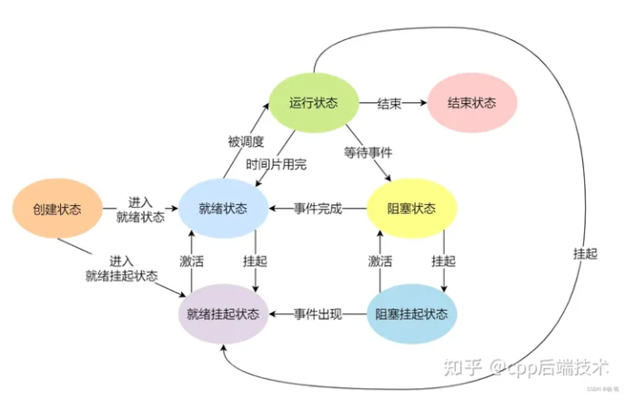


#### 5、进程的创建

- 创建进程的函数需要调⽤ fork() 函数, 则会产⽣⼀个新的进程
- 通过 fork() 函数创建⼦进程之后⽗⼦进程并发执⾏, ⼦进程从 fork() 之后开始执⾏
- ⽗⼦进程的执⾏顺序由操作系统算法决定的，不是由程序本身决定
- ⼦进程会拷⻉⽗进程地址空间的内容, 包括缓冲区、⽂件描述符等


```c
#include <sys/types.h>
#include <unistd.h>
#include <stdio.h>

//pid_t fork(void);

int main(int argc, char const *argv[])
{
    pid_t t  = fork();
    if (t==-1)
    {
        perror("fork(): ");
        return -1;
    }
    
    printf("hello world!\n");
    return 0;
}

```

输出两个hello world，父子进程都要执行


``` c
#include <sys/types.h>
#include <unistd.h>
#include <stdio.h>

static int idata = 200;
int main(int argc, char const *argv[])
{
    int isstack = 300;
    pid_t pid  = fork();

    // after code each proces run
    if (pid==-1)
    {
        perror("fork(): ");
        return -1;
    }else if (pid==0)
    {
        idata*=2;
        isstack*=2;
    }
    
    printf("%s,%d,%d",pid==0?"child":"parent",idata,isstack);
    return 0;
}


```

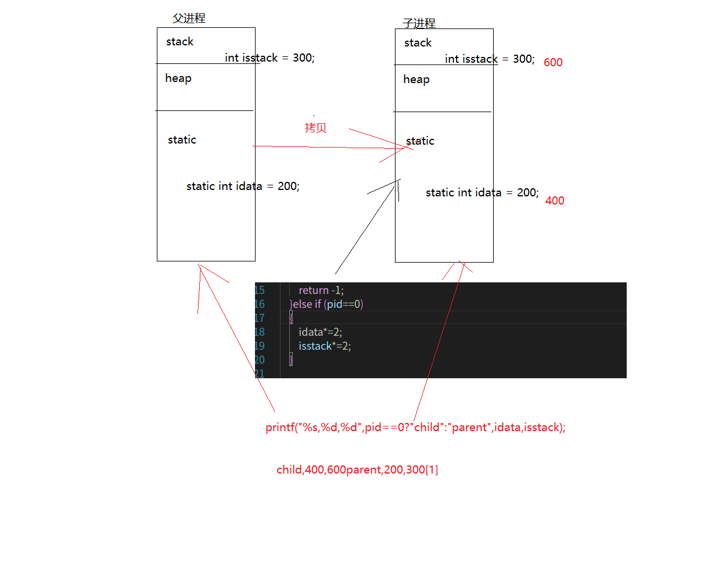

进程直接的内存空间不共享

 父子进程的执行顺序由操作系统算法决定的，不是由程序本身决定

 子进程会拷贝父进程地址空间的内容, 包括缓冲区 、文件描述符等

```c
#include <stdio.h>  
#include <stdlib.h>  
#include <unistd.h>  
#include <sys/types.h>  
#include <sys/wait.h>  
#include <fcntl.h>  
  
int main() {  
    pid_t pid;  
    int fd;  
  
    // 打开一个文件，获取文件描述符  
    fd = open("example.txt", O_CREAT | O_RDWR, 0666);  
    if (fd == -1) {  
        perror("open");  
        exit(EXIT_FAILURE);  
    }  
  
    // 创建子进程  
    pid = fork();  
    if (pid == -1) {  
        perror("fork");  
        exit(EXIT_FAILURE);  
    }  
  
    // 父进程和子进程会执行下面的代码  
    if (pid == 0) {  
        // 子进程代码  
        printf("I am the child process, PID: %d\n", getpid());  
        // 子进程可以使用父进程打开的文件描述符  
        write(fd, "Hello from child", 16);  
        close(fd);  // 子进程关闭文件描述符  
        exit(EXIT_SUCCESS);  
    } else {  
        // 父进程代码  
        printf("I am the parent process, PID: %d, Child PID: %d\n", getpid(), pid);  
        // 父进程等待子进程结束  
        wait(NULL);  
        // 父进程也可以使用相同的文件描述符，因为它被继承了  
        write(fd, "Hello from parent", 16);  
        close(fd);  // 父进程关闭文件描述符  
    }  
  
    return 0;  
}
```

#### 6、进程多任务

​	**使⽤ fork() 函数之后，会创建⼦进程，fork() 之后的代码会在⽗⼦进程中都执⾏⼀遍**

- 如果⽗⼦进程执⾏相同的任务，则正常执⾏
- 如果⽗⼦进程执⾏不同的任务，则需要利⽤ fork() 函数返回值

```c
#include <stdio.h>
#include <stdlib.h>
#include <sys/types.h>
#include <unistd.h>
int main(void)
{
    pid_t cpid;
    cpid = fork();
    if (cpid == -1)
    {
        perror("[ERROR] fork()");
        exit(EXIT_FAILURE);
    }
    else if (cpid == 0)
    {
        printf("Child process task.\n");
        exit(EXIT_SUCCESS);
    }
    else if (cpid > 0)
    {
        printf("Parent process task.\n");
    }
    printf("Child and parent Process Process task.\n");
    return 0;
}

```

- 在创建多个进程时, 最主要的原则为由⽗进程统⼀创建，统⼀管理, 不能进⾏递归创建

```c
#include <stdio.h>
#include <stdlib.h>
#include <sys/types.h>
#include <unistd.h>
#include <sys/wait.h>
int main(void)
{
    int cpid;
    cpid = fork();
    if (cpid == -1)
    {
        perror("fork(): ");
        exit(EXIT_FAILURE);
    }
    else if (cpid == 0)
    {
        printf("The child process < %d > running...\n", getpid());
        sleep(2);
        printf("The child process < %d > has exited\n", getpid());
        exit(EXIT_SUCCESS);
    }
    else if (cpid > 0)
    {
        cpid = fork();
        if (cpid == -1)
        {
            perror("fork(): ");
        }
        else if (cpid == 0)
        {
            printf("The child process < %d > running...\n", getpid());
            sleep(3);
            printf("The child process < %d > has exited\n", getpid());
            exit(EXIT_SUCCESS);
        }
        else if (cpid > 0)
        {
        }
    }
    return 0;
}

```

#### 7、进程的退出

- 在进程结束时，需要释放进程地址空间 以及内核中产⽣的各种数据结构

- 资源的释放需要通过调⽤ exit 函数或者 _exit 函数来完成

- 在程序结束时，会⾃动调⽤ exit 函数

- exit 函数让当前进程退出, 并刷新缓冲区

  - 原型

    ```c
    void exit(int status);
    ```

  - 参数

    EXIT_SUCCESS : 正常退出 

    EXIT_FAILURE : 异常退出

#### 8、进程的等待

##### 8.1、wait

- 在⼦进程运⾏结束后，进⼊僵死状态, 并释放资源, ⼦进程在内核中的数据结构依然保留

- ⽗进程调⽤ wait() 与 waitpid() 函数等待⼦进程退出后，释放⼦进程遗留的资源 （task_struct）

- 原型

  ```c
  pid_t wait(int *wstatus);
  ```
  
- 函数参数

  wstatus : 保存⼦进程退出状态值变量的指针

  获取具体值需要使⽤ WEXITSTATUS() 宏定义

- 函数返回值

  成功 : 返回退出⼦进程的 pid 

  失败 ：返回 -1 

- 说明 

  会阻塞调⽤者进程（⼀般为⽗进程）

  在⼦进程状态为僵死态时，回收资源，并释放资源后返回

- 注意

  - 在 wait 存储在 satus 变量的值, 存储了很多信息, 通过⼀系列 W 开头的宏来解析获取 
  - WIFEXITED(status) : 进程是否正常结束 
  - WEXITSTATUS(wstatus) : 获取进程退出状态值, exit 函数的参数 
  - WIFSIGNALED(wstatus) : 表示该⼦进程是否被信号结束的, 返回真，则表示被信号结束的 
  - WTERMSIG(wstatus) : 返回结束该⼦进程的那个信号的信号值 
  - WCOREDUMP(wstatus) : 表示该⼦进程被信号唤醒的 
  - WIFSTOPPED(wstatus) : 表示该⼦进程是否被信号中⽌ (stop) 的 , 返回真，则表示是被信号中⽌的 

- 示例

  ```c
  #include <stdio.h>
  #include <stdlib.h>
  #include <sys/types.h>
  #include <unistd.h>
  #include <sys/wait.h>
  int main(void)
  {
      pid_t cpid;
      cpid = fork();
      if (cpid == -1)
      {
          perror("[ERROR] fork(): ");
          exit(EXIT_FAILURE);
      }
      else if (cpid == 0)
      {
          printf("The Child process < %d > running...\n", getpid());
          sleep(3);
          exit(88);
      }
      else if (cpid > 0)
      {
          int rpid, status = 0;
  
          rpid = wait(&status);
          if (rpid == -1)
          {
              perror("[ERROR] wait() : ");
              exit(EXIT_FAILURE);
          }
          printf("The Child Process < %d > has exited,exit code < %d >.\n", rpid, WEXITSTATUS(status));
      }
  
      return 0;
  }
  ```

##### 8.2、waitpid

- 功能

与 wait 函数⼀样，但⽐ wait() 函数功能更强⼤, 可以理解成 wait() 底层调⽤waitpid() 函数

- 原型

  ```c
  pid_t waitpid(pid_t pid, int *wstatus, int options);
  ```

- 参数

  pid : 进程 id 

  ​	-1 : 可以等待任意⼦进程 

  ​	> 0 : 等待 id 为 pid 的进程 

  wstatus : 保存⼦进程退出状态值变量的指针 

  options : 选项 WNOHANG : ⾮阻塞选项

- 函数返回值

  成功 : 

  ```
  > 0 : 退出进程的 pid
  = 0 : 在⾮阻塞模式下，没有进程退出
  ```

  失败: -1 并设置 errno

- 示例 : 创建⼀个⼦进程, ⼦进程运⾏后 3s 退出, ⽗进程等待⼦进程退出

  ```c
  #include <stdio.h>
  #include <stdlib.h>
  #include <sys/types.h>
  #include <unistd.h>
  #include <sys/wait.h>
  int main(void)
  {
      pid_t cpid;
      cpid = fork();
      if (cpid == -1)
      {
          perror("[ERROR] fork(): ");
          exit(EXIT_FAILURE);
      }
      else if (cpid == 0)
      {
          printf("The Child process < %d > running...\n", getpid());
          sleep(3);
          exit(88);
      }
      else if (cpid > 0)
      {
          int rpid, status = 0;
          rpid = waitpid(-1, &status, 0);
          if (rpid == -1)
          {
              perror("[ERROR] wait() : ");
              exit(EXIT_FAILURE);
          }
  #if 0
   while((rpid = waitpid(-1,&status,WNOHANG)) == 0){
  
   }
  #endif
          printf("The Child Process < %d > has exited,exit code < %d >.\n", rpid, WEXITSTATUS(status));
      }
  
      return 0;
  }
  
  ```

- 总结

  waitpid 函数常⻅⽤法下: 使⽤阻塞的⽅式等待任意⼦进程退出

  ```c
   waitpid(-1,&status,0);
   while(waitpid(pid,&status,WNOHANG) == 0)
   {
   	usleep(50000);
   }
  
  ```

- 练习

  创建两个⼦进程，⼦进程 A 与 ⼦进程 B ,A 进程延时 2s 后退出, B 进程延时 5s 后退出，⽗进程分别 等待两个⼦进程退出

#### 9、进程的替换

- 创建⼀个进程后，pid 以及在内核中的信息保持 保持不变, 但进程所执⾏的代码进⾏替换
- 作⽤ : 通过⼀个进程启动另外⼀个进程

- 应⽤场景

  Linux 终端应⽤程序，执⾏命令时，通过创建⼀个进程后，替换成命令中的可执⾏程序执⾏

- 函数原型

  ```c
  int execl(const char *pathname, const char arg, … / (char *) NULL */);
  int execlp(const char *file, const char arg, … / (char *) NULL */);
  int execle(const char *pathname, const char arg, … /, (char *) NULL, char *const envp[] */);
  int execv(const char *pathname, char *const argv[]);
  int execvp(const char *file, char *const argv[]);
  int execvpe(const char *file, char *const argv[], char *const envp[]);
  ```

- 函数参数

  ```
  path：可执⾏⽂件的路径名
  file : 可执⾏⽂件名，可以通过 path 环境变量指定的路径
  arg : 参数列表，以 NULL 结尾
  argv[] : 参数数组
  envp[] : 环境变量数组
  ```

- 函数返回值

  成功 : 0 

  失败 : -1

- 示例 : 通过 execl 函数族执⾏ ls -l 命令

  ```c
  // 通过 execl 函数族执⾏ ls -l 命令
  #include <stdio.h>
  #include <stdlib.h>
  #include <unistd.h>
  int main(void)
  {
      int ret; 
      ret = execl("/bin/ls", "ls", "-l", NULL);
      if (ret == -1)
      {
          perror("[ERROR] execl(): ");
          exit(EXIT_FAILURE);
      }
      return 0;
  }
  
  ```

#### 10、进程间通讯	

​	每个进程都有⾃⼰独⽴的内存空间, 当两个不同进程需要进⾏交互时, 就需要使⽤进程间通讯。进程之间传递数据。进程间通讯分两种： 单机多进程，多机多进程

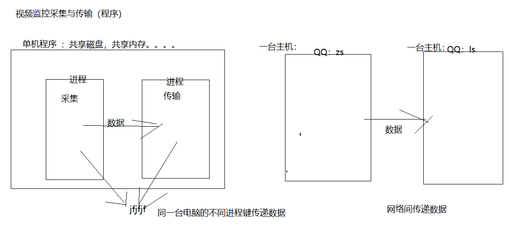

   今天主要讲单机多进程，后者就是网络编程。 并且单机多进程通讯的实录是往共享空间，放数据。大家读写同一个区域的数据。 当时实现方式有： 管道，信号，消息队列，共享内存，信号量。

   

##### 10.1、无名管道（父子传递）

- ⽆名管道⽤于**⽗⼦进程**之间通讯，有名管道⽤于任意进程之间通讯

- 管道的本质是在内存建⽴⼀段缓冲区，由操作系统内核来负责创建与管理, 具体通讯模型如下:

  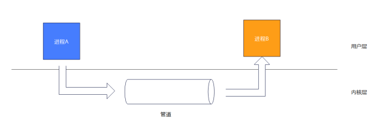

- ⽆名管道的特点: 
  - ⽆名管道属于单向通讯
  - ⽆名管道只能⽤于⽗⼦进程通讯 
  - ⽆名管道发送端叫做写端, 接收端叫做读端 
  - ⽆名管道读端与写端抽象成两个⽂件进⾏操作，在⽆名管道创建成功之后，则会返回读端与写端的⽂件描述符
  - 当管道为空时，读管道会阻塞读进程
  - 创建有名管道需要调⽤ pipe() 函数
  - 当管道的写端被关闭了，从管道中读取剩余数据后，read 函数返回 0
  - 在写⼊管道时，确保不超过 PIPE_BUF 字节的操作是原⼦的
    - 当写⼊的数据达到 PIPE_BUF 字节时，write() 会在必要的时候阻塞直到管道 中的可⽤空间⾜以原⼦地完成操作
    - 当写⼊的数据⼤于 PIPE_BUF 字节时，write() 会尽可能多传输数据以充满这 个管道
  - 管道的⼤⼩是有限的, 不能让⽗／⼦进程同时对管道进⾏读／写操作
  - 当⼀个进程试图想⼀个管道中写⼊数据但没有任何进程拥有该管道的打开着的读取描 述符, 内核向写⼊进程发送⼀个 SIGPIPE 信号

  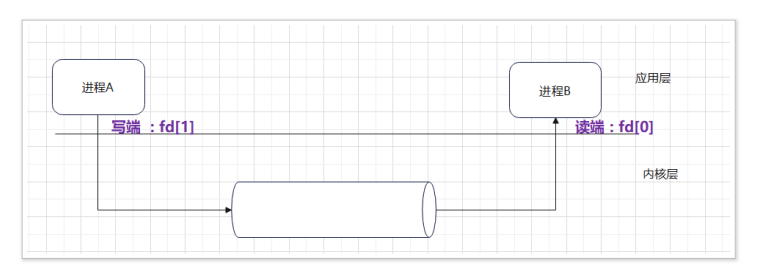

  - 示例

    ```c
    // 无名管道
    #include <stdio.h>
    #include <stdlib.h>
    #include <string.h>
    #include <sys/types.h>
    #include <unistd.h>
    #include <sys/wait.h>
    int main(void)
    {
        pid_t cpid;
        int ret;
        int pipefd[2];
        //创建无名管道，就会有两个文件描述符号。 0用来读，1用来写
        ret = pipe(pipefd);
        if (ret == -1)
        {
            perror("[ERROR] pipe(): ");
            exit(EXIT_FAILURE);
        }
        cpid = fork();
        if (cpid == -1)
        {
            perror("[ERROR] fork(): ");
            exit(EXIT_FAILURE);
        }
        else if (cpid == 0)
        {
            ssize_t rbytes;
            char buffer[64] = {0};
            close(pipefd[1]);
    		//注意用sizeof
            rbytes = read(pipefd[0], buffer, sizeof(buffer));
            if (rbytes == -1)
            {
                perror("[ERROR] read(): ");
                close(pipefd[0]);
                exit(EXIT_FAILURE);
            }
            printf("buffer : %s\n", buffer);
            close(pipefd[0]);
        }
        else if (cpid > 0)
        {
            ssize_t wbytes;
            char buffer[] = "hello,pipe.";
            close(pipefd[0]);
            wbytes = write(pipefd[1], buffer, strlen(buffer));
            if (wbytes == -1)
            {
                perror("[ERROR] write(): ");
                wait(NULL);
                close(pipefd[1]);
                exit(EXIT_FAILURE);
            }
    
            close(pipefd[1]);
            wait(NULL);
        }
        return 0;
    }
    
    ```


##### 10.2、有名管道

- 有名管道是在 ⽂件系统中可⻅的⽂件, 但是不占⽤磁盘空间, 仍然在内存中, 可以通过 mkfifo 命令创建有名管道

- 有名管道与⽆名管道⼀样，在应⽤层是基于⽂件接⼝进⾏操作

- 有名管道⽤于 **任意进程之间的通讯**, 当管道为空时, 读进程会阻塞.

- 有名管道严格遵循先进先出(first in first out) ,对匿名管道及有名管道的读总是从开始处返回数据，对它们的写则把数据添加到末尾。它们不支持诸如lseek()等文件定位操作。

- 有名管道的名字存在于文件系统中，内容存放在内存中。

- 创建有名管道需要调⽤ mkfifo() 函数

  - 原型

    ```c
    int mkfifo(const char *pathname, mode_t mode);
    ```

  - 参数

    pathname : 有名管道路径名 

    mode : 有名管道⽂件访问权限

  - 返回值

    成功 : 返回 0 

    失败 : 返回 -1, 并设置 errno

  - fifo_read.c

    ```c
    #include <stdio.h>
    #include <stdlib.h>
    #include <sys/types.h>
    #include <sys/stat.h>
    #include <fcntl.h>
    #include <unistd.h>
    #define FIFO_NAME "./fifo"
    int main(int argc, char *argv[])
    {
      
       
         
       
        int ret = access(FIFO_NAME, F_OK);
        if (ret == -1) //如果不存在创建管道
            mkfifo(FIFO_NAME, 0644);
        //打开文件
        int fd = open(FIFO_NAME, O_RDWR);
        if (fd == -1)
        {
            perror("[ERROR] open():");
            exit(EXIT_FAILURE);
        }
        int rbytes;
         char rbuffer[64];
        /*rbytes = read(fd, rbuffer, sizeof(rbuffer));
        if (rbytes > 0)
        {
            printf("rbytes : %d rbuffer : %s\n", rbytes, rbuffer);
        }
        close(fd);*/
         while ( rbytes = read(fd, rbuffer, sizeof(rbuffer)))
        {
             printf("rbytes : %d rbuffer : %s\n", rbytes, rbuffer);
        }
        
        return 0;
    }
    
    ```

  - fifo_write.c

    ```c
    #include <stdio.h>
    #include <stdlib.h>
    #include <string.h>
    #include <sys/types.h>
    #include <sys/stat.h>
    #include <fcntl.h>
    #include <unistd.h>
    #define FIFO_NAME "./fifo"
    int main(int argc, char *argv[])
    {
        
        //尝试访问文件，判断管道是否存在
        int ret = access(FIFO_NAME, F_OK);
        if (ret == -1) //如果不存在创建管道
            mkfifo(FIFO_NAME, 0644);
        
        //打开文件
        int fd = open(FIFO_NAME, O_RDWR);
        if (fd == -1)
        {
            perror("[ERROR] open():");
            exit(EXIT_FAILURE);
        }
        
        //写内容到管道。。。
        int wbytes;
        char wbuffer[64] = "fifo pipe.";
        wbytes = write(fd, wbuffer, strlen(wbuffer) + 1);
        if (wbytes < 0)
            perror("write():");
        close(fd);
        return 0;
    }
    
    ```

- 注意

  - 如果有名管道的⼀端以只读⽅式打开，它会阻塞到另⼀端以写的⽅式 (只写，读写)
  - 如果有名管道的⼀端以只写⽅式打开，它会阻塞到另⼀端以读的⽅式 (只读，读写)

- 优缺点:

  - 优点:可以实现任意进程间通信，操作起来和⽂件操作⼀样
  - 缺点:
    - 打开的时候需要读写⼀起进⾏否则就会阻塞，管道⼤⼩是 4096 个字节
    - 半双⼯的⼯作模式，如果和多个进程通信则需要创建多个管道

##### 10.3、信号（特殊场景）

###### 概念

信号是在软件层次上 是⼀种通知机制, 对中断机制的⼀种模拟，是⼀种异步通信⽅式

###### 特点

- 进程在运⾏过程中，随时可能被各种信号打断
- 进程可以忽略, 或者去调⽤相应的函数去处理信号
- 进程⽆法预测到达的精准时间
- 在进程没有结束时，进程在任何时间点都可以接受到信号
- 如果一个信号被进程设置为阻塞，则该信号的传递被延迟，直到其阻塞被取消是才被传递给进程。
- 需要阻塞等待信号时，则可以调⽤ pause() 函数, 具体如下

###### 来源

- 程序执⾏错误，如内存访问越界，数学运算除 0
- 由其他进程发送
- 通过控制终端发送 如 ctrl + c
- ⼦进程结束时向⽗进程发送的 SIGCLD 信号
- 程序中设定的定时器产⽣的 SIGALRM 信号

###### 常⽤信号

在 Linux 系统可以通过 kill -l 命令查看, 常⽤的信号列举如下:

- SIGINT 该信号在⽤户键⼊ INTR 字符 (通常是 Ctrl-C) 时发出，终端驱动程序发送此 信号并送到前台进>程中的每⼀个进程。
- SIGQUIT 该信号和 SIGINT 类似，但由 QUIT 字符 (通常是 Ctrl-) 来控制。
- SIGILL 该信号在⼀个进程企图执⾏⼀条⾮法指令时 (可执⾏⽂件本身出现错误，或者 试图执⾏数据段、堆栈溢出时) 发出。
- SIGFPE 该信号在发⽣致命的算术运算错误时发出。这⾥不仅包括浮点运算错误，还 包括溢出及除数 > 为 0 等其它所有的算术的错误。
- SIGKILL 该信号⽤来⽴即结束程序的运⾏，并且不能被阻塞、处理和忽略。
- SIGALRM 该信号当⼀个定时器到时的时候发出。
- SIGSTOP 该信号⽤于暂停⼀个进程，且不能被阻塞、处理或忽略。
- SIGTSTP 该信号⽤于交互停⽌进程，⽤户可键⼊ SUSP 字符时 (通常是 Ctrl-Z) 发出 这个信号。
- SIGCHLD ⼦进程改变状态时，⽗进程会收到这个信号
- SIGABRT 进程异常中⽌

###### 信号的处理

- 忽略信号, 即对信号不做任何处理，但是有两个信号不能忽略：即 SIGKILL 及 SIGSTOP。
- 捕捉信号, 定义信号处理函数，当信号发⽣时，执⾏相应的处理函数。
- 执⾏缺省操作，Linux 对每种信号都规定了默认操作

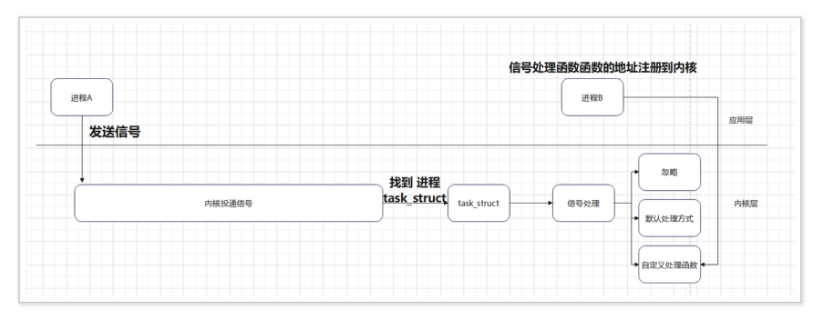
- 当由进程来发送信号时, 则可以调⽤ kill() 函数与 raise () 函数

  - kill

    - 原型

    ```c
    int kill(pid_t pid, int sig);
    ```

    - 功能

      向指定的进程发送⼀个信号

    - 参数

      pid : 进程的 id

      sig : 信号的 id

    - 返回值

      成功: 返回 0 

      失败: 返回 -1, 并设置 errno

  - raise

    - 功能

      给**当前进程**发送指定信号(自己给自己发信号)

    - 原型

      ```c
      int raise(int sig);
      ```

    - 参数

      sig : 信号编号

    - 返回值

      成功 : 返回 0 

      失败 : 返回 -1, 并设置 errno

###### 示例讲解

- 示例 1

  创建⼀个⼦进程，⼦进程通过信号暂停，⽗进程发送终⽌信号:

  ```c
  // 创建⼀个⼦进程，⼦进程通过信号暂停，⽗进程发送终⽌信号
  #include <stdio.h>
  #include <stdlib.h>
  #include <sys/types.h>
  #include <unistd.h>
  #include <signal.h>
  #include <sys/wait.h>
  int main(void)
  {
      pid_t cpid;
      cpid = fork();
      if (cpid < 0)
      {
          perror("[ERROR] fork() : \n");
          exit(0);
      }
      else if (cpid == 0)
      {
          fprintf(stdout, "\tchild %d running.\n", getpid());
  
          raise(SIGSTOP);//给自己发一个信号暂停
          
          //父亲杀死儿子，后续代码不会执行
          fprintf(stdout, "\t child %d exit \n", getpid());
          exit(EXIT_SUCCESS);
      }
      else if (cpid > 0)
      {
          int status, ret;
          sleep(1);
          ret = kill(cpid, SIGKILL);//给子进程去死的信号
          if (ret == 0)
          {
              fprintf(stdout, "Father %d Killed child %d\n", getpid(), cpid);
          }
          waitpid(cpid, NULL, 0);
          fprintf(stdout, "father %d exit\n", getpid());
          exit(EXIT_SUCCESS);
      }
      return 0;
  }
  
  ```

- 示例2

  创建创建⼀个⼦进程, ⽗进程调⽤ pause 函数，⼦进程给⽗进程发送信号。**pause 函数⼀定要在收到信号之前调⽤，让进程进⼊到睡眠状态。**

  ```c
  #include <stdio.h>
  #include <stdlib.h>
  #include <sys/types.h>
  #include <signal.h>
  #include <unistd.h>
  int main(void)
  {
      pid_t cpid;
      cpid = fork();
      if (cpid == -1)
      {
          perror("[ERROR] fork()]");
          exit(EXIT_FAILURE);
      }
      else if (cpid == 0)
      {
          fprintf(stdout, "Child Process Start.\n");
          sleep(3);
          kill(getppid(), SIGUSR1);//用户自定义信号，默认终止进程
          exit(EXIT_SUCCESS);
      }
      else if (cpid > 0)
      {
          sleep(1);
          fprintf(stdout, "Main Process Start..\n");
          pause();
  
          fprintf(stdout, "Main Process End.\n");
      }
      return 0;
  }
  
  ```

- 示例3

  创建⼀个⼦进程, ⽗进程给⼦进程发送 SIGUSR1 信号，并使⽤⾃定义的处理⽅式

  ```c
  #include <stdio.h>
  #include <stdlib.h>
  #include <string.h>
  #include <sys/types.h>
  #include <signal.h>
  #include <unistd.h>
  #include <sys/wait.h>
  void do_sig_usr(int sig)
  {
      printf(" Receive %s \n", strsignal(sig));
  }
  int main(void)
  {
      pid_t cpid;
  
      //把信号出来函数绑定起来
      if (signal(SIGUSR1, do_sig_usr) == SIG_ERR)
      {
          perror("[ERROR] signal(): ");
          exit(EXIT_FAILURE);
      }
      cpid = fork();
      if (cpid == -1)
      {
          perror("fork(): ");
          exit(EXIT_FAILURE);
      }
      else if (cpid == 0)
      {
          printf("Child Process < %d > start.\n", getpid());
          pause();
          printf("Child Process < %d > end.\n", getpid());
          exit(EXIT_SUCCESS);
      }
      else if (cpid > 0)
      {
          sleep(1);
          kill(cpid, SIGUSR1);
          wait(NULL);
      }
      return 0;
  }
  
  ```

- 示例4

  设置定时器的定时时间为 3s , 并处理 SIGALRM 信号

  ```c
  #include <stdio.h>
  #include <stdlib.h>
  #include <string.h>
  #include <sys/types.h>
  #include <signal.h>
  #include <unistd.h>
  #include <sys/wait.h>
  #include <signal.h>
  #include <string.h>
  void do_alarm(int sig)
  {
   printf("Recieve signal < %s >\n",strsignal(sig));
  }
  int main(void)
  {
   __sighandler_t sigret;
      //绑定定时器出来函数
   sigret = signal(SIGALRM,do_alarm);
   if (sigret == SIG_ERR){
   perror("[ERROR] signal(): ");
   exit(EXIT_FAILURE);
   }
      //3s后出发，就会发一个信号
   alarm(3);
   pause();
   return 0;
  }
  
  ```

- 问题

  在使⽤ wait() 函数时，由于阻塞或者⾮阻塞都⾮常消耗资源，并且在阻塞情况下，⽗进程不能执⾏其他逻辑，这时怎么办?

  答：⼦进程退出是异步事件, 可以利⽤在⼦进程退出时，会⾃动给⽗进程发送 **SIGCHLD 信号**。示例:

  ```c
  #include <stdio.h>
  #include <stdlib.h>
  #include <string.h>
  #include <sys/types.h>
  #include <signal.h>
  #include <unistd.h>
  #include <sys/wait.h>
  #include <signal.h>
  #include <string.h>
  void do_sig_child(int sig)
  {
      printf("Receive signal < %s >\n", strsignal(sig));
      wait(NULL);
  }
  int main(void)
  {
      pid_t cpid;
      __sighandler_t sigret;
      sigret = signal(SIGCHLD, do_sig_child);
      if (sigret == SIG_ERR)
      {
          perror("[ERROR] signal(): ");
          exit(EXIT_FAILURE);
      }
  
      cpid = fork();
      if (cpid == -1)
      {
          perror("[ERROR] fork(): ");
          exit(EXIT_FAILURE);
      }
      else if (cpid == 0)
      {
          printf("Child process < %d > start.\n", getpid());
          sleep(2);
          exit(EXIT_SUCCESS);//退出，先发信号，自己慢慢退出
      }
      else if (cpid > 0)
      {
          
          while (1)
          {	
               printf("parent process < %d > start.\n", getpid()); 
          }
      }
      return 0;
  }
  ```
  
  

##### 10.4、消息队列（用得最多）

###### 概念

​	消息队列是**存放在内核中的消息链表**，每个消息队列由消息队列标识符表示。

###### 特点

- 消息队列是消息的链表,具有特定的格式,存放在内存中并由消息队列标识符标识

- 消息队列允许一个或多个进程向它写入与读取消息

- 消息队列可以实现消息的随机查询,消息不一定要以先进先出的次序读取,也可以按消息的类型读取.比FIFO更有优势。

- 消息队列克服了信号承载信息量少，管道只能承载无格式字节流以及缓冲区大小受限等缺。

- 消息队列是随内核持续的，只有在内核重起或者人工删除时，该消息队列才会被删除。

- 消息队列是属于 sytem ipc 的⼀种, 由内核维护与管理 可以通过 ipcs -q 查看

  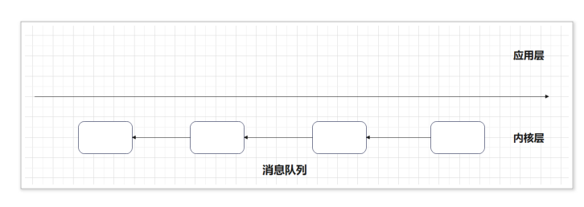

- **与有名管道相比优势**

  1、消息队列也可以独立于发送和接收进程而存在，从而消除了在同步命名管道的打开和关闭时可能产生的困难。

  2、同时通过发送消息还可以避免命名管道的同步和阻塞问题，不需要由进程自己来提供同步方法。

  3、接收程序可以通过消息类型有选择地接收数据，而不是像命名管道中那样，只能默认地接收。

###### 相关接口

1、msgget()函数

原型：

```c
int msgget(key_t, key, int msgflg);
```

​	与其他的IPC机制一样，程序必须提供一个键来命名某个特定的消息队列。msgflg是一个权限标志，表示消息队列的访问权限，它与文件的访问权限一样。msgflg可以与IPC_CREAT做或操作，表示当key所命名的消息队列不存在时创建一个消息队列，如果key所命名的消息队列存在时，IPC_CREAT标志会被忽略，而只返回一个标识符。

它返回一个以key命名的消息队列的标识符（非零整数），失败时返回-1. 

2、msgsnd()函数

原型：

```c
int msgsend(int msgid, const void *msg_ptr, size_t msg_sz, int msgflg);
```

msgid是由msgget函数返回的消息队列标识符。

msg_ptr是一个指向准备发送消息的指针，但是消息的数据结构却有一定的要求，指针msg_ptr所指向的消息结构一定要是以一个长整型成员变量开始的结构体，接收函数将用这个成员来确定消息的类型。所以消息结构要定义成这样： 

struct my_message {
    long int message_type;
    /* The data you wish to transfer */
};
msg_sz 是msg_ptr指向的消息的长度，注意是消息的长度，而不是整个结构体的长度，也就是说msg_sz是不包括长整型消息类型成员变量的长度。

msgflg 用于控制当前消息队列满或队列消息到达系统范围的限制时将要发生的事情。

如果调用成功，消息数据的一分副本将被放到消息队列中，并返回0，失败时返回-1. 

 3、msgrcv()函数

原型

```c
int msgrcv(int msgid, void *msg_ptr, size_t msg_st, long int msgtype, int msgflg);
```

msgid, msg_ptr, msg_st 的作用也函数msgsnd()函数的一样。

msgtype 可以实现一种简单的接收优先级。如果msgtype为0，就获取队列中的第一个消息。如果它的值大于零，将获取具有相同消息类型的第一个信息。如果它小于零，就获取类型等于或小于msgtype的绝对值的第一个消息。

msgflg 用于控制当队列中没有相应类型的消息可以接收时将发生的事情。

调用成功时，该函数返回放到接收缓存区中的字节数，消息被复制到由msg_ptr指向的用户分配的缓存区中，然后删除消息队列中的对应消息。失败时返回-1。 

4、msgctl()函数

原型：

```c
int msgctl(int msgid, int command, struct msgid_ds *buf);
```

command是将要采取的动作，它可以取3个值，

I**PC_STAT**：把msgid_ds结构中的数据设置为消息队列的当前关联值，即用消息队列的当前关联值覆盖msgid_ds的值。
**IPC_SET**：如果进程有足够的权限，就把消息列队的当前关联值设置为msgid_ds结构中给出的值
**IPC_RMID**：删除消息队列
buf是指向msgid_ds结构的指针，它指向消息队列模式和访问权限的结构。msgid_ds结构至少包括以下成员： 

struct msgid_ds
{
    uid_t shm_perm.uid;
    uid_t shm_perm.gid;
    mode_t shm_perm.mode;
};
成功时返回0，失败时返回-1.


```

ftok函数
ftok函数是一个用于生成键值（key_t）的系统调用，这个键值通常用于System V IPC（进程间通信）机制，如消息队列、共享内存和信号量。其原型如下：12

函数原型。key_t ftok(const char *fname, int id);12
fname：这是一个已存在的文件路径名，通常使用当前目录（例如，通过ftok(".", 1);表示使用当前目录）。16
id：这是一个介于0到255之间的整数，通常称为项目ID（proj_id），用于进一步区分不同路径下的键值。
返回值。成功时，ftok返回一个32位的键值（key_t）。如果失败，则返回-1，并设置errno以指示错误。
```


###### 示例1

创建⼀个消息队列, 并打印消息队列 ID及上删除队列：

```c
#include <stdio.h>
#include <stdlib.h>
#include <string.h>
#include <sys/types.h>
#include <sys/ipc.h>
#include <sys/msg.h>
#define PATHNAME "."
#define PROID 10
int main(void)
{
    key_t key;
    int mq_id;
    int ret;
    //产生一个msgkey
    key = ftok(PATHNAME, PROID);
    if (key == -1)
    {
        perror("fotk(): ");
        exit(EXIT_FAILURE);
    }

    //创建一个消息队列
    mq_id = msgget(key, IPC_CREAT | 0666);
    if (mq_id == -1)
    {
        perror("msgget(): ");
        exit(EXIT_FAILURE);
    }

    printf("mq id : %d\n", mq_id);

     sleep(20);//睡眠20，通过ipcs -q
    ret = msgctl(mq_id, IPC_RMID, NULL);
    //通过ipcs -q再次查询

    if (ret == -1)
    {
        perror("msgctl(): ");
        exit(EXIT_FAILURE);
    }
    return 0;
}
```

###### 示例2

创建两个没有⾎缘关系的进程, 使⽤消息队列进⾏通讯

msg_read.c

```c
#include <stdio.h>
#include <stdlib.h>
#include <string.h>
#include <sys/types.h>
#include <sys/ipc.h>
#include <sys/msg.h>
#define PATHNAME "."
#define PRO_ID 10
#define MSG_TYPE 100
#define MSG_SZ 64
struct msgbuf
{
    long mtype;
    char mtext[MSG_SZ];
};
int main(void)
{
    key_t key;
    int msgid, ret;
    ssize_t rbytes;
    struct msgbuf rcv_msg;
    key = ftok(PATHNAME, PRO_ID);
    if (key == -1)
    {
        perror("[ERROR] fotk(): ");
        exit(EXIT_FAILURE);
    }
    msgid = msgget(key, IPC_CREAT | 0666);
    if (msgid == -1)
    {
        perror("msgget(): ");
        exit(EXIT_FAILURE);
    }
    printf("msg id : %d\n", msgid);
    while (rbytes = msgrcv(msgid, (void *)&rcv_msg, MSG_SZ, MSG_TYPE, 0))
    {
        printf("mtype : %ld\n", rcv_msg.mtype);
        printf("mtext : %s\n", rcv_msg.mtext);
    }
    
    // if (rbytes == -1)
    // {
    //     perror("[ERROR] msgrcv(): ");
    //     exit(EXIT_FAILURE);
    // }
 
    /* ret = msgctl(msgid, IPC_RMID, NULL);
     if (ret == -1)
     {
         perror("msgctl(): ");
         exit(EXIT_FAILURE);
     }*/
    return 0;
}

```

msg_write.c

```c
#include <stdio.h>
#include <stdlib.h>
#include <string.h>
#include <sys/types.h>
#include <sys/ipc.h>
#include <sys/msg.h>
#define PATHNAME "."
#define PRO_ID 10
#define MSG_TYPE 100
#define MSG_SZ 64
struct msgbuf
{
    long mtype;
    char mtext[MSG_SZ];
};
int main(void)
{
    key_t key;
    int msgid, ret;
    struct msgbuf msg;
    key = ftok(PATHNAME, PRO_ID);
    if (key == -1)
    {
        perror("fotk(): ");
        exit(EXIT_FAILURE);
    }
    msgid = msgget(key, IPC_CREAT | 0666);
    if (msgid == -1)
    {
        perror("msgget(): ");
        exit(EXIT_FAILURE);
    }
    printf("msg id : %d\n", msgid);
    msg.mtype = MSG_TYPE;
    strcpy(msg.mtext, "Hello msg queue");
    ret = msgsnd(msgid, (const void *)&msg, strlen(msg.mtext) + 1, 0);
    if (ret == -1)
    {
        perror("msgsnd(): ");
        exit(EXIT_FAILURE);
    }
    return 0;
}

```

###### 练习

创建两个⼦进程 A 与 B，⽗进程分别给两个⼦进程发型消息，消息类型为 100 与 200 

⽗进程从键盘循环接收数据, 发送给⼦进程，输⼊quit 则退出

##### 10.5、共享内存

- 共享内存是将分配的物理空间直接映射到进程的⽤户虚拟地址空间中, 减少数据在内核空间缓存

- 共享内存是⼀种效率较⾼的进程间通讯的⽅式

- shmget

  - 原型

    ```c
    int shmget(key_t key, size_t size, int shmflg);
    ```

  - 功能

    创建⼀个共享内存, 并返回 ID

  - 参数

    ```
    key : 由 ftok() 函数返回
    size : 共享内存的⼤⼩
    shmflg : 共享内存标志
    ```

  - 返回值

    ```
    成功 : 返回 共享内存 id
    失败 : 返回 -1, 并设置 errno
    
    ```

  - 示例1

    创建⼀个共享内存, 并打印出共享内存 ID

- shmctl

  - 原型

    ```c
    int shmctl(int shmid, int cmd, struct shmid_ds *buf);
    ```

    

  - 功能

    共享内存控制函数, 功能由具体的功能命令字决定

  - 参数

    ```
    1. shmid : 共享内存 id
    2. cmd : 控制命令字
    1. IPC_STAT： 获取消息队列属性
    2. IPC_SET : 设置消息队列属性
    3. IPC_RMID : 删除消息队列属性 , ⽤此命名时，第三个参数为 NULL
    3. buf : 共享内存属性结构体指针
    ```

  - 返回值

    ```
    成功 : 返回 0
    失败 : 返回 -1
    ```

  - 示例2

    创建⼀个共享内存后，输出共享内存 id, 删除共享内存

    ```c
    #include <stdio.h>
    #include <stdlib.h>
    #include <sys/types.h>
    #include <sys/ipc.h>
    #include <sys/shm.h>
    #define PATHNAME "."
    #define PRO_ID 100
    #define SZ 256
    int main(void)
    {
        key_t key;
        int shmid, ret;
        key = ftok(PATHNAME, PRO_ID);
        if (key == -1)
        {
            perror("[ERROR] key(): ");
            exit(EXIT_FAILURE);
        }
        shmid = shmget(key, SZ, IPC_CREAT | 0666);
        if (shmid == -1)
        {
            perror("shmid(): ");
            exit(EXIT_FAILURE);
        }
        printf("shmid = %d\n", shmid);
        ret = shmctl(shmid, IPC_RMID, NULL);
        if (ret == -1)
        {
            perror("[ERROR] shmctl(): ");
            exit(EXIT_FAILURE);
        }
        return 0;
    }
    
    ```

- shmat

  - 原型

    ```c
    void *shmat(int shmid, const void *shmaddr, int shmflg);
    ```

  - 功能

    将进程地址空间映射到共享内存上

  - 参数

    ```
    shmid : 共享内存 id
    shmaddr : 指定映射的到进程地址空间的起始地址
    指定为 NULL 时, 由系统选择映射的地址
    shmflg : 共享内存标志, ⼀般设置为 0
    
    ```

  - 返回值

    ```c
    成功 : 返回映射到进程地址空间的起始地址
    失败 : (void *) -1, 并设置 errno
    ```

- shmdt

  - 原型

    ```c
    int shmdt(const void *shmaddr);
    ```

    

  - 功能

    解除进程地址空间与共享内存的映射

  - 参数

    ```
    成功 : 返回 0
    失败 : 返回 -1, 并设置 errno
    
    ```

- 示例3

  使⽤共享内存进⾏进程间通讯

  10.531.c
  
  ```c
  #include <stdio.h>
  #include <stdlib.h>
  #include <string.h>
  #include <sys/types.h>
  #include <sys/ipc.h>
  #include <sys/shm.h>
  #define PATHNAME "."
  #define PRO_ID 100
  #define SZ 256
  int main(void)
  {
      key_t key;
      int shmid, ret;
      void *addr = NULL;
      key = ftok(PATHNAME, PRO_ID);
      if (key == -1)
      {
          perror("[ERROR] key(): ");
          exit(EXIT_FAILURE);
      }
  
      //创建共享空间
      shmid = shmget(key, SZ, IPC_CREAT | 0666);
      if (shmid == -1)
      {
          perror("shmid(): ");
          exit(EXIT_FAILURE);
      }
      printf("shmid = %d\n", shmid);
      //把进程的内存空间链接到共享工具上面
      addr = shmat(shmid, NULL, 0);
      if (addr == (void *)-1)
      {
          perror("[ERROR] shmat(): ");
          return -1;
      }
  
      memset(addr, 'A', 10);
  
      shmdt(addr);
      return 0;
  }
  
  ```
  
  10.532.c
  
  ```c
  
  #include <stdio.h>
  #include <stdlib.h>
  #include <string.h>
  #include <sys/types.h>
  #include <sys/ipc.h>
  #include <sys/shm.h>
  #define PATHNAME "."
  #define PRO_ID 100
  #define SZ 256
  int main(void)
  {
      //key_t key;
      int key, shmid, i;
      char buffer[10] = {0};
      void *addr = NULL;
      key = ftok(PATHNAME, PRO_ID);
      if (key == -1)
      {
          perror("[ERROR] key(): ");
          exit(EXIT_FAILURE);
      }
        // 创建共享空间
      shmid = shmget(key, SZ, IPC_CREAT | 0666);
      if (shmid == -1)
      {
          perror("shmid(): ");
          exit(EXIT_FAILURE);
      }
      printf("shmid = %d\n", shmid);//0
      addr = shmat(shmid, NULL, 0);
      if (addr == (void *)-1)
      {
          perror("[ERROR] shmat(): ");
          return -1;
      }
  
      memcpy(buffer, addr, 10);
  
      for (i = 0; i < 10; i++)
      {
          printf(" %c ", buffer[i]);
      }
      putchar('\n');
      shmdt(addr);
      return 0;
  }
  
  ```
  
  


##### 10.6、信号量（进程之间竞争资源）

​	信号量主要用来解决进程和线程间并发执行时的同步问题，进程同步是并发进程为了完成共同任务采用某个条件来协调他们的活动，这是进程之间发生的一种直接制约关系。

- 资源竞争 : 当多个进程在同时访问共享资源时, 会产⽣资源竞争，最终最导致数据混乱

- 临界资源 : 不允许同时有多个进程访问的资源, 包括硬件资源 (CPU、内存、存储器以及其他外 围设备) 与软件资源(共享代码段、共享数据结构)

- 互斥 : 同⼀时刻只有⼀个进程访问临界资源

- 同步 : 在互斥的基础上增加了进程对临界资源的访问顺序

- 进程主要的同步与互斥⼿段是 **信号量**

- 信号量: 由内核维护的整数, 其值被限制为⼤于或等于 0

- 信号可以执⾏如下操作: 

  ```
  将信号量设置成⼀个具体的值
  在信号量当前值的基础上加上⼀个数值
  在信号量当前值的基础上减上⼀个数值
  等待信号量的值为 0
  
  ```

- ⼀般信号量分为⼆值信号量与 计数信号量

  > ```
  > ⼆值信号量 : ⼀般指的是信号量 的值为 1, 可以理解为只对应⼀个资源
  > 计数信号量: ⼀般指的是值⼤于等于 2 , 可以理解为对应多个资源
  > ```

- 在 Linux 系统中查询信号量使⽤ ipcs -s

  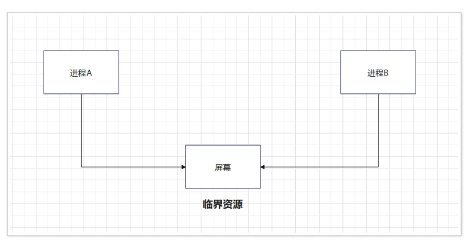

- semctl

  - 原型

    ```
    int semctl(int semid, int semnum, int cmd, …);
    ```

  - 功能

    信号集合控制函数，根据 cmd 决定当前函数的功能

  - 参数

    ```
    semid : 信号量集合的 id
    semnum : 信号量的编号, 信号量的编号从 0 开始
    cmd : 命令控制字
    SETVAL: 设置信号量的值
    GETVAL: 获取信号量的值
    … : 后⾯是属于可变参参数列表, 根据不同的命令有不同的参数
    ```

  - 返回值

    ```
    成功 : 根据不同的命令有不同的返回值, 可以查看帮助⽂档关于 RETURN 的说明
    GETNCNT the value of semncnt
    GETPID the value of sempid
    GETVAL the value of semval
    GETZCNT the value of semzcnt.
    All other cmd values return 0 on success.
    失败 : 返回 -1, 并设置 errno
    
    ```

- 示例1

  创建⼀个信号量集合，集合中包含⼀个信号量, 并设置信号量的值为 1

```
#include <stdio.h>
#include <stdlib.h>
#include <sys/types.h>
#include <sys/ipc.h>
#include <sys/sem.h>
#define SEM_PATHNAME "."
#define SEM_PRO_ID 100
union semun
{
    int val;
};
int main(void)
{
    int semid, ret;
    union semun s;
    key_t key = ftok(SEM_PATHNAME, SEM_PRO_ID);
    if (key == -1)
    {
        perror("[ERROR] ftok() : ");
        return -1;
    }
    //创建一个信号量semid
    semid = semget(key, 1, IPC_CREAT | 0666);
    if (semid == -1)
    {
        perror("[ERROR] semget() : ");
        return -1;
    }
    s.val = 1;
    //从0开始，SETVAL设置值  1
    ret = semctl(semid, 0, SETVAL, s);
    if (ret == -1)
    {
        perror("[ERROR] semctl() : ");
        return -1;
    }
    return 0;
}
```

- 操作信号量调⽤ semop 函数

  - 原型

    ```c
    int semop(int semid, struct sembuf *sops, size_t nsops);
    ```

  - 功能

    信号量操作函数，⽤于**占⽤信号量、释放信号量、设置信号量等待**

  - 参数

    ```
    semid : 信号量集合 id
    sops : 信号量操作结构体指针, ⻅后⾯关于 struct sembuf 解释
    nsops : 操作的信号量的数量
    ```

  - 返回值

    ```
    成功 : 返回 0
    失败 : 返回 -1, 并设置 errno
    ```

  - struct sembuf

    ```
    unsigned short sem_num;
    	信号量编号, 从 0 开始, 在 sem_op 的帮助⽂档中
    short sem_op;
        信号量操作
            -1 : 占⽤资源
            +1 : 释放资源
            0 : 等待资源
    short sem_flg;
        信号量操作标志
            IPC_NOWAIT : ⾮阻塞，在信号量的值为 0 时, 会⽴即返回
            SEM_UNDO : 在进程终⽌时, 会⾃动释放信号量
    ```

- 信号量集合调⽤ semctl 函数，设置命令为 IPC_RMID(第 三个参数会被忽略)

  ```c
  ret = semctl(semid,IPC_RMID,NULL);
  ```

- 信号量操作封装

  ```c
#include <stdio.h>
  #include <stdlib.h>
  #include <unistd.h>
  #include <pthread.h>
  #include <semaphore.h>
  
  // 信号量结构体定义
  typedef struct {
      sem_t *sem;
      int value;
  } MySemaphore;
  
  // 创建信号量
  int sem_create(MySemaphore *sem, int value) {
      sem->sem = (sem_t*)malloc(sizeof(sem_t));
    if (sem_init(sem->sem, 0, value) == -1) {
          perror("sem_init");
        return -1;
      }
      sem->value = value;
      return 0;
  }
  
  // P操作（等待）
  int sem_p(MySemaphore *sem) {
      if (sem_wait(sem->sem) == -1) {
          perror("sem_wait");
          return -1;
      }
      sem->value--;
      return 0;
  }
  
  // V操作（释放）
  int sem_v(MySemaphore *sem) {
      if (sem_post(sem->sem) == -1) {
          perror("sem_post");
          return -1;
      }
      sem->value++;
      return 0;
  }
  
  // 销毁信号量
  int sem_del(MySemaphore *sem) {
      if (sem_destroy(sem->sem) == -1) {
          perror("sem_destroy");
          return -1;
      }
      free(sem->sem);
      sem->value = 0;
      return 0;
  }
  
  // 线程函数示例，使用P和V操作控制共享资源
  void *thread_function(void *arg) {
      MySemaphore *semaphore = (MySemaphore*)arg;
      sem_p(semaphore);
      printf("Thread acquired semaphore, semaphore value: %d\n", semaphore->value);
      // Simulate some work
      sleep(2);
      sem_v(semaphore);
      printf("Thread released semaphore, semaphore value: %d\n", semaphore->value);
      return NULL;
  }
  
  int main() {
      MySemaphore semaphore;
      if (sem_create(&semaphore, 1) == -1) {
          fprintf(stderr, "Semaphore creation failed\n");
          return 1;
      }
  
      pthread_t thread1, thread2;
  
      // 创建两个线程并启动
      pthread_create(&thread1, NULL, thread_function, (void*)&semaphore);
    pthread_create(&thread2, NULL, thread_function, (void*)&semaphore);
  
    // 等待线程结束
      pthread_join(thread1, NULL);
      pthread_join(thread2, NULL);
  
      // 销毁信号量
      sem_del(&semaphore);
  
      return 0;
  }
  
  ```
  
- 信号量的同步

  创建⽗⼦进程，输出 “ABA” 字符串，具体需求如下: 

  ```
  ⽗进程 输出 A
  ⼦进程 输出 B
  ⽗进程 输出 A ，输出换⾏
  能够循环输出 “ABA” 字符
  ```

  基本思路:

  ​	通过创建⼀个信号量集合，包含 2 个信号量，⼀个信号量 编号为 0 （SEM_CONTROL_P）控制⽗进程的运⾏与暂停，⼀个信号量 编号为 1 （SEM_CONTROL_C） 控制⼦进程的运⾏与暂停

  信号初始化

  ​	SEM_CONTROL_P : 初始化为 1 

  ​	SEM_CONTROL_C : 初始化为 0

  ⼦进程:	

  ```
  占⽤ SEM_CONTROL_C , 此时⼦进程阻塞
  当⽗进程释放 SEM_CONTROL_C 时, ⼦进程 输出 B ，释放 SEM_CONTROL_P
  循环占⽤ SEM_CONTROL_C，由于之前已经占⽤，此时进⼊⼦进程阻塞，等待⽗进
  程释放 SEM_CONTROL_C
   while(1){
   sem_p(semid,SEM_CONTROL_C);
   printf("B");
   fflush(stdout);
   sem_v(semid,SEM_CONTROL_P);
   }
  
  ```

  ⽗进程:

  ```
  占⽤ SEM_CONTROL_P, 此时⽗进程正常运⾏, 输出 A
  释放 SEM_CONTROL_C, 占⽤ SME_CONTROL_P，此时⽗进程阻塞，⼦进程继续执
  ⾏
  当⼦进程输出 B 之后，释放 SEM_CONTROL_P, ⽗进程继续执⾏，输出 A
  ⽗进程 释放 SEM_CONTROL_P 循环结束
  while(1){
   sem_p(semid,SEM_CONTROL_P);
   printf("A");
   fflush(stdout);
   sem_v(semid,SEM_CONTROL_C);
   sem_p(semid,SEM_CONTROL_P);
   printf("A");
   fflush(stdout);
   sem_v(semid,SEM_CONTROL_P);
   sleep(1);
   putchar('\n');
   }
  
  ```

  示例:

  ```c
  #include <stdio.h>
  #include <stdlib.h>
  #include <sys/types.h>
  #include <sys/wait.h>
  #include "sem.h"
  #define SEM_CONTROL_P 0
  #define SEM_CONTROL_C 1
  int main(void)
  {
      pid_t cpid;
      int semid;
      unsigned short values[2] = {1, 0};
      semid = sem_create(2, values);
      if (semid == -1)
          exit(EXIT_FAILURE);
      cpid = fork();
      if (cpid == -1)
      {
          perror("[ERROR] fork(): ");
          exit(EXIT_FAILURE);
      }
      else if (cpid == 0)
      {
          while (1)
          {
              sem_p(semid, SEM_CONTROL_C);
              printf("B");
              fflush(stdout);
              sem_v(semid, SEM_CONTROL_P);
          }
      }
      else
      {
          while (1)
          {
              sem_p(semid, SEM_CONTROL_P);
              printf("A");
              fflush(stdout);
              sem_v(semid, SEM_CONTROL_C);
              sem_p(semid, SEM_CONTROL_P);
              printf("A");
              fflush(stdout);
              sem_v(semid, SEM_CONTROL_P);
              sleep(1);
            putchar('\n');
          }
          wait(NULL);
      }
      return 0;
  }
  ```
  


总结： 

没有竞争：父子传建议用**无名管道**，**信号特殊场景用**，其他都**用消息队列。**

竞         争：两个进程竞争资源**用信号量。**

## 五、线程

  进程都有自己内存空间。。。。难道我们提高效率就要无限制开进程。

### 1、概念

​	线程是进程中的⼀个执⾏单元，负责当前进程中程序的执⾏，⼀个进程中⾄少有⼀个线程，多个线程共享同一个进程的所有资源，每个线程参与操作系统的统一调度。


​     进程是自愿分配最小单位。

​     线程是操作系统调度最小单位。

### 2、与进程区别

#### 2.1、内存空间

```
一个进程中多个线程共享同一个内存空间
多个进程拥有独立的内存空间
```

#### 2.2、进程/线程间通讯

```
线程间通讯方式简单-共享
进程间通讯方式复杂--空间隔离
```

### 3、线程资源

##### 共享进程的资源

```
同一块地址空间
    堆
    静态区
文件描述符表
每种信号的处理方式（如：SIG_DFL,SIG_IGN或者自定义的信号优先级）
当前工作目录
用户id和组id
```

##### 独立的资源

```c
线程栈--线程私有，里面的函数是栈帧
每个线程都有私有的上下文信息。
寄存器的值
errno变量
信号屏蔽字以及调度优先级
```

### 4、状态（生命周期）

​	在线程的生命周期中，它要经过新建（New）、就绪（Ready）、运行（Running）、阻塞（Blocked）和死亡（Dead）5种状态。尤其是当线程启动以后，它不可能一直“霸占”着CPU独自运行，所以CPU需要在多条线程之间切换，于是线程状态也会多次在运行、就绪之间切换。

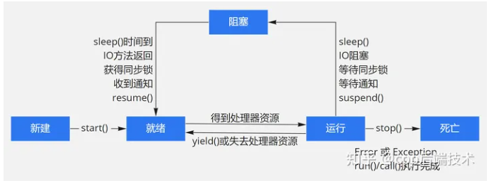

### 5、线程模型

一个“重”（heavy weight）进程可以有多个“轻”（light weight）并发执行路径。

- 主程序 a.out 计划由本机操作系统运行。a.out 加载并获取运行所需的所有系统和用户资源。这是“heavy weight”过程。
- a.out 执行一些串行工作，然后创建许多任务（线程），这些任务可以由操作系统同时调度和运行。
- 每个线程都有本地数据（栈），但也共享 a.out 的全部资源（堆）。这避免了为每个线程复制程序资源。每个线程还可以从全局内存视图中受益，因为它们共享 a.out 的内存空间。
- 最好将线程的工作描述为主程序中的子程序。任何线程都可以与其他线程同时执行任何子程序。
- 线程通过全局内存（更新地址位置）相互通信。这需要同步结构来确保同一时刻不会有多个线程更新相同的全局地址。
- 线程可以产生或消亡，但是 a.out 需要一直存在，以提供必要的共享资源，直到应用程序结束。

### 6、查看线程的命令

​    pidstat，top，ps

```
pidstat -p 进程号 -t
top -H -p 11202
ps -T -p 11202
```

   难道说main函数运行，会创建一个线程id为pid的线程，来执行main？

### 7 线程操作

​	**sleep休眠**

#### 7.1创建pthread_create

##### 原型

```c
int pthread_create(pthread_t *tip, const pthread_attr_t *attr,void *(*start_routine) (void *), void *arg);
```

##### 参数

```c
thread : 线程 ID 变量指针
attr : 线程属性,默认属性可设置为 NULL
start_routine : 线程执行函数
arg : 线程执行函数的参数
```

##### 返回值

```
成功 : 返回 0
失败 : 返回 错误码
```

##### 注意

```
一旦子线程创建成功,则会被独立调度执行,并且与其他线程 并发执行
创建多个线程时，⼀般由主线程统⼀创建，并等待释放资源或者分离线程, 不要递归创建。
在编译时需要链接 -lpthread
```


```c
#include <pthread.h>
#include <stdio.h>
#include <stdlib.h>

void *do_thread01(void *param)
{
    pthread_t current_tid = pthread_self();
    printf("user thread id is %ld\n", current_tid);
    while (1)
    {
    
    }
    
    return NULL;
}


void *do_thread02(void *param)
{
    pthread_t current_tid = pthread_self();
    printf("user thread id is %ld\n", current_tid);
    while (1)
    {
    
    }
    
    return NULL;
}
int main(int argc, char const *argv[])
{
    // get current thread
    pthread_t main_tid = pthread_self();
    printf("main thread  id is%ld\n", main_tid);

    int result01;
    pthread_t tid01;
    result01 = pthread_create(&tid01, NULL, do_thread01, NULL);
    if (result01 != 0)
    {
        perror("error.......");
        exit(EXIT_FAILURE);
    }


    int result02;
    pthread_t tid02;
    result02 = pthread_create(&tid02, NULL, do_thread02, NULL);
    if (result02 != 0)
    {
        perror("error.......");
        exit(EXIT_FAILURE);
    }

    while (1) // block,sure user thread can run!
    {
    }

    return 0;
}

```

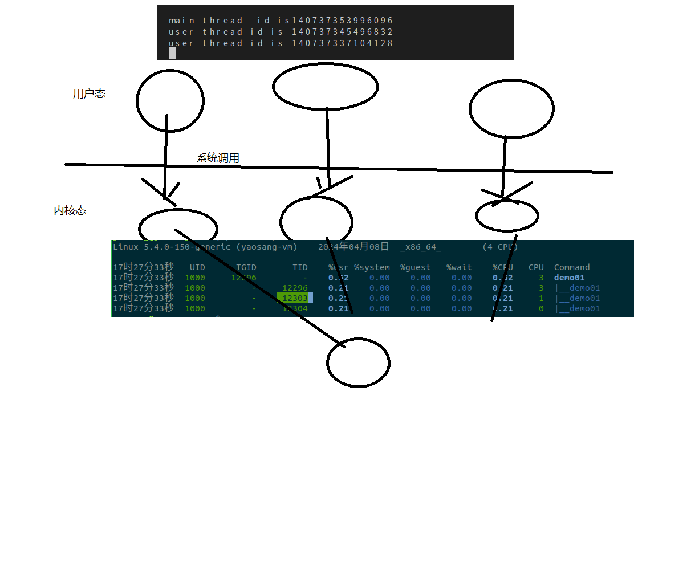

task.json

```
     "args": [
                "-fdiagnostics-color=always",
                "-g",
                "${file}",
                "-o",
                "${fileDirname}/${fileBasenameNoExtension}",
                "-lpthread"
            ],
```

导入pthread.h，只是导入接口，是以链接库的方式使用，加上  "-lpthread"才OK

#### 7.2、退出pthread_exit

##### 原型

```c
void pthread_exit(void *retval);
```

##### 参数

retval : 线程返回值,通过指针传递

##### 返回值

```
成功 ：返回 0
失败 : 返回 -1
```

##### 注意

```
1.当主线程调用 pthread_exit 函数时，进程不会结束，也不会导致其他子线程退出
2.任何线程调用 exit 函数会让进程结束
```

#### 7.3、等待pthread_join

###### 原型

```c
int pthread_join(pthread_t thread, void **retval);
```

###### 参数

```
thread : 线程 ID
retval : 获取线程退出值的指针
```

返回值

```
成功 : 返回 0
失败 : 返回 错误码
```

#### 7.4、分离pthread_detach

线程退出后，由操作系统自动释放该线程的资源

##### 原型

```c
int pthread_detach(pthread_t thread);
```

##### 参数

```
thread : 线程 ID
```

##### 返回值

```
成功 : 返回 0
失败 : 返回 -1
```

##### 注意

​	线程分离函数不会阻塞线程的执行


```c
#include <pthread.h>
#include <stdio.h>
#include <stdlib.h>
#include <unistd.h>

void *do_thread01(void *param)
{
    pthread_t current_tid = pthread_self();
    printf("user thread id is %ld\n", current_tid);
    sleep(10); //thread sleep
    pthread_exit(current_tid); //exit thread
    printf("user thread id is %ld end.\n", current_tid);
    return NULL;
}


void *do_thread02(void *param)
{
    pthread_t current_tid = pthread_self();
    printf("user thread id is %ld\n", current_tid);
    sleep(15);
    printf("user thread id is %ld end.\n", current_tid);
    return NULL;
}
int main(int argc, char const *argv[])
{
    // get current thread
    pthread_t main_tid = pthread_self();
    printf("main thread  id is%ld\n", main_tid);

    int result01;
    pthread_t tid01;
    result01 = pthread_create(&tid01, NULL, do_thread01, NULL);
    if (result01 != 0)
    {
        perror("error.......");
        exit(EXIT_FAILURE);
    }
 


    int result02;
    pthread_t tid02;
    result02 = pthread_create(&tid02, NULL, do_thread02, NULL);
    if (result02 != 0)
    {
        perror("error.......");
        exit(EXIT_FAILURE);
    }

     printf("main thread run.....\n");

    //wait user thread run finish!

    pthread_detach(tid01);  //not wait
    pthread_detach(tid02);
    pthread_join(tid01,NULL);
    pthread_join(tid02,NULL);
     printf("main thread run  end.....\n");
    return 0;
}

```


### 8、线程间通讯

线程之间的同学分两种： 父线程与子线程    **非父子关系（消息队列。。。。）**

#### 8.1、主线程通过 pthread_create 函数的第 4 个参数传递给⼦线程

```c
#include <stdio.h>
#include <stdlib.h>
#include <pthread.h>
#include <string.h>
void *do_thread(void *arg)
{
 int num = *(int *)arg;
 
 printf("num = %d\n",num);
 printf("thread start.\n");
 pthread_exit(NULL);
}
int main(void)
{
 pthread_t tid;
 int err;
 int num = 100;
 err = pthread_create(&tid,NULL,do_thread,&num);
 if(err != 0){ 
 fprintf(stderr,"[ERROR] pthread_create(): %s \n",strerror(err));
 exit(EXIT_FAILURE);
 } 
 pthread_join(tid,NULL);
 return 0;
}
```

练习

设计⼀个结构 struct perosn , 包含名字与年龄，在主线程中定义结构体变量，并传递到⼦线程进⾏打

印


```c
#include <stdio.h>
#include <stdlib.h>
#include <pthread.h>
#include <string.h>

struct  Person
{
    long id;
    char name[20];
};

typedef struct Person Person;


   void * do_thread (void * param){
        Person * pp = (Person *)param;
        printf("thread start.\n");
        printf("person name is %s",pp->name);
        pthread_exit(NULL);
    }
/**
 * 主线程通过 pthread_create 函数的第 4 个参数传递给⼦线程
*/
int main(int argc, char const *argv[])
{
    
    Person zs = {1,"zs"};
    //Person  *pp = &zs;

    pthread_t tid;
    int result = pthread_create(&tid,NULL,do_thread,&zs);

    if (result!=0)
    {
            perror("create thread erorr!");
            exit(EXIT_FAILURE);
    }

    //wait child thread run end!
    pthread_join(tid,NULL);
    return 0;
}

```


#### 8.2、⼦线程通过返回值传递参数给主线程

```c
#include <stdio.h>
#include <stdlib.h>
#include <pthread.h>
#include <string.h>

struct  Person
{
    long id;
    char name[20];
};


struct Sunzi
{
     long id;
     char sname[20];
};

typedef struct Person Person;
typedef struct Sunzi Sunzi;

   void * do_thread (void * param){
        Person * pp = (Person *)param;
        printf("thread start.\n");
        printf("person name is %s\n",pp->name);

        //return one val to parent
        Sunzi* sunzi = (Sunzi *)malloc(sizeof(Sunzi));
        sunzi->id =1;
        strcpy(sunzi->sname,"ls");
        pthread_exit(sunzi);
    }
/**
 * 主线程通过 pthread_create 函数的第 4 个参数传递给⼦线程
*/
int main(int argc, char const *argv[])
{
    
    Person zs = {1,"zs"};
    //Person  *pp = &zs;

    pthread_t tid;
    void * thread_ret;
    int result = pthread_create(&tid,NULL,do_thread,&zs);

    if (result!=0)
    {
            perror("create thread erorr!");
            exit(EXIT_FAILURE);
    }

    //wait child thread run end!
    pthread_join(tid,&thread_ret);

      Sunzi* ls =  (Sunzi *)thread_ret;

      printf("sunzi name is%s\n",ls->sname);
    
    return 0;
}

```

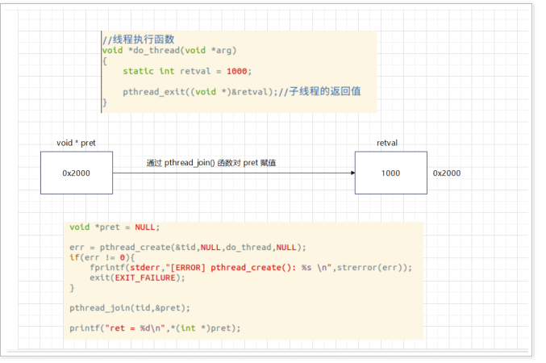

⼦线程给主线程传参的⽅式如下:

在⼦线程将需要返回的值存储在 pthread_exit 函数中的 retval 参数中

在主线程中通过 pthread_join 函数的第 2 个参数 retval 得到返回, pthread_join 函数

会将线程的返回值 (指针) 保存到 retval 中

练习

设计⼀个结构 struct perosn , 包含名字与年龄，在⼦线程中定义结构体变量，并传递给主线程进⾏打

印

### 9、线程安全

#### 9.1、概念

​	在多线程的环境下，不同线程同时读和写公共资源（临界资源），导致的数据异常问题。

​	线程安全问题大多是由**全局变量**及**静态变量**引起的，他们是多个线程共享的。**局部变量逃逸**也可能导致线程安全问题。

四个窗口卖票，没有做线程安全出来，导致票数出问题了！

```c
#include <stdio.h>
#include <stdlib.h>
#include <string.h>
#include <pthread.h>
#include <unistd.h>

static int ticket_num = 3;

 void * sale_ticket (void * param){
    while (1)
    {
        printf("%ld prepare sale ticket,ticket_num is %d\n", pthread_self(),ticket_num);
        if (ticket_num>0) //1
        { //4
            sleep(2);
            ticket_num-=1;
            printf("%ld saled ticket,ticket_num is %d\n",pthread_self(),ticket_num);
        }else{
            pthread_exit(NULL);
        }
    }
 }
int main(int argc, char const *argv[])
{
    // user four window sale ticket! use four thread!
    pthread_t tids[4];
    int result;
    for (int i = 0; i < 4; i++)
    {
      result = pthread_create(&tids[i],NULL,sale_ticket,NULL);
      if (result!=0)
      {
         fprintf(stderr,"[ERROR] pthread_create(): < %s > \n",strerror(result));
         exit(EXIT_FAILURE);
      }
    }
   

   //create thread finished,wait threads end!
    for (int i = 0; i < 4; i++){
        pthread_join(tids[i],NULL);
    }

    printf("end  ticket_num is %d.....................\n",ticket_num);
    return 0;
}

```

```
在C语言中，由于缺少语言级别的线程安全支持，因此需要手动实现多线程下的线程安全机制。以下是一些常见的线程安全机制：
1 线程局部存储（Thread Local Storage）：使用线程局部存储可以确保每个线程都拥有自己的变量副本，从而避免了多个线程之间的竞争问题。--每个线程都有自己数据，不访问共享数据。

2 使用互斥锁（Mutex）：使用互斥锁可以确保在任何时候只有一个线程可以访问临界区，从而避免了并发写操作引起的问题。-马上讲

3 使用信号量（Semaphore）：使用信号量可以控制对资源的访问数量，避免资源的超额占用和浪费，从而提高资源利用率。-已经讲过
4 原子操作：原子操作是编写线程安全代码的另一种方法。原子操作是一个操作单元，在执行过程中不会被中断，可以保证数据的完整性。-后面讲

5 使用读写锁（Read-Write Lock）：如果某些数据被频繁地读取，但很少被写入，那么可以使用读写锁同步对这些数据的访问，从而优化性能。-后面讲

总之，选择合适的线程安全机制取决于应用程序的需求，设计良好的多线程程序需要对并发操作进行认真的分析和考虑，合理地选择数据结构和算法，以及有效地应用线程安全技术，从而确保应用程序在多线程环境下运行时不会出现数据竞争，获取预期的结果。
```


#### 9.2、互斥锁实现

互斥锁pthread_mutex_t⽤于解决多线程资源竞争问题

##### 9.2.1 概述

- 工作机制

  当⼀个线程 A 获得锁, 另外⼀个线程 B 在获得锁则会阻塞，直到线程 A 释放锁, 线程

  B 则才会获得锁.

- 工作原理

  本质上是⼀个 pthread_mutex_t 类型的变量, 假设名为 v

  当 v = 1, 则表示当前临界资源可以竞争访问 , 得到互斥锁的线程则可以访问，此时 v = 0

  当 v = 0, 则表示临界资源正在被某个线程访问, 其他线程则需要等待

- 特点

  互斥锁是⼀个 pthread_mutex_t 型的变量, 就代表⼀个 互斥锁

  如果两个线程访问的是同⼀个 pthread_mutex_t 变量，那么它们访问了同⼀个互斥锁

  对应的变量定义在 pthreadtypes.h 头⽂件中, 是⼀个共⽤体中包含⼀个结构体

##### 9.2.2 api解读

- 初始化锁

   静态初始化

  定义 pthread_mutex_t 类型的变量，然后对其初始化为PTHREAD_MUTEX_INITIALIZER.

  **pthread_mutex_t mtx = PTHREAD_MUTEX_INITIALIZER**

  动态初始化

  动态初始化主要涉及两个函数 pthread_mutex_init 函数 与

  pthread_mutex_destroy 函数

- 获取锁 (lock) 

  - 原型

    ```c
    int pthread_mutex_lock(pthread_mutex_t *mutex);
    ```

  - 功能

    将互斥锁进⾏锁定，如果已经锁定，则阻塞线程

  - 参数

    mutex : 线程互斥锁指针

  - 返回值

    ```
    成功 : 返回 0
    失败 : 返回 错误码
    ```

- 释放锁 (unlock)

  - 原型

    ```c
    int pthread_mutex_unlock(pthread_mutex_t *mutex);
    ```

  - 功能

    解除互斥锁锁定状态，解除后，所有线程可以重新竞争锁

  - 参数

    ```
    成功 : 返回 0
    失败 : 返回 错误码	
    ```

  pthread_mutex_t mutex;
  pthread_mutex_init(&mutex,NULL);  ///< 初始化互斥锁
  pthread_mutex_lock(&mutex);       ///< 加锁
  ///< 操作公共资源
  pthread_mutex_unlock(&mutex);     ///< 解锁
  pthread_mutex_destroy(&mutex);    ///< 销毁互斥锁

##### 9.2.3 实现


```c
#include <stdio.h>
#include <stdlib.h>
#include <string.h>
#include <pthread.h>
#include <unistd.h>

static int ticket_num = 3;
//init nutex lock
 pthread_mutex_t  mtx = PTHREAD_MUTEX_INITIALIZER;
 void * sale_ticket (void * param){
    while (1)
    {
           sleep(1);
        //try lock,cant get ....wait
        pthread_mutex_lock(&mtx);
        printf("%ld prepare sale ticket,ticket_num is %d\n", pthread_self(),ticket_num);
        if (ticket_num>0) //1
        { //4
            ticket_num-=1;   
            printf("%ld saled ticket,ticket_num is %d\n",pthread_self(),ticket_num);
            pthread_mutex_unlock(&mtx);
        }else{
            pthread_mutex_unlock(&mtx);
            pthread_exit(NULL);
        }

      
    }
 }
int main(int argc, char const *argv[])
{
    // user four window sale ticket! use four thread!
    pthread_t tids[4];
    int result;
    for (int i = 0; i < 4; i++)
    {
      result = pthread_create(&tids[i],NULL,sale_ticket,NULL);
      if (result!=0)
      {
         fprintf(stderr,"[ERROR] pthread_create(): < %s > \n",strerror(result));
         exit(EXIT_FAILURE);
      }
    }
   

   //create thread finished,wait threads end!
    for (int i = 0; i < 4; i++){
        pthread_join(tids[i],NULL);
    }

    printf("end  ticket_num is %d.....................\n",ticket_num);
    return 0;
}

```


#### 9.3、线程同步

##### 9.3.1 概述

​	同步是指在互斥的基础上（⼤多数情况），通过其它机制实现访问者对 资源的有序访问。

​	线程同步⽐较典型的应⽤场合就是 ⽣产者与消费者

这个模型中, 分为 ⽣产者线程 与 消费者线程, 通过这个线程来模拟多个线程同步的过程.

在这个模型中, 需要以下组件:

​	仓库 : ⽤于存储产品, ⼀般作为共享资源

​	⽣产者线程 : ⽤于⽣产产品

​	消费者线程 : ⽤于消费产品

​    机制：当仓库没有产品时, 则消费者线程需要等待, 直到有产品时才能消费当仓库已经装满产品时, 则⽣产者线程需要等待, 直到消费者线程消费产品之后

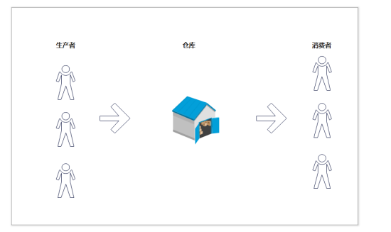

##### 9.3.2 基于互斥锁实现⽣产者与消费者模型

主线程为消费者

n 个⼦线程作为⽣产者

```c
#include <stdio.h>
#include <stdlib.h>
#include <stdbool.h>
#include <pthread.h>
#include <unistd.h>
static int number = 0;
pthread_mutex_t mtx = PTHREAD_MUTEX_INITIALIZER;
void *thread_handler(void *arg)
{
 int cnt = atoi((char *)arg);
 int i,tmp;
 for(i = 0;i < cnt;i++){
 pthread_mutex_lock(&mtx);
 printf("线程 [%ld] ⽣产⼀个产品,产品数量为:%d\n",pthread_self(),++number);
 pthread_mutex_unlock(&mtx);
 }
 pthread_exit((void *)0);
}
int main(int argc,char *argv[])
{
 pthread_t tid;
 int i;
 int err;
 int total_of_produce = 0;
 int total_of_consume = 0;
 bool done = false;
 for (i = 1;i < argc;i++){
 total_of_produce += atoi(argv[i]); 
 err = pthread_create(&tid,NULL,thread_handler,(void *)argv[i]);
 if (err != 0)
 {
 perror("pthread_create()");
 exit(EXIT_FAILURE);
 }
 }
 for (;;){
 pthread_mutex_lock(&mtx);
 while(number > 0){
 total_of_consume++; 
 printf("消费⼀个产品,产品数量为:%d\n",--number);
 done = total_of_consume >= total_of_produce; 
 sleep(1);
 }
 pthread_mutex_unlock(&mtx);
 if (done)
 break;
 }
 return 0;
}
~
```

不⾜:

主线程 (消费者线程) 需要不断查询是否有产品可以消费, 如果没有产品可以消费，也

在运⾏程序，包括获得互斥锁、判断条件、释放互斥锁，⾮常消耗 cpu 资源


#### 9.4 条件变量

##### 9.4.1 概述

允许⼀个线程就某个共享变量的状态变化通知其他线程, 并让其他线程等待这⼀通知

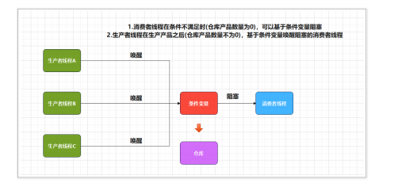

条件变量的本质为 pthread_cond_t 类型的变量, 其他线程可以阻塞在这个条件变量上, 或者唤

醒阻塞在这个条件变量上的线程,

用于自动阻塞线程，直到某个条件满足或者特定的事件发生为止，是线程库提供的专⻔针对线程同步的机制。

##### 9.4.2 api

- 定义与初始化

条件变量的定义

```c
pthread_cond_t MyCond;
```

宏初始化

```c
pthread_cond_t MyCond = PTHREAD_COND_INITIALIZER;
```

函数初始化

```c
#include <pthread.h>
int pthread_cond_init(pthread_cond_t *cond, 
                      const pthread_condattr_t *attr);
1）参数 cond 指向 pthread_cond_t 条件变量对象；
2）参数 attr 指向一个 pthread_condattr_t 类型对象，
   pthread_condattr_t 数据类型用于描述条件变量的属性。
   这个条件变量的属性内容有点多，感兴趣的可以查资料学习！
```

- ##### 销毁条件变量


```c
#include <pthread.h>
int pthread_cond_destroy(pthread_cond_t *cond);
```

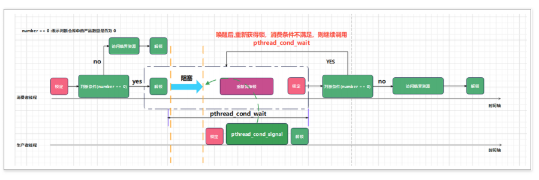

```
step 1 : 消费者线程判断消费条件是否满⾜ (仓库是否有产品)，如果有产品可以消费，则可以正
常消费产品，然后解锁
step 2 : 当条件不能满⾜时 (仓库产品数量为 0)，则调⽤ pthread_cond_wait 函数, 这个函数
具体做的事情如下:
在线程睡眠之前，对互斥锁解锁
让线程进⼊到睡眠状态
等待条件变量收到信号时 **，该函数重新竞争锁，并获取锁后，函数返回 **
step 3 ：重新判断条件是否满⾜, 如果不满⾜，则继续调⽤ pthread_cond_wait 函数
step 4 : 唤醒后，从 pthread_cond_wait 返回，消费条件满⾜，则正常消费产品
step 5 : 释放锁，整个过程结束
```


- ##### 等待条件变量

  问题 1: 为什么条件变量需要与互斥锁结合起来使⽤?

  解答:

​	防⽌在调⽤ pthread_cond_wait 函数等待⼀个条件变量收到唤醒信号，另外⼀个线程

发送信号在第⼀个线程实际等待它之前

线程还没有完全进⼊到睡眠状态，其他线程发送唤醒信号

下⾯是官⽅帮助⽂档的解释如下:

​	

```c
#include <pthread.h>
int pthread_cond_wait(pthread_cond_t *cond, pthread_mutex_t *mutex);
参数：
1）cond ：指向需要等待的条件变量，目标条件变量；
2）mutex ：参数 mutex 是一个 pthread_mutex_t 类型指针，指向一个互斥锁对象；
 
返回值：调用成功返回 0；失败将返回一个非 0 值的错误码。
```

- ##### 通知条件变量


​	使用 pthread_cond_broadcast()函数总能产生正确的结果，唤醒所有等待状态的线程。但函数 pthread_cond_signal()会更为高效，因为它只需确保至少唤醒一个线程即可，所以如果我们的程序当中，只有一个处于等待状态的线程，建议使用 pthread_cond_signal()。

​	当其他线程通过pthread_cond_signal()或pthread_cond_broadcast，把该线程唤醒，使 pthread_cond_wait()通过（返回）时，该线程又自动获得该mutex。

```c
#include <pthread.h> 
int pthread_cond_broadcast(pthread_cond_t *cond); 
int pthread_cond_signal(pthread_cond_t *cond);
```


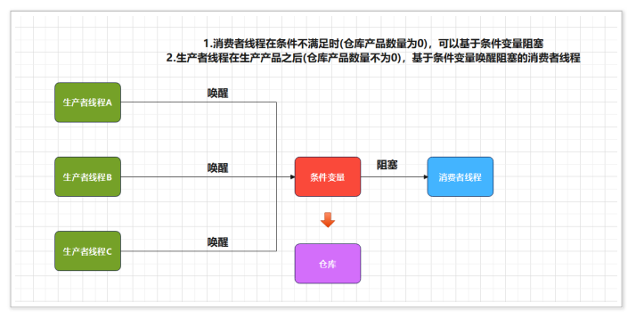

##### 9.4.3  代码实现

基于条件变量实现⽣产者与消费者模型 (多个⽣产者对应⼀个消费者)

```c
#include <stdio.h>
#include <stdlib.h>
#include <stdbool.h>
#include <pthread.h>
#include <unistd.h>
static int number = 0;
static pthread_mutex_t mtx = PTHREAD_MUTEX_INITIALIZER;
static pthread_cond_t cond = PTHREAD_COND_INITIALIZER;
void *thread_handler(void *arg)
{
    int cnt = atoi((char *)arg);
    int i, tmp;
    for (i = 0; i < cnt; i++)
    {
        pthread_mutex_lock(&mtx);
        printf("线程 [%ld] ⽣产⼀个产品,产品数量为:%d\n", pthread_self(), ++number);
        pthread_mutex_unlock(&mtx);
        pthread_cond_signal(&cond);
    }
    pthread_exit((void *)0);
}
int main(int argc, char *argv[])
{
    pthread_t tid;
    int i;
    int err;
    int total_of_produce = 0;
    int total_of_consume = 0;
    bool done = false;
    for (i = 1; i < argc; i++)
    {
        total_of_produce += atoi(argv[i]);
        err = pthread_create(&tid, NULL, thread_handler, (void *)argv[i]);
        if (err != 0)
        {
            perror("[ERROR] pthread_create(): ");
            exit(EXIT_FAILURE);
        }
    }
    for (;;)
    {
        pthread_mutex_lock(&mtx);
        while (number == 0)
            pthread_cond_wait(&cond, &mtx);
        while (number > 0)
        {
            total_of_consume++;
            printf("消费⼀个产品,产品数量为:%d\n", --number);
            done = total_of_consume >= total_of_produce;
        }
        pthread_mutex_unlock(&mtx);
      if (done)
            break;
    }
    return 0;
}
```


### 12、线程池

#### 1、概念	

​	线程过多会带来调度开销，进而影响缓存局部性和整体性能。而线程池维护着多个线程，等待着监督管理者分配可并发执行的任务。这避免了在处理短时间任务时创建与销毁线程的代价。线程池不仅能够保证内核的充分利用，还能防止过分调度。

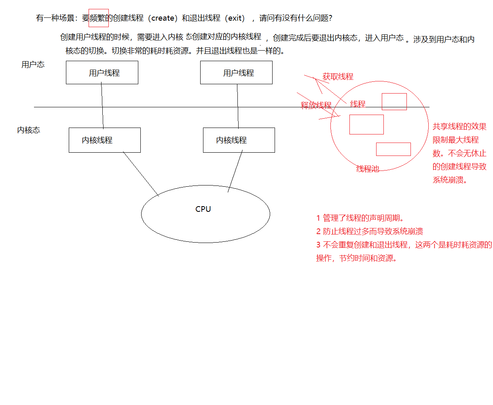

#### 2、应用范围

- 需要大量的线程来完成任务，且完成任务的时间比较短。 
- 对性能要求苛刻的应用，比如要求服务器迅速响应客户请求。
- 接受突发性的大量请求，但不至于使服务器因此产生大量线程的应用。

#### 3、示例

thread_pool.h

```c
#ifndef __THREADPOOL_H__
#define __THREADPOOL_H__
// #include<stdio.h>
#include <stdio.h>
#include <pthread.h>
// 任务结构体
struct Task
{
    void (*function)(void *arg);
    void *arg;
};
typedef struct Task Task;
// 线程池结构体
struct ThreadPool
{
    /* 任务队列 */
    Task *taskQ;
    int queueCapacity;    // 容量
    int queueSize;        // 当前任务个数
    int queueFront;       // 队头 -> 取数据
    int queueRear;        // 队尾  -> 放数据
    pthread_t managerID;  // 管理者线程ID(只有1个！)
    pthread_t *threadIDs; // 工作的线程ID(有许多个！)
    int minNum;
    int maxNum;
    int busyNum;
    int liveNum;
    int exitNum;
    pthread_mutex_t mutexPool; // 锁整个线程池 pthread_mutex_t <==> std::mutex(C++11)
    pthread_mutex_t mutexBusy; // 锁busyNum变量 pthread_mutex_t <==> std::mutex(C++11)
    pthread_cond_t notFull;    // 任务队列是不是满了 pthread_cond_t <==> std::condition_varibale类(C++11)
    pthread_cond_t notEmpty;   // 任务队列是不是满了
    int shutdown;              // 是不是要销毁线程池，销毁为1，不销毁为0
};
typedef struct ThreadPool ThreadPool;

// 创建线程池并且初始化
ThreadPool *threadPoolCreate(int min, int max, int queueSize);

// 销毁线程池
int threadPoolDestroy(ThreadPool *pool);

// 给线程池添加任务
void threadPoolAdd(ThreadPool *pool, void (*func)(void *), void *arg);

// 获取线程池中工作的线程的个数
int threadPoolBusyNum(ThreadPool *pool);

// 获取线程池中活着的线程的个数
int threadPoolAliveNum(ThreadPool *pool);

// 注意：工作的线程一定是活着的！但是，活着的线程不一定在工作！！！

// 工作的线程（消费者线程）的任务函数
void *worker(void *arg);
// 管理者线程任务函数
void *manager(void *arg); // (主要用于创建和销毁线程池的！)
// 单个线程退出
void threadExit(ThreadPool *pool);
#endif
```

thread_pool.c

```c
#include "thread_pool.h"
#include <string.h>               //用memset函数
#include <unistd.h>               //用sleep函数
#include <pthread.h>              //使用pthread_self() 打印当前线程的id的函数
#include <stdlib.h>               //使用malloc操作
const int ADDORDESTROYNUMBER = 2; // 每次添加/销毁的线程的number个数

// typedef struct Task Task;
// typedef struct ThreadPool ThreadPool;
// 创建线程池并且初始化
ThreadPool *threadPoolCreate(int min, int max, int queueSize)
{ // 形参表分别为：最小线程个数，最大线程个数以及队列大小！
    ThreadPool *pool = (ThreadPool *)malloc(sizeof(ThreadPool));
    do
    {
        if (pool == NULL)
        {
            printf("malloc threadpool fail ...\n"); // 分配内存失败 return 空
            break;
            // return NULL;
        }
        // succeed to create a thread pool!
        pool->threadIDs = (pthread_t *)malloc(sizeof(pthread_t) * max); // 工作线程中，分别Max个空间的heap区数组空间
        if (pool->threadIDs == NULL)
        {
            printf("malloc threadIDs fail ...\n"); // 分配内存失败 return 空
            break;
            // return NULL;
        }
        // 初始化工作的线程IDs们
        memset(pool->threadIDs, 0, sizeof(pthread_t) * max); // memset为cstring中的函数，用来赋值！
        // 把线程id数组中的元素全都赋值为0
        pool->minNum = min;
        pool->maxNum = max;
        pool->busyNum = 0;
        pool->liveNum = min; // 初始化时以线程的个数最小值来创建活着的线程的个数！
        pool->exitNum = 0;   // 一开始初始化肯定没有销毁线程的，这个数量要根据程序运行中的状态来decide！

        if (pthread_mutex_init(&pool->mutexPool, NULL) != 0 ||
            pthread_mutex_init(&pool->mutexBusy, NULL) != 0 ||
            pthread_cond_init(&pool->notEmpty, NULL) != 0 ||
            pthread_cond_init(&pool->notFull, NULL) != 0)
        {
            // 此时创建失败
            printf("mutex or condition inti fail ...\n");
            break;
            // return 0;
        }

        // 此时创建锁mutex和条件变量cond成功！

        // 然后创建任务队列
        pool->taskQ = (Task *)malloc(sizeof(Task) * queueSize);
        // 开辟一块arr内存存放任务队列，arr所存储的任务最大值为容量那么大
        pool->queueCapacity = queueSize;
        pool->queueSize = 0;  // 当前任务数为0个
        pool->queueFront = 0; // 因为没有任务，所有头部执行0index
        pool->queueRear = 0;  // 因为没有任务，所有尾部执行0index

        pool->shutdown = 0; // 初始化时肯定不能销毁线程池，所有标记为0（自己规定的）

        // 创建线程
        pthread_create(&pool->managerID, NULL, manager, pool); // 创建管理者这一个线程
        for (int i = 0; i < min; i++)
        { // 一开始就创建min个线程（这是线程池中的最小线程数！）
            pthread_create(&pool->threadIDs[i], NULL, worker, pool);
        }

        // 如果能成功执行到这里，那么就表示成功执行了线程池！
        // 此时直接返回线程池即可！
        return pool;
    } while (0); // 只会执行一次！只要有开辟不成功的case，马上break出while循环！

    // 下面再进行资源释放的工作！
    if (pool && pool->threadIDs)
        free(pool->threadIDs); // 线程池存在的case下，开辟了线程IDs的空间时，就释放它！
    if (pool && pool->taskQ)
        free(pool->taskQ); // 线程池存在的case下，开辟了taskQ的空间时，就释放它！
    if (pool)
        free(pool); // 释放线程池

    return NULL;
}

// 销毁线程池（当线程池被销毁时，线程池中的所有成员都必须被销毁！）
int threadPoolDestroy(ThreadPool *pool)
{
    if (pool == NULL)
        return -1; //    表示此时线程池已空，不需要销毁了
    //  线程池不空（没被销毁时）
    pool->shutdown = 1; // 关闭线程池！

    //  阻塞回收管理者线程
    pthread_join(pool->managerID, NULL);

    //  唤醒阻塞的（活着的）消费者线程
    //  唤醒后他们会自动退出，为什么退出呢？（因为我们写了让他们退出的条件判断代码！）
    for (int i = 0; i < pool->liveNum; i++)
    {
        pthread_cond_signal(&pool->notEmpty);
    }

    //  释放申请的堆区内存
    if (pool->taskQ)
    {
        free(pool->taskQ);
        pool->taskQ = NULL;
    }
    if (pool->threadIDs)
    {
        free(pool->threadIDs);
        pool->threadIDs = NULL;
    }

    // 再释放互斥量锁还有条件类锁
    pthread_mutex_destroy(&pool->mutexBusy);
    pthread_mutex_destroy(&pool->mutexPool);
    pthread_cond_destroy(&pool->notEmpty);
    pthread_cond_destroy(&pool->notFull);

    free(pool);
    pool = NULL;
    return 0; // return 0 就表示的是成功Destory了线程池并返回了！
}

// 给线程池的任务队列中添加任务
void threadPoolAdd(ThreadPool *pool, void (*func)(void *), void *arg)
{
    // 由于你给该线程池的任务队列中添加任务时，很有可能此时你正在对任务进行读or写的操作
    // 那么因此这里就必须要用线程池的锁mutex_pool来锁住(防止这份共享代码因为OS的调度切换搞乱了！)
    pthread_mutex_lock(&pool->mutexPool);
    while (pool->queueSize == pool->queueCapacity && !pool->shutdown)
    {
        //  此时线程池的任务队列数 = 其最大容量了 并且 该线程池还没有被销毁 时

        //  阻塞生产者线程
        pthread_cond_wait(&pool->notFull, &pool->mutexPool);
    }
    //  此时被堵塞的生产者线程 被唤醒了（注意：此时该线程还是拿到了mutex互斥锁的状态的！）

    //  先判断线程池是否已经被销毁了！
    //  线程池被销毁
    if (pool->shutdown)
    {
        pthread_mutex_unlock(&pool->mutexPool); //   解锁
        return;                                 //   并 退出程序
    }

    //  线程池没被销毁时
    //  给线程池中的任务队列 添加任务

    pool->taskQ[pool->queueRear].function = func;
    pool->taskQ[pool->queueRear].arg = arg;
    //  让队尾index (循环)后移！
    pool->queueRear = (pool->queueRear + 1) % pool->queueCapacity;
    pool->queueSize++; //    队列任务+1

    pthread_cond_signal(&pool->notEmpty); // pool->notEmpty用来worker中！
    // 通知pool->notEmpty这个condition_variable条件变量的对象 返回true 让他唤醒了去工作干活了！

    pthread_mutex_unlock(&pool->mutexPool);
}

//  获取线程池中工作(忙)的线程的个数
int threadPoolBusyNum(ThreadPool *pool)
{
    //  注意 读取pool中的成员变量时 也为了防止别的线程给这些变量写or读数据
    //  应该加上锁！
    pthread_mutex_lock(&pool->mutexBusy);
    int busyNum = pool->busyNum;
    pthread_mutex_unlock(&pool->mutexBusy);
    return busyNum;
}

//  获取线程池中活着的线程的个数
int threadPoolAliveNum(ThreadPool *pool)
{
    //  注意 读取pool中的成员变量时 也为了防止别的线程给这些变量写or读数据
    //  应该加上锁！且这里因为没有给aliveNum 定义对应的互斥量 so 直接用线程池的锁即可
    pthread_mutex_lock(&pool->mutexPool);
    int aliveNum = pool->liveNum;
    pthread_mutex_unlock(&pool->mutexPool);
    return aliveNum;
}

//  工作的线程（消费者线程）的任务函数
void *worker(void *arg)
{
    // 首先把传入进来的参数类型转换为线程池类型
    ThreadPool *pool = (ThreadPool *)arg;

    // 接下来就算不断地读取任务队列中的任务（每个任务就是一个函数）

    while (1)
    {
        pthread_mutex_lock(&pool->mutexPool); // 加锁
        //  当前任务队列是否为空
        while (pool->queueSize == 0 && !pool->shutdown)
        {
            //  在当前队列中任务为空 并且 线程池没有被销毁时 就阻塞在这个工作线程中
            pthread_cond_wait(&pool->notEmpty, &pool->mutexPool); // 只有当pool->notEmpty的返回值为true时，就继续往下执行！

            //  当该哦工作的线程被唤醒时，判断一下该线程是否需要被销毁
            if (pool->exitNum > 0)
            {
                pool->exitNum--; // 每次判断好要让该线程自杀后，必须让exitNum--才行！
                //  当然，当条件变量wait被唤醒后，肯定是拿到了互斥锁才继续往下面执行的
                //  此时就必须要把pool->mutexPool这把锁头给unlock解锁一下，再退出该程序，否则你没解锁就退出的话该程序就直接死锁了！
                if (pool->liveNum > pool->minNum)
                {
                    pool->liveNum--;
                    pthread_mutex_unlock(&pool->mutexPool); // 解锁
                    // pthread_exit(NULL);//退出该线程！
                    threadExit(pool);
                }
            }
        }

        //  判断线程池是否被关闭了
        if (pool->shutdown)
        {                                           //   若线程池被销毁了，可以直接退出线程！
            pthread_mutex_unlock(&pool->mutexPool); // 解锁
            //  pthread_exit(NULL);//退出线程
            threadExit(pool);
        }

        //  若线程池没有被销毁了，可以直接做任务了（消费）
        //  从任务队列中取出一个任务(真正 do things！)
        struct Task task;
        task.function = pool->taskQ[pool->queueFront].function;
        task.arg = pool->taskQ[pool->queueFront].arg;
        //  移动头节点 使之do循环移动 构成一个循环队列
        pool->queueFront = (pool->queueFront + 1) % pool->queueCapacity;
        pool->queueSize--; // 取出1个任务了，所有--

        // 解锁
        pthread_cond_signal(&pool->notFull);
        pthread_mutex_unlock(&pool->mutexPool);

        //  do 真正的工作（在function中）
        printf("thread %ld start working...\n", pthread_self());
        pthread_mutex_lock(&pool->mutexBusy);
        pool->busyNum++; // 工作时++
        pthread_mutex_unlock(&pool->mutexBusy);

        //  do things
        task.function(task.arg); // <==> (*task.function)(task.arg);
        //  同时，因为此时这个线程在忙，所有busyNum++且用对应的锁来锁住，防止这个线程的小任务还没真正开始干活呢，
        //  OS就因为调度切换到别的线程去了

        free(task.arg);
        task.arg = NULL;
        printf("thread %ld end working...\n", pthread_self());

        pthread_mutex_lock(&pool->mutexBusy);
        pool->busyNum--; // 工作完成后--
        pthread_mutex_unlock(&pool->mutexBusy);

        pthread_mutex_unlock(&pool->mutexPool); // 解锁
    }
    return NULL;
}
// 管理者线程任务函数(主要用于创建和销毁线程池的！)
void *manager(void *arg)
{
    ThreadPool *pool = (ThreadPool *)arg;
    while (!pool->shutdown)
    {
        //  只要线程池没有销毁 就继续管理它
        //  每隔3s钟 管理一下
        sleep(3); // linux 下要包含头文件unistd.h才能使用！

        //  取出线程池钟的任务数量以及当前线程的数量
        //  (由于你读取的过程钟有可能别的线程正在写数据)，为了防止这种case你就必须要上锁才行！
        pthread_mutex_lock(&pool->mutexPool); // 加锁
        int queueSize = pool->queueSize;
        int liveNum = pool->liveNum;
        pthread_mutex_unlock(&pool->mutexPool); // 解锁

        //  取出忙的线程的数量
        pthread_mutex_lock(&pool->mutexBusy); // 加锁
        int busyNum = pool->busyNum;
        pthread_mutex_unlock(&pool->mutexBusy); // 解锁

        //  添加线程(此时可以根据你项目的需要来制定相应的添加线程个数的规则)

        //  比如：当存活的线程数 < max && 当前存活的线程数 < 当前任务队列钟的任务数量 时 就添加线程！（此时表明当前的线程数已经忙不过来了）

        if (liveNum < pool->maxNum && liveNum < queueSize)
        {
            pthread_mutex_lock(&pool->mutexPool); // 加锁
            int cnt = 0;
            for (int i = 0; i < pool->maxNum && cnt < ADDORDESTROYNUMBER && pool->liveNum < pool->maxNum; i++)
            {
                if (pool->threadIDs[i] == 0) // 为0就 表明此时该线程ID可用！（之前没被使用，线程我可以用了！）
                {
                    //  创建线程元素并放进去数组中！
                    pthread_create(&pool->threadIDs[i], NULL, worker, pool);
                    cnt++;
                    pool->liveNum++;
                }
            }
            pthread_mutex_unlock(&pool->mutexPool); // 解锁
        }

        //  销毁线程(此时可以根据你项目的需要来制定相应的销毁线程个数的规则)

        //  比如：当 忙的线程数*2 < 存活的线程数 && 最小线程数 < 存活的线程数 时 就销毁线程
        if (busyNum * 2 < liveNum && pool->minNum < liveNum)
        {
            pthread_mutex_lock(&pool->mutexPool);
            pool->exitNum = ADDORDESTROYNUMBER; // 要销毁的线程数字定义为ADDORDESTROYNUMBER(2)
            pthread_mutex_unlock(&pool->mutexPool);

            //  让工作的线程自杀
            for (int i = 0; i < ADDORDESTROYNUMBER; i++)
            {
                // 唤醒线程
                pthread_cond_signal(&pool->notEmpty); // ==> condition_variable中的.notify_one()
            }
        }
    }
    return NULL;
}
// 单个线程退出
void threadExit(ThreadPool *pool)
{
    // 先获取当前线程的线程id
    pthread_t threadId = pthread_self(); // <==> std::this_thread::get_id();
    for (int i = 0; i < pool->maxNum; i++)
    {
        if (pool->threadIDs[i] == threadId)
        {
            pool->threadIDs[i] = 0; // 重新置为0，表示该线程ID可在后续被使用了！
            printf("threadExit() called，%ld existing...\n", threadId);
            break;
        }
    }
    pthread_exit(NULL);
}
```

main.cpp

```c
#include <stdio.h>
#include "thread_pool.h"
#include <unistd.h> //用sleep函数
#include <pthread.h>
#include <stdlib.h>
//  工作的函数
//  注意：只要你在线程池中创建的函数类型与这里传入的函数类型一致，即可以作为工作函数去使用！
void taskFunc(void *arg)
{
    int num = *((int *)arg);
    printf("thread %ld is working, number = %d\n", pthread_self(), num);
    sleep(1); // 休眠1s钟！
}
int main(void)
{

    // 创建线程池
    ThreadPool *myPool = threadPoolCreate(3, 10, 100); //  线程池最大线程数为10，最小线程数为3，线程池中的任务队列最大容量为100个
    for (int i = 0; i < 100; i++)
    {
        int *pnum = (int *)malloc(sizeof(int));
        *pnum = i + 100;
        threadPoolAdd(myPool, taskFunc, pnum);
    }
    // 注意：当你想要销毁线程池之前，应该让主线程休眠一段时间，以让仍然在线程池中的线程执行完他们进行中的任务

    sleep(10); // 主线程休眠10s，等待子线程中的线程池做完他们手头上的工作！

    // 销毁线程池！
    threadPoolDestroy(myPool);
    return 0;
}
```

