# 网络IO模型

## 一、课程介绍

- IO模型介绍
- 前置知识
- 各模型详细介绍

## 二、IO模型介绍

### 1、IO模型是什么

​	在计算机中，I/O（Input/Output）操作是指数据传输到或从计算机中的外部设备（如硬盘、键盘、鼠标、打印机等）的过程。I/O 操作是计算机系统中非常重要的一部分，因为它们是与外部世界交互的主要方式。

### 2、 IO模型用在哪里

I/O模型广泛应用于计算机系统的各个方面，包括网络编程、文件操作和数据库管理等。

- 在网络编程中，I/O模型被用来管理网络通信，例如TCP和UDP通信。不同的I/O模型适用于不同类型的网络应用，例如Web服务器、即时通信应用和游戏等。例如，异步I/O模型适用于高吞吐量和低延迟的网络应用，而I/O多路复用模型适用于需要同时处理多个客户端连接的网络应用。
- 在文件操作中，I/O模型被用来管理文件读写操作，例如在数据库管理系统中，I/O模型被用来管理磁盘I/O操作。不同的I/O模型适用于不同类型的文件操作，例如顺序读取、随机读取和批量写入等。

总之，I/O模型在计算机系统中的应用非常广泛，可以帮助提高系统的性能和效率，并为各种应用程序提供最佳的性能和响应时间。

### 3、 IO模型有那些

使用不同的I/O模型，需要根据具体的应用场景和需求来选择合适的模型。以下是一些常见的I/O模型的使用方法：

- 阻塞I/O模型（Blocking I/O Model）：在阻塞I/O模型中，当应用程序发起I/O请求时，它会一直等待I/O操作完成并返回结果，这个过程是阻塞的。这种模型适用于对响应时间要求不高的应用，例如批处理应用或简单的命令行工具。
- 非阻塞I/O模型（Non-blocking I/O Model）：在非阻塞I/O模型中，应用程序发起I/O请求后，它不会等待I/O操作完成，而是继续执行其他操作，随后轮询I/O操作是否完成，这个过程是非阻塞的。这种模型适用于对响应时间要求较高的应用，例如多线程服务器应用。
- I/O多路复用模型（I/O Multiplexing Model）：在I/O多路复用模型中，应用程序通过一个系统调用来同时监视多个I/O操作的状态，等待任何一个I/O操作完成后返回。这种模型适用于需要同时处理多个I/O操作的应用，例如Web服务器和流媒体应用。
- 信号驱动I/O模型（Signal-driven I/O Model）：在信号驱动I/O模型中，应用程序将I/O操作请求发送给操作系统，并同时指定一个信号处理函数。当I/O操作完成后，操作系统会向应用程序发送一个信号，应用程序通过信号处理函数获取I/O操作的结果。这种模型适用于需要实现异步I/O操作的应用。
- 异步I/O模型（Asynchronous I/O Model）：在异步I/O模型中，应用程序发起I/O请求后，不需要等待I/O操作完成，而是继续执行其他操作。当I/O操作完成后，操作系统会向应用程序发送一个通知，应用程序通过回调函数来处理I/O操作的结果。这种模型适用于需要实现高吞吐量和低延迟的应用。
- 在具体实现上，不同的I/O模型对应不同的API和系统调用。例如，在Linux系统中，阻塞I/O模型对应的系统调用是read()和write()，非阻塞I/O模型对应的系统调用是fcntl()和ioctl()，I/O多路复用模型对应的系统调用是select()和poll()，异步I/O模型对应的系统调用是aio_read()和aio_write()等。


## 三、前置知识

#### 1、内核态，用户态

 	操作系统为了保护自己，设计了用户态、内核态两个状态。应用程序一般工作在用户态，当调用一些底层操作的时候（比如 IO 操作），就需要切换到内核态才可以进行。

#### 2、应用程序从网络中接收数据的大致流程

- 数据通过计算机网络来到了网卡

- 把网卡的数据读取到 socket 缓冲区
- 把 socket 缓冲区读取到用户缓冲区，之后应用程序就可以使用了

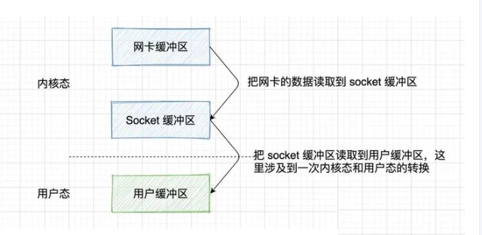

核心就是两次读取操作，五大 IO 模型的不同之处也就在于这两个读取操作怎么交互。

发送就反过来

#### 3、理解同步/异步、阻塞/非阻塞

同步/异步：这个是应用层面的概念，指的是调用一个函数，我们是等这个函数执行完再继续执行下一步，还是调完函数就继续执行下一步，另起一个线程去执行所调用的函数。关注的是线程间的协作。

 阻塞/非阻塞，这个是硬件层面的概念，阻塞是指 cpu “被”休息，处理其他进程去了，比如IO操作，而非阻塞则是 cpu 仍然会执行，不会切换到其他进程。关注的是CPU会不会“被”休息，表现在应用层面就是线程会不会“被”挂起。 

#### 

按阻塞/非阻塞分：

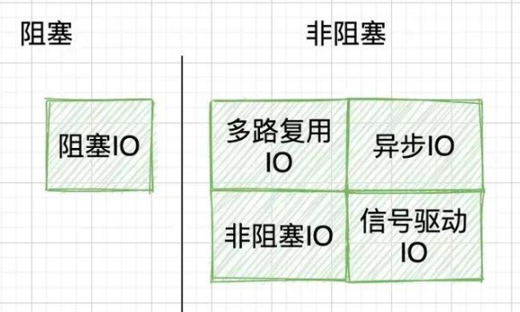

按同步/异步分：

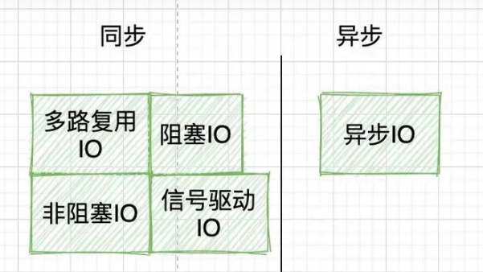

## 四、阻塞式IO

简单易用，但效率不高。在 linux 中，默认情况下所有的 socket 都是 blocking，一个典型的读操作流程

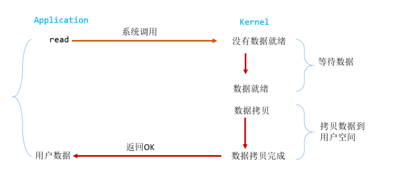

​	当用户进程调用了 read 这个系统调用，kernel 就开始了 IO 的第一个阶段：准备数据。对于 network io 来说，很多时候数据在一开始还没有到达（比如，还没有收到一个完整的数据包）这个时候 kernel 就要等待足够的数据到来。而在用户进程这边，整个进程会被阻塞。当 kernel 一直等到数据准备好了，它就会将数据从 kernel 中拷贝到用户内存，然后 kernel 返回结果，用户进程才解除 block 的状态，重新运行起来。

​	所以，blocking IO 的特点就是在 IO 执行的两个阶段（等待数据和拷贝数据两个阶段）都被block 了。

​	第一次接触到的网络编程都是从 listen()、send()、recv() 等接口开始的，这些接口都是阻塞型的。所谓阻塞型接口是指系统调用（一般是 IO 接口）不返回调用结果并让当前线程一直阻塞，只有当该系统调用获得结果或者超时出错时才返回。使用这些接口可以很方便的构建服务器/客户机的模型。下面是一个简单地“一问一答”的服务器。

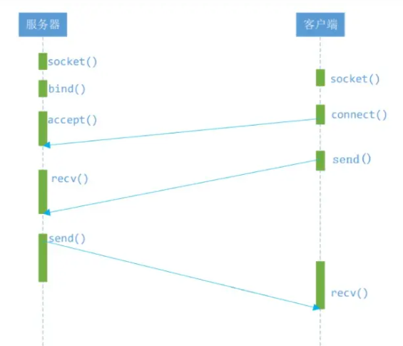

实际上，除非特别指定，几乎所有的 IO 接口 ( 包括 socket 接口 ) 都是阻塞型的。这给网络编程带来了一个很大的问题，如在调用 send()的同时，线程将被阻塞，在此期间，线程将无法执行任何运算或响应任何的网络请求。

假设对上述的服务器 / 客户机模型，提出更高的要求，即让服务器同时为多个客户机提供一问一答的服务。于是有了如下的模型。

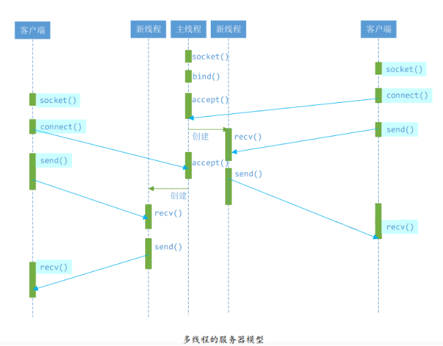

“线程池”和“连接池”技术也只是在一定程度上缓解了频繁调用 IO 接口带来的资源占用。当请求大大超过上限时，“池”构成的系统对外界的响应并不比没有池的时候效果好多少。面对大规模的服务请求，多线程模型也会遇到瓶颈，可以用非阻塞接口来尝试解决这个问题。

**阻塞 IO优缺点**：

**优点**：开发简单，容易入门。在阻塞等待期间，用户线程挂起，在挂起期间不会占用 CPU 资源

**缺点**：一个线程维护一个 IO ，不适合大并发，在并发量大的时候需要创建大量的线程来维护网络连接，内存、线程开销非常大

### `server.c`

```c
#include <stdio.h>
#include <stdlib.h>
#include <string.h>
#include <unistd.h>
#include <arpa/inet.h>
#include <sys/socket.h>

#define PORT 8888
#define BUFFER_SIZE 1024

int main()
{
    int server_fd, client_fd;
    struct sockaddr_in server_addr, client_addr;
    socklen_t client_addr_len;
    char buffer[BUFFER_SIZE];

    // 创建 TCP 套接字
    /*
    AF_INET和PF_INET是指使用IPv4网络协议进行通信。AF_UNIX和PF_UNIX则是指在同一台主机上的进程通过UNIX域套接字进行通信。在某些系统中，AF_LOCAL和PF_LOCAL是指同样的东西，即UNIX域套接字。*/
    if ((server_fd = socket(AF_INET, SOCK_STREAM, 0)) == -1)
    {
        perror("Error creating socket");
        exit(EXIT_FAILURE);
    }

    // 配置服务器地址
    memset(&server_addr, 0, sizeof(server_addr));
    server_addr.sin_family = AF_INET;
    server_addr.sin_addr.s_addr = htonl(INADDR_ANY);
    server_addr.sin_port = htons(PORT);

    // 绑定地址
    if (bind(server_fd, (struct sockaddr *)&server_addr, sizeof(server_addr)) == -1)
    {
        perror("Error binding");
        exit(EXIT_FAILURE);
    }

    // 监听连接
    if (listen(server_fd, 5) == -1)
    {
        perror("Error listening");
        exit(EXIT_FAILURE);
    }

    printf("Server listening on port %d...\n", PORT);

    // 接受连接
    client_addr_len = sizeof(client_addr);
    if ((client_fd = accept(server_fd, (struct sockaddr *)&client_addr, &client_addr_len)) == -1)
    {
        perror("Error accepting connection");
        exit(EXIT_FAILURE);
    }

    printf("Client connected: %s\n", inet_ntoa(client_addr.sin_addr));

    // 接收和发送数据
    ssize_t bytes_received, bytes_sent;
    while ((bytes_received = recv(client_fd, buffer, BUFFER_SIZE, 0)) > 0)
    {
        bytes_sent = send(client_fd, buffer, bytes_received, 0);
        if (bytes_sent == -1)
        {
            perror("Error sending data");
            exit(EXIT_FAILURE);
        }
    }

    if (bytes_received == -1)
    {
        perror("Error receiving data");
        exit(EXIT_FAILURE);
    }

    // 关闭连接
    close(client_fd);
    close(server_fd);

    return 0;
}

```


### `client.c`

```c
#include <stdio.h>
#include <stdlib.h>
#include <string.h>
#include <unistd.h>
#include <arpa/inet.h>
#include <sys/socket.h>

#define SERVER_IP "127.0.0.1"
#define PORT 8888
#define BUFFER_SIZE 1024

int main()
{
    int client_fd;
    struct sockaddr_in server_addr;
    char buffer[BUFFER_SIZE];

    // 创建 TCP 套接字
    if ((client_fd = socket(AF_INET, SOCK_STREAM, 0)) == -1)
    {
        perror("Error creating socket");
        exit(EXIT_FAILURE);
    }

    // 配置服务器地址
    memset(&server_addr, 0, sizeof(server_addr));
    server_addr.sin_family = AF_INET;
    server_addr.sin_addr.s_addr = inet_addr(SERVER_IP);
    server_addr.sin_port = htons(PORT);

    // 连接服务器
    if (connect(client_fd, (struct sockaddr *)&server_addr, sizeof(server_addr)) == -1)
    {
        perror("Error connecting to server");
        exit(EXIT_FAILURE);
    }

    printf("Connected to server at %s:%d\n", SERVER_IP, PORT);

    // 发送和接收数据
    ssize_t bytes_sent, bytes_received;
    const char *message = "Hello, server!";
    bytes_sent = send(client_fd, message, strlen(message), 0);
    if (bytes_sent == -1)
    {
        perror("Error sending data");
        exit(EXIT_FAILURE);
    }

    bytes_received = recv(client_fd, buffer, BUFFER_SIZE, 0);
    if (bytes_received == -1)
    {
        perror("Error receiving data");
        exit(EXIT_FAILURE);
    }

    printf("Received from server: %.*s\n", (int)bytes_received, buffer);

    // 关闭连接
    close(client_fd);

    return 0;
}

```


## 五、非阻塞式IO

​	可以让应用程序在等待数据准备完成的过程中执行其他操作，但需要应用程序不断轮询内核缓冲区。Linux 下，可以通过设置 socket 使其变为 non-blocking。当对一个 non-blocking socket 执行读操作时，流程是这个样子：

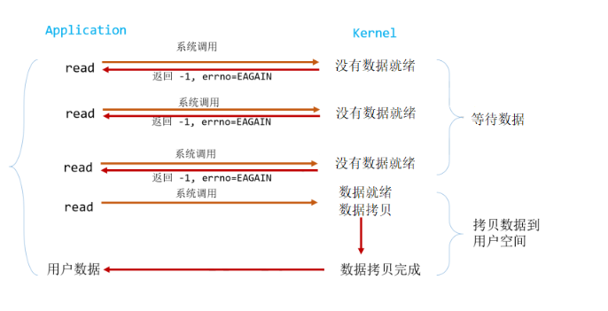

​	从图中可以看出，在非阻塞式 IO 中，用户进程其实是**需要不断的主动询问 kernel数据准备好了没有**。

在非阻塞状态下，recv() 接口在被调用后立即返回，返回值代表了不同的含义。如在本例中

- recv() 返回值大于 0，表示接受数据完毕，返回值即是接受到的字节数；
- recv() 返回 0，表示连接已经正常断开；
- recv() 返回 -1，且 errno 等于 EAGAIN，表示 recv 操作还没执行完成；
- recv() 返回 -1，且 errno 不等于 EAGAIN，表示 recv 操作遇到系统错误 errno。

非阻塞的接口相比于阻塞型接口的显著差异在于，在被调用之后立即返回。使用如下的函数可以将某句柄 fd 设为非阻塞状态。

```c
fcntl( fd, F_SETFL, O_NONBLOCK );
```


下面将给出只用一个线程，但能够同时从多个连接中检测数据是否送达，并且接收数据的模型。

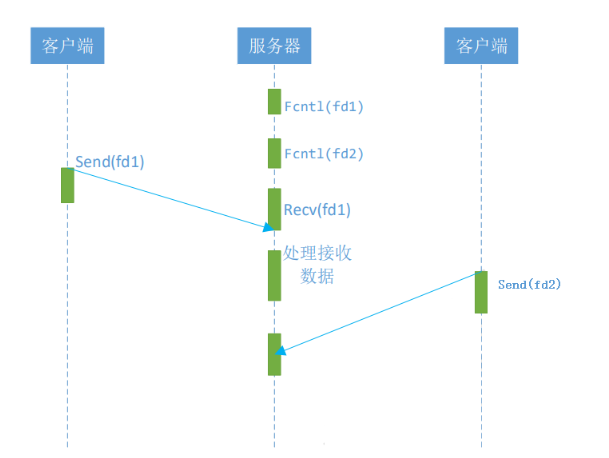

​	可以看到服务器线程可以通过循环调用 recv()接口，可以在单个线程内实现对所有连接的数据接收工作。但是上述模型绝不被推荐。因为，循环调用 recv()将大幅度推高 CPU占用率；此外，在这个方案中 recv()更多的是起到检测“操作是否完成”的作用，实际操作系统提供了更为高效的检测“操作是否完成“作用的接口，例如 **select()多路复用模式，可以一次检测多个连接是否活跃。**

**非阻塞 IO优缺点**：

**优点**：每次发起 IO 调用，在内核等待数据的过程中可以立即返回，用户线程不会阻塞，实时性好

**缺点**：多个线程不断轮询内核是否有数据，占用大量 CPU 资源，效率不高。一般 Web 服务器不会采用此模式

### `server_nonblocking.c`

```c
#include <stdio.h>
#include <stdlib.h>
#include <string.h>
#include <unistd.h>
#include <fcntl.h>
#include <arpa/inet.h>
#include <sys/socket.h>

#define PORT 8888
#define BUFFER_SIZE 1024

int main() {
    int server_fd, client_fd;
    struct sockaddr_in server_addr, client_addr;
    socklen_t client_addr_len;
    char buffer[BUFFER_SIZE];

    // 创建 TCP 套接字
    if ((server_fd = socket(AF_INET, SOCK_STREAM, 0)) == -1) {
        perror("Error creating socket");
        exit(EXIT_FAILURE);
    }

    // 配置服务器地址
    memset(&server_addr, 0, sizeof(server_addr));
    server_addr.sin_family = AF_INET;
    server_addr.sin_addr.s_addr = htonl(INADDR_ANY);
    server_addr.sin_port = htons(PORT);

    // 绑定地址
    if (bind(server_fd, (struct sockaddr *)&server_addr, sizeof(server_addr)) == -1) {
        perror("Error binding");
        exit(EXIT_FAILURE);
    }

    // 设置非阻塞模式
    int flags = fcntl(server_fd, F_GETFL, 0);
    if (flags == -1) {
        perror("Error getting socket flags");
        exit(EXIT_FAILURE);
    }
    if (fcntl(server_fd, F_SETFL, flags | O_NONBLOCK) == -1) {
        perror("Error setting non-blocking mode");
        exit(EXIT_FAILURE);
    }

    // 监听连接
    if (listen(server_fd, 5) == -1) {
        perror("Error listening");
        exit(EXIT_FAILURE);
    }

    printf("Server listening on port %d...\n", PORT);

    while (1) {
        // 接受连接
        client_addr_len = sizeof(client_addr);
        client_fd = accept(server_fd, (struct sockaddr *)&client_addr, &client_addr_len);
        if (client_fd == -1) {
            // 如果没有连接请求，继续循环
            continue;
        }

        printf("Client connected: %s\n", inet_ntoa(client_addr.sin_addr));

        // 设置客户端连接为非阻塞模式
        flags = fcntl(client_fd, F_GETFL, 0);
        if (flags == -1) {
            perror("Error getting client socket flags");
            close(client_fd);
            continue;
        }
        if (fcntl(client_fd, F_SETFL, flags | O_NONBLOCK) == -1) {
            perror("Error setting client socket non-blocking mode");
            close(client_fd);
            continue;
        }

        // 接收和发送数据
        ssize_t bytes_received, bytes_sent;
        while ((bytes_received = recv(client_fd, buffer, BUFFER_SIZE, 0)) > 0) {
            bytes_sent = send(client_fd, buffer, bytes_received, 0);
            if (bytes_sent == -1) {
                perror("Error sending data");
                break;
            }
        }

        if (bytes_received == -1) {
            // 如果没有数据可读，则继续循环
            if (errno == EAGAIN || errno == EWOULDBLOCK) {
                continue;
            } else {
                perror("Error receiving data");
            }
        }

        // 关闭连接
        close(client_fd);
    }

    // 关闭服务器套接字
    close(server_fd);

    return 0;
}

```

### client_nonblocking.c

```c
#include <stdio.h>
#include <stdlib.h>
#include <string.h>
#include <unistd.h>
#include<errno.h>
#include <fcntl.h>
#include <arpa/inet.h>
#include <sys/socket.h>

#define SERVER_IP "127.0.0.1"
#define PORT 8888
#define BUFFER_SIZE 1024

int main(int argc, char const *argv[])
{
    int client_fd;
    struct sockaddr_in server_addr;
    char buffer[BUFFER_SIZE];

    // 创建 TCP 套接字
    if ((client_fd = socket(AF_INET, SOCK_STREAM, 0)) == -1) {
        perror("Error creating socket");
        exit(EXIT_FAILURE);
    }

    // 配置服务器地址
    memset(&server_addr, 0, sizeof(server_addr));
    server_addr.sin_family = AF_INET;
    server_addr.sin_addr.s_addr = inet_addr(SERVER_IP);
    server_addr.sin_port = htons(PORT);

    // 设置非阻塞模式
    int flags = fcntl(client_fd, F_GETFL, 0);
    if (flags == -1) {
        perror("Error getting socket flags");
        exit(EXIT_FAILURE);
    }
    if (fcntl(client_fd, F_SETFL, flags | O_NONBLOCK) == -1) {
        perror("Error setting non-blocking mode");
        exit(EXIT_FAILURE);
    }

    // 连接服务器
    if (connect(client_fd, (struct sockaddr *)&server_addr, sizeof(server_addr)) == -1) {
        if (errno != EINPROGRESS) {
            perror("Error connecting to server");
            exit(EXIT_FAILURE);
        }
    }

    printf("Connected to server at %s:%d\n", SERVER_IP, PORT);

    // 发送和接收数据
    ssize_t bytes_sent, bytes_received;
    const char *message = "Hello, server!";
    bytes_sent = send(client_fd, message, strlen(message), 0);
    if (bytes_sent == -1) {
        perror("Error sending data");
        exit(EXIT_FAILURE);
    }

    bytes_received = recv(client_fd, buffer, BUFFER_SIZE, 0);
    if (bytes_received == -1) {
        if (errno == EAGAIN || errno == EWOULDBLOCK) {
            printf("No data available yet.\n");
        } else {
            perror("Error receiving data");
            exit(EXIT_FAILURE);
        }
    } else {
        printf("Received from server: %.*s\n", (int)bytes_received, buffer);
    }

    // 关闭连接
    close(client_fd);

    return 0;
}

```


## 六、IO多路复用(本质上也是阻塞)


https://blog.csdn.net/weixin_43412762/article/details/136436746

​	也称为事件驱动 IO(event driven IO)。可以同时监控多个文件描述符，提高了应用程序对输入输出操作的管理能力。 select/epoll 这个 function会不断的轮询所负责的所有 socket，当某个 socket 有数据到达了，就通知用户进程。它的流程如图：

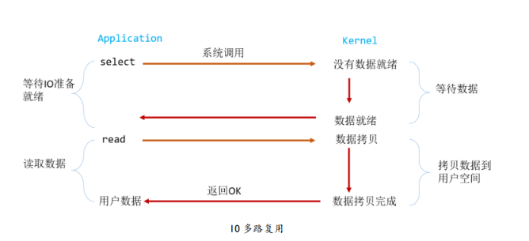

​	和 blocking IO 的图其实并没有太大的不同，事实上还更差一些。因为这里需要使用两个系统调用(select 和 read)，而 blocking IO 只调用了一个系统调用(read)。

​	如果处理的连接数不是很高的话，使用select/epoll 的 web server 不一定比使用 multi-threading + blocking IO 的 webserver 性能更好，可能延迟还更大。select/epoll 的优势并不是对于单个连接能处理得更快，**而是在于能处理更多的连接。**

​	在多路复用模型中，对于每一个 socket，一般都设置成为 non-blocking，但是，如上图所示，整个用户的 process 其实是一直被 block 的。只不过 process 是被 select 这个函数 block，而不是被 socket IO 给 block。因此 select()与非阻塞 IO 类似。

​	大部分 Unix/Linux 都支持 select 函数，该函数用于探测多个文件句柄的状态变化。

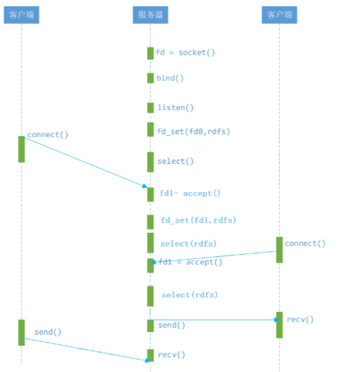

​	客户端的一个 connect() 操作，将在服务器端激发一个“可读事件”，所以 select() 也能探测来自客户端的 connect() 行为。

​	上述模型中，最关键的地方是如何动态维护 select()的三个参数 readfds、writefds和 exceptfds。作为输入参数，readfds 应该标记所有的需要探测的“可读事件”的句柄，其中永远包括那个探测 connect() 的那个“母”句柄；同时，writefds 和 exceptfds 应该标记所有需要探测的“可写事件”和“错误事件”的句柄 ( 使用 FD_SET() 标记 )。

​	作为输出参数，readfds、writefds 和 exceptfds 中的保存了 select() 捕捉到的所有事件的句柄值。程序员需要检查的所有的标记位 ( 使用 FD_ISSET()检查 )，以确定到底哪些句柄发生了事件。

​	上述模型主要模拟的是“一问一答”的服务流程，所以如果 select()发现某句柄捕捉到了“可读事件”，服务器程序应及时做recv()操作，并根据接收到的数据准备好待发送数据，并将对应的句柄值加入 writefds，准备下一次的“可写事件”的 select()探测。同样，如果 select()发现某句柄捕捉到“可写事件”，则程序应及时做 send()操作，并准备好下一次的“可读事件”探测准备。

​	这种模型的特征在于每一个执行周期都会探测一次或一组事件，一个特定的事件会触发某个特定的响应。我们可以将这种模型归类为“事件驱动模型”。相比其他模型，使用 select() 的事件驱动模型只用单线程（进程）执行，占用资源少，不消耗太多 CPU，同时能够为多客户端提供服务。如果试图建立一个简单的事件驱动的服务器程序，这个模型有一定的参考价值。

​	但这个模型依旧有着很多问题。首先 select()接口并不是实现“事件驱动”的最好选择。因为当需要探测的句柄值较大时，select()接口本身需要消耗大量时间去轮询各个句柄。很多操作系统提供了更为高效的接口，如linux提供了epoll，BSD提供了kqueue，Solaris提供了/dev/poll，…。如果需要实现更高效的服务器程序，类似 epoll 这样的接口更被推荐。遗憾的是不同的操作系统特供的 epoll 接口有很大差异，所以使用类似于 epoll 的接口实现具有较好跨平台能力的服务器会比较困难。

​	其次，该模型将事件探测和事件响应夹杂在一起，一旦事件响应的执行体庞大，则对整个模型是灾难性的。如下例，庞大的执行体 1 的将直接导致响应事件 2 的执行体迟迟得不到执行，并在很大程度上降低了事件探测的及时性。

​	幸运的是，有很多高效的事件驱动库可以屏蔽上述的困难，常见的事件驱动库有libevent 库，还有作为 libevent 替代者的 libev 库。这些库会根据操作系统的特点选择最合适的事件探测接口，并且加入了信号(signal) 等技术以支持异步响应，这使得这些库成为构建事件驱动模型的不二选择。下章将介绍如何使用 libev 库替换 select 或 epoll接口，实现高效稳定的服务器模型。

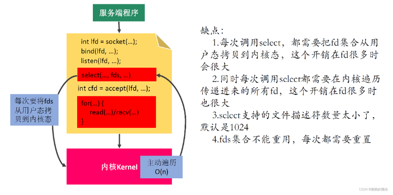

#### 1 select

**接口API**:

```c
select (I/O 多工机制/用来等待文件描述词状态的改变 )
头文件:
    #include <sys/time.h>
    #include <sys/types.h>
    #include <unistd.h>
定义函数:
    int select(int n, fd_set * readfds, fd_set * writefds,
    fd_set * exceptfds, struct timeval * timeout);
参数说明：
    n --> 当前最大的描述符+1
    readfds --> 读取描述符组
    writefds --> 写入描述符组
    exceptfds --> 其他描述符组
    timeout --> 超时时间
返回值：
    如果参数 timeout 设为 NULL 则表示 select ()没有 timeout.
    超时 返回 0
    发生错误 返回 -1

注意：
struct timeval
{
    time_t tv_sec;
    time_t tv_usec;
};

FD_CLR(inr fd, fd_set* set); 用来清除描述词组 set 中相关 fd 的位
FD_ISSET(int fd, fd_set *set); 用来测试描述词组 set 中相关 fd 的位是否为真
FD_SET(int fd, fd_set*set); 用来设置描述词组 set 中相关 fd 的位
FD_ZERO(fd_set *set); 用来清除描述词组 set 的全部位
```

**多路复用关键代码：**

```c
// 配置超时时间
struct timeval time_val ;
time_val.tv_sec = 5 ;
time_val.tv_usec = 0 ;

// 设置多路复用集合
fd_set set ;
FD_ZERO(&set); // 清空 集合
FD_SET(connect_fd , &set); // 添加 套记字到集合中
FD_SET(STDIN_FILENO , &set); // 添加标准输入到集合中

// 找到描述符最大值
max_fd = connect_fd > STDIN_FILENO ? connect_fd : STDIN_FILENO ;
// 等待描述符状态变化并设置超时5秒
select(max_fd+1, &set , NULL ,NULL, &time_val);

// 等待客户端发话
bzero(msg , 1024);
if(FD_ISSET(STDIN_FILENO, &set)) //检查时候标准输入描述符有数据到达
{
    fgets(msg , 1024 , stdin); // 获取标准输入数据
    send(connect_fd , msg , strlen(msg), 0 ); // 发送数据
}

if(FD_ISSET(connect_fd, &set)) // 检查是否套接字描述符有数据到达
{
    recv(connect_fd , msg , 1024 , 0); // 从套接字获得数据并发送
    printf("msg :%s \n");
}

```

##### server_multiplexing.c

```c
#include <stdio.h>
#include <arpa/inet.h>
#include <unistd.h>
#include <stdlib.h>
#include <string.h>
#include <sys/select.h>

int main() {

    // 1. 创建socket
    int lfd = socket(PF_INET, SOCK_STREAM, 0);
    struct sockaddr_in saddr;
    saddr.sin_port = htons(9999);
    saddr.sin_family = AF_INET;
    saddr.sin_addr.s_addr = INADDR_ANY;

    // 2. 绑定
    bind(lfd, (struct sockaddr *)&saddr, sizeof(saddr));

    // 3. 监听
    listen(lfd, 8);

    // 创建一个fd_set的集合，存放的是需要检测的文件描述符
    fd_set rdset, tmp;
    FD_ZERO(&rdset);
    FD_SET(lfd, &rdset);
    int maxfd = lfd;

    while(1) {

        tmp = rdset;

        // 调用select系统函数，让内核帮检测哪些文件描述符有数据
        int ret = select(maxfd + 1, &tmp, NULL, NULL, NULL);
        if(ret == -1) {
            perror("select");
            exit(-1);
        } else if(ret == 0) {
            continue;
        } else if(ret > 0) {
            // 说明检测到了有文件描述符的对应的缓冲区的数据发生了改变
            
            if(FD_ISSET(lfd, &tmp)) {
                // 表示有新的客户端连接进来了
                struct sockaddr_in cliaddr;
                int len = sizeof(cliaddr);
                int cfd = accept(lfd, (struct sockaddr *)&cliaddr, &len);

                // 将新的文件描述符加入到集合中
                FD_SET(cfd, &rdset);

                // 更新最大的文件描述符
                maxfd = maxfd > cfd ? maxfd : cfd;
            }

            for(int i = lfd + 1; i <= maxfd; i++) {
                if(FD_ISSET(i, &tmp)) {
                    // 说明这个文件描述符对应的客户端发来了数据
                    char buf[1024] = {0};
                    int len = read(i, buf, sizeof(buf));
                    if(len == -1) {
                        perror("read");
                        exit(-1);
                    } else if(len == 0) {
                        printf("client closed...\n");
                        close(i);
                        FD_CLR(i, &rdset);
                    } else if(len > 0) {
                        printf("read buf = %s\n", buf);
                        write(i, buf, strlen(buf) + 1);
                    }
                }
            }

        }

    }
    close(lfd);
    return 0;
}

```


##### client_multiplexing.c

```c
#include <stdio.h>
#include <arpa/inet.h>
#include <stdlib.h>
#include <unistd.h>
#include <string.h>

int main() {

    // 创建socket
    int fd = socket(PF_INET, SOCK_STREAM, 0);
    if(fd == -1) {
        perror("socket");
        return -1;
    }

    struct sockaddr_in seraddr;
    inet_pton(AF_INET, "127.0.0.1", &seraddr.sin_addr.s_addr);
    seraddr.sin_family = AF_INET;
    seraddr.sin_port = htons(9999);

    // 连接服务器
    int ret = connect(fd, (struct sockaddr *)&seraddr, sizeof(seraddr));

    if(ret == -1){
        perror("connect");
        return -1;
    }

    int num = 0;
    while(1) {
        char sendBuf[1024] = {0};
        sprintf(sendBuf, "send data %d", num++); // 格式化
        write(fd, sendBuf, strlen(sendBuf) + 1);

        // 接收
        int len = read(fd, sendBuf, sizeof(sendBuf));
        if(len == -1) {
            perror("read");
            return -1;
        }else if(len > 0) {
            printf("read buf = %s\n", sendBuf);
        } else {
            printf("服务器已经断开连接...\n");
            break;
        }
        sleep(1);
        // usleep(1000);
    }

    close(fd);

    return 0;
}

```

- 不使用多进程或多线程，实现了多客户端的连接。 100---》1k进程

#### 2 poll

```c
#include <poll.h>

// 封装成结构体：只需修改revents；且没有数组大小（1024），的限制。
struct pollfd {
	int fd; 			/* 委托内核检测的文件描述符 */   
	short events; 		/* 委托内核检测文件描述符的什么事件 */   // 一般都是读事件，看有没有数据发过来
	short revents;		/* 文件描述符实际发生的事件 */
};

// 既检测读事件，又检测写事件
struct pollfd myfd;
myfd.fd = 5;
myfd.events = POLLIN | POLLOUT;

int poll(struct pollfd *fds, nfds_t nfds, int timeout);
	- 参数：
		- fds : 是一个struct pollfd 结构体数组，这是一个需要检测的文件描述符的集合
		- nfds : 这个是第一个参数数组中最后一个有效元素的下标 + 1
		- timeout : 阻塞时长
				0 : 不阻塞
				-1 : 阻塞，当检测到需要检测的文件描述符有变化，解除阻塞
				>0 : 阻塞的时长
	- 返回值：
		-1 : 失败
		>0（n） : 成功,n表示检测到集合中有n个文件描述符发生变化

```

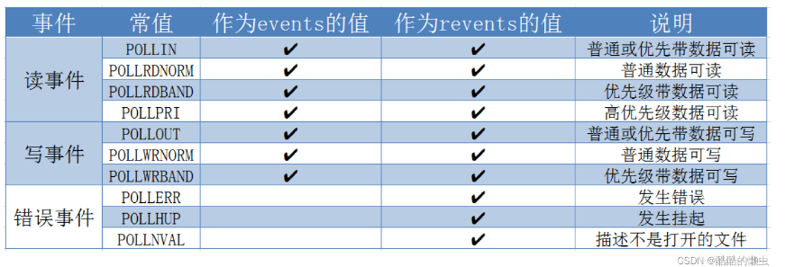

server.c

```c
#include <stdio.h>
#include <arpa/inet.h>
#include <unistd.h>
#include <stdlib.h>
#include <string.h>
#include <poll.h>


int main() {

    // 创建socket
    int lfd = socket(PF_INET, SOCK_STREAM, 0);
    struct sockaddr_in saddr;
    saddr.sin_port = htons(9999);
    saddr.sin_family = AF_INET;
    saddr.sin_addr.s_addr = INADDR_ANY;

    // 绑定
    bind(lfd, (struct sockaddr *)&saddr, sizeof(saddr));

    // 监听
    listen(lfd, 8);

    // 初始化检测的文件描述符数组
    struct pollfd fds[1024];  //max num can set
    for(int i = 0; i < 1024; i++) {
        fds[i].fd = -1;
        fds[i].events = POLLIN; // 检测读事件
    }
    fds[0].fd = lfd;
    int nfds = 0;

    while(1) {

        // 调用poll系统函数，让内核帮检测哪些文件描述符有数据
        int ret = poll(fds, nfds + 1, -1);
        if(ret == -1) {
            perror("poll");
            exit(-1);
        } else if(ret == 0) {
            continue;
        } else if(ret > 0) {
            // 说明检测到了有文件描述符的对应的缓冲区的数据发生了改变
            if(fds[0].revents & POLLIN) {   // 有可能 revents 是读或写
                // 表示有新的客户端连接进来了
                struct sockaddr_in cliaddr;
                int len = sizeof(cliaddr);
                int cfd = accept(lfd, (struct sockaddr *)&cliaddr, &len);

                // 将新的文件描述符加入到集合中
                for(int i = 1; i < 1024; i++) {
                    if(fds[i].fd == -1) {
                        fds[i].fd = cfd;
                        fds[i].events = POLLIN;
                        break;
                    }
                }

                // 更新最大的文件描述符的索引
                nfds = nfds > cfd ? nfds : cfd;
            }

            for(int i = 1; i <= nfds; i++) {
                if(fds[i].revents & POLLIN) {
                    // 说明这个文件描述符对应的客户端发来了数据
                    char buf[1024] = {0};
                    int len = read(fds[i].fd, buf, sizeof(buf));
                    if(len == -1) {
                        perror("read");
                        exit(-1);
                    } else if(len == 0) {
                        printf("client closed...\n");
                        close(fds[i].fd);
                        fds[i].fd = -1;
                    } else if(len > 0) {
                        printf("read buf = %s\n", buf);
                        write(fds[i].fd, buf, strlen(buf) + 1);
                    }
                }
            }

        }

    }
    close(lfd);
    return 0;
}

```


client.c

   和select一样


#### 3 epoll（用得多）

```
#include <sys/epoll.h>

// 创建一个新的epoll实例。在内核中创建了一个数据，这个数据中有两个比较重要的数据，一个是需要检
// 测的文件描述符的信息（红黑树），还有一个是就绪列表，存放检测到数据发送改变的文件描述符信息（双向链表）。
int epoll_create(int size);
	- 参数：
		size : 目前没有意义了。随便写一个数，必须大于0
	- 返回值：
		-1 : 失败
		> 0 : 文件描述符，操作epoll实例的

typedef union epoll_data {
	void 		*ptr;
	int 		fd;
	uint32_t 	u32;
	uint64_t 	u64;
} epoll_data_t;

struct epoll_event {
	uint32_t events; 		/* Epoll events */
	epoll_data_t data; 		/* User data variable */
};

常见的Epoll检测事件：
	- EPOLLIN
	- EPOLLOUT
	- EPOLLERR

// 对epoll实例进行管理：添加文件描述符信息，删除信息，修改信息
int epoll_ctl(int epfd, int op, int fd, struct epoll_event *event);
	- 参数：
		- epfd : epoll实例对应的文件描述符
		- op : 要进行什么操作
				EPOLL_CTL_ADD: 添加
				EPOLL_CTL_MOD: 修改
				EPOLL_CTL_DEL: 删除
		- fd : 要检测的文件描述符
		- event : 检测文件描述符什么事情

// 检测函数
int epoll_wait(int epfd, struct epoll_event *events, int maxevents, int timeout);
	- 参数：
		- epfd : epoll实例对应的文件描述符
		- events : 传出参数，保存了发送了变化的文件描述符的信息
		- maxevents : 第二个参数结构体数组的大小
		- timeout : 阻塞时间
			- 0 : 不阻塞
			- -1 : 阻塞，直到检测到fd数据发生变化，解除阻塞
			- > 0 : 阻塞的时长（毫秒）
	- 返回值：
		- 成功，返回发送变化的文件描述符的个数 > 0
		- 失败 -1

```

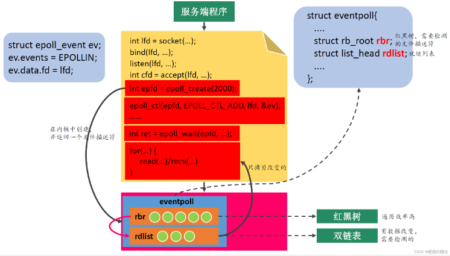

server.c

```c
#include <stdio.h>
#include <arpa/inet.h>
#include <unistd.h>
#include <stdlib.h>
#include <string.h>
#include <sys/epoll.h>

int main() {

    // 创建socket
    int lfd = socket(PF_INET, SOCK_STREAM, 0);
    struct sockaddr_in saddr;
    saddr.sin_port = htons(9999);
    saddr.sin_family = AF_INET;
    saddr.sin_addr.s_addr = INADDR_ANY;

    // 绑定
    bind(lfd, (struct sockaddr *)&saddr, sizeof(saddr));

    // 监听
    listen(lfd, 8);

    // 调用epoll_create()创建一个epoll实例
    int epfd = epoll_create(100);

    // 将监听的文件描述符相关的检测信息添加到epoll实例中
    struct epoll_event epev;
    epev.events = EPOLLIN;
    epev.data.fd = lfd;
    epoll_ctl(epfd, EPOLL_CTL_ADD, lfd, &epev);

    struct epoll_event epevs[1024];

    while(1) {

        int ret = epoll_wait(epfd, epevs, 1024, -1);
        if(ret == -1) {
            perror("epoll_wait");
            exit(-1);
        }

        printf("ret = %d\n", ret);

        for(int i = 0; i < ret; i++) {

            int curfd = epevs[i].data.fd;

            if(curfd == lfd) {
                // 监听的文件描述符有数据达到，有客户端连接
                struct sockaddr_in cliaddr;
                int len = sizeof(cliaddr);
                int cfd = accept(lfd, (struct sockaddr *)&cliaddr, &len);

                epev.events = EPOLLIN;  // 后面可能会变成 EPOLLOUT
                epev.data.fd = cfd;
                epoll_ctl(epfd, EPOLL_CTL_ADD, cfd, &epev);

            } else {// 有数据到达，需要通信

                if(epevs[i].events & EPOLLOUT) {
                    continue;
                }   
                
                char buf[1024] = {0};
                int len = read(curfd, buf, sizeof(buf));
                if(len == -1) {
                    perror("read");
                    exit(-1);
                } else if(len == 0) {
                    printf("client closed...\n");
                    epoll_ctl(epfd, EPOLL_CTL_DEL, curfd, NULL); // 在红黑树中删除
                    close(curfd);
                } else if(len > 0) {
                    printf("read buf = %s\n", buf);
                    write(curfd, buf, strlen(buf) + 1);
                }

            }

        }
    }

    close(lfd);
    close(epfd);
    return 0;
}

```


client.c 

​    不变

**多路复用 IO优缺点**：

**优点**：系统不必创建维护大量线程，只使用一个线程、一个选择器就可同时处理成千上万连接，大大减少了系统开销

**缺点**：本质上，select 和 epoll 的系统调用是阻塞式的，属于同步 IO，需要在读写时间就绪后，由系统调用进行阻塞的读写

实际上，Linux 内核从 2.6 开始，也引入了支持异步响应的 IO 操作，如 aio_read,aio_write，这就是异步 IO。

## 七、异步IO

​	可以让应用程序在数据准备好时接收到通知，避免了轮询。流程如下:

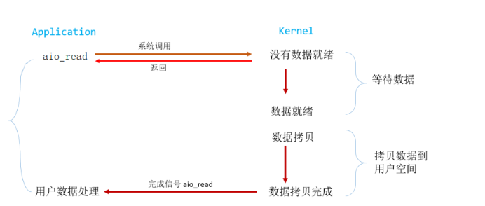

​	用户进程发起 read 操作之后，立刻就可以开始去做其它的事。而另一方面，从 kernel的角度，当它收到一个 asynchronous read 之后，首先它会立刻返回，所以不会对用户进程产生任何 block。然后，kernel 会等待数据准备完成，然后将数据拷贝到用户内存，当这一切都完成之后，kernel 会给用户进程发送一个 signal，告诉它 read 操作完成了。

**问题**:blocking 和 non-blocking 的区别在哪，synchronous IO 和 asynchronous IO 的区别在哪。

​	blocking 与 non-blocking。前面的介绍中其实已经很明确的说明了这两者的区别。调用 blocking IO 会一直 block 住对应的进程直到操作完成，而non-blocking IO 在 kernel 还在准备数据的情况下会立刻返回。

​	synchronous IO 和 asynchronous IO 的区别就在于 synchronous IO 做”IO operation”的时候会将 process 阻塞。之前所述的 blocking IO，non-blocking IO，IO multiplexing 都属于synchronous IO。定义中所指的”IO operation”是指真实的 IO 操作，就是例子中的 read 这个系统调用。non-blocking IO 在执行 read 这个系统调用的时候，如果 kernel 的数据没有准备好，这时候不会 block 进程。但是当 kernel 中数据准备好的时候，read 会将数据从 kernel 拷贝到用户内存中，这个时候进程是被 block 了，在这段时间内进程是被 block的。asynchronous IO 则不一样，当进程发起 IO 操作之后，就直接返回再也不理睬了，直到 kernel 发送一个信号，告诉进程说 IO 完成。在这整个过程中，进程完全没有被 block。异步 IO 才是真正的非阻塞（两个阶段全是非阻塞）。

​      直接测试文件io  aio.h

## 八、信号驱动 IO udp测试

​	可以让应用程序在发起异步读写操作后立即返回，并不等待操作完成。

​	首先我们允许套接口进行信号驱动 I/O,并安装一个信号处理函数，进程继续运行并不阻塞。

​	当数据准备好时，进程会收到一个 SIGIO 信号，可以在信号处理函数中调用 I/O 操作函数处理数据。当数据报准备好读取时，内核就为该进程产生一个 SIGIO 信号。我们随后既可以在信号处理函数中调用 read 读取数据报，并通知主循环数据已准备好待处理，也可以立即通知主循环，让它来读取数据报。无论如何处理 SIGIO 信号，这种模型的优势在于等待数据报到达(第一阶段)期间，进程可以继续执行，不被阻塞。免去了 select 的阻塞与轮询，当有活跃套接字时，由注册的 handler 处理。

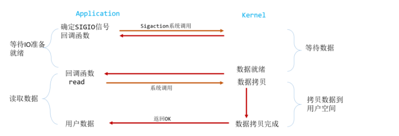

​	信号驱动通过监听文件描述符的状态（是否有 产生信号）， 当文件描述符有数据到达时就会产生一个IO信号（SIGIO），来通知用户进行IO操作。

**特点：** 信**号驱动一般用于UDP协议中，很少用于TCP协议中， 因为TCP协议中会有多次IO状态的改变，所 以会有非常多的SIGIO信号产生，非常难捕捉到哪一个时数据到达产生的。 由于数据变化时，产生SIGIO信号，所以必须体现设置好信号捕获，并设置其对应的响应函数。 必须给文件描述符设置信号触发模式**

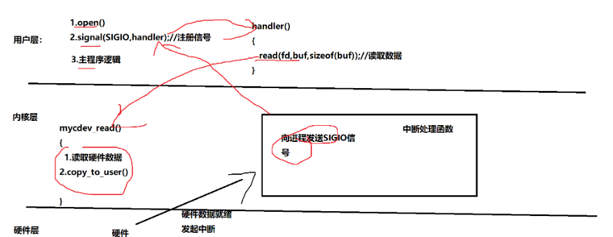

### `server_signal.c`

```c
#include <stdio.h>
#include <stdlib.h>
#include <string.h>
#include <unistd.h>
#include <arpa/inet.h>
#include <sys/socket.h>
#include <signal.h>

#define PORT 8888
#define BUFFER_SIZE 1024

int server_fd;

void sigio_handler(int signum) {
    struct sockaddr_in client_addr;
    socklen_t client_addr_len = sizeof(client_addr);
    char buffer[BUFFER_SIZE];

    // 接受客户端连接
    int client_fd = accept(server_fd, (struct sockaddr *)&client_addr, &client_addr_len);
    if (client_fd == -1) {
        perror("Error accepting connection");
        exit(EXIT_FAILURE);
    }
    printf("New connection, socket fd is %d, IP is : %s, port : %d\n", client_fd, inet_ntoa(client_addr.sin_addr), ntohs(client_addr.sin_port));

    // 接收数据
    ssize_t bytes_received = recv(client_fd, buffer, BUFFER_SIZE, 0);
    if (bytes_received == -1) {
        perror("Error receiving data");
        close(client_fd);
        return;
    }

    // 将接收到的数据发送回客户端
    ssize_t bytes_sent = send(client_fd, buffer, bytes_received, 0);
    if (bytes_sent == -1) {
        perror("Error sending data");
        close(client_fd);
        return;
    }

    // 关闭客户端连接
    close(client_fd);
}

int main() {
    struct sockaddr_in server_addr;
    struct sigaction sigio_action;

    // 创建 TCP 套接字
    if ((server_fd = socket(AF_INET, SOCK_STREAM, 0)) == -1) {
        perror("Error creating socket");
        exit(EXIT_FAILURE);
    }

    // 配置服务器地址
    memset(&server_addr, 0, sizeof(server_addr));
    server_addr.sin_family = AF_INET;
    server_addr.sin_addr.s_addr = htonl(INADDR_ANY);
    server_addr.sin_port = htons(PORT);

    // 绑定地址
    if (bind(server_fd, (struct sockaddr *)&server_addr, sizeof(server_addr)) == -1) {
        perror("Error binding");
        exit(EXIT_FAILURE);
    }

    // 监听连接
    if (listen(server_fd, 5) == -1) {
        perror("Error listening");
        exit(EXIT_FAILURE);
    }

    printf("Server listening on port %d...\n", PORT);

    // 设置 SIGIO 信号处理函数
    memset(&sigio_action, 0, sizeof(sigio_action));
    sigio_action.sa_handler = sigio_handler;
    if (sigaction(SIGIO, &sigio_action, NULL) == -1) {
        perror("Error setting signal handler");
        exit(EXIT_FAILURE);
    }

    // 设置套接字为异步信号驱动模式
    if (fcntl(server_fd, F_SETOWN, getpid()) == -1) {
        perror("Error setting F_SETOWN");
        exit(EXIT_FAILURE);
    }
    int flags = fcntl(server_fd, F_GETFL, 0);
    if (flags == -1) {
        perror("Error getting socket flags");
        exit(EXIT_FAILURE);
    }
    if (fcntl(server_fd, F_SETFL, flags | O_ASYNC) == -1) {
        perror("Error setting O_ASYNC");
        exit(EXIT_FAILURE);
    }

    // 设置套接字为非阻塞模式
    if (fcntl(server_fd, F_SETFL, flags | O_NONBLOCK) == -1) {
        perror("Error setting non-blocking mode");
        exit(EXIT_FAILURE);
    }

    // 进入无限循环，等待信号驱动的事件
    while (1) {
        sleep(1);
    }

    // 关闭服务器套接字
    close(server_fd);

    return 0;
}

```

### 	**`client_signal.c`**

```c
#include <stdio.h>
#include <sys/types.h>
#include <sys/stat.h>
#include <fcntl.h>
#include <unistd.h>
#include <stdlib.h>
#include <string.h>
#include <sys/wait.h>
#include <sys/ioctl.h>
#include <sys/select.h>
#include <sys/epoll.h>
#include <signal.h>
/* According to earlier standards */
#include <sys/time.h>
 
char buf[128] = {0};
int fd;
// 定义信号处理函数
void sigio_handler(int sig)
{
    // 读取硬件数据
    read(fd, buf, sizeof(buf));
    printf("buf:%s\n", buf);
}
int main(int argc, char const *argv[])
{
 
    // 打开文件
    fd = open("/dev/mycdev", O_RDWR);
    if (fd < 0)
    {
        printf("打开设备文件失败\n");
        exit(-1);
    }
    // 注册SIGIO的信号处理函数
    signal(SIGIO, sigio_handler);
    // 回调驱动中的fasync方法，完成驱动中发生信号之前的准备工作
    int flags = fcntl(fd, F_GETFL);     // 获取文件描述符的相关属性
    fcntl(fd, F_SETFL, flags | FASYNC); // 当文件描述符中有FASYNC这个标志时，驱动中fasync方法就会被调用
    // 设置文件描述符fd对应的驱动发生SIGIO信号只发送给当前进程
    fcntl(fd, F_SETOWN, getpid());
    while (1)
    {
        printf("aaaaa\n");
        sleep(1);
    }
    return 0;
}
```

​	经过上面的介绍，会发现 non-blocking IO 和 asynchronous IO 的区别还是很明显的。在non-blocking IO 中，虽然进程大部分时间都不会被 block，但是它仍然要求进程去主动的 check，并且当数据准备完成以后，也需要进程主动的再次调用 recvfrom 来将数据拷贝到用户内存。而 asynchronous IO 则完全不同。它就像是用户进程将整个 IO 操作交给了他人（kernel）完成，然后他人做完后发信号通知。在此期间，用户进程不需要去检查 IO 操作的状态，也不需要主动的去拷贝数据。

​	阻塞IO，非阻塞IO，多路复用IO，信号驱动IO这四种的主要区别在第一阶段，他们在第二阶段是一样的：数据从内核缓冲区复制到调用者缓冲区期间都被阻塞住。他们都是同步IO，只有同步 IO 模型才考虑阻塞和非阻塞。异步 IO 肯定是非阻塞。

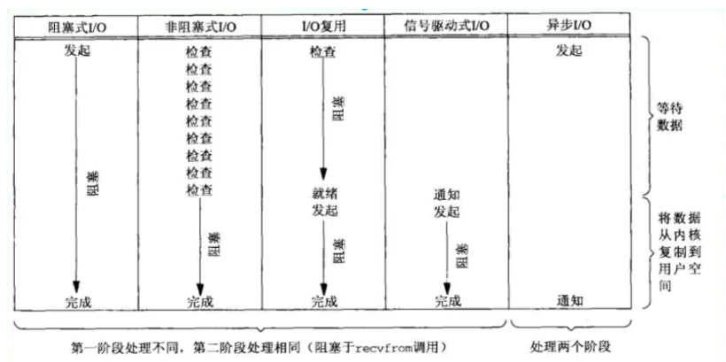

九、总结

每种模型都有其优点和缺点，以下是对五种网络 I/O 模型的简要比较：

1. **阻塞式 I/O**：
   - 优点：
     - 实现简单，易于理解和使用。
     - 适用于连接数较少且请求处理时间较短的场景。
   - 缺点：
     - 在大量并发连接的情况下，效率较低，会导致资源浪费和性能下降。
     - 当有连接等待数据时，会阻塞当前线程，不能处理其他连接，可能会导致性能瓶颈。
2. **非阻塞式 I/O**：
   - 优点：
     - 可以实现并发处理多个连接，提高系统的吞吐量。
     - 可以在等待数据时处理其他任务，减少资源浪费。
   - 缺点：
     - 需要轮询检查每个连接的状态，可能会导致 CPU 资源的浪费。
     - 编程复杂度较高，需要处理非阻塞状态下的错误和重试逻辑。
3. **I/O 多路复用**（如 `select` 或 `poll`）：
   - 优点：
     - 单线程即可处理多个连接，节省了线程切换开销。
     - 可以同时处理大量连接，提高系统的并发能力。
   - 缺点：
     - 对于大规模并发的情况，性能可能会受到限制，因为需要遍历所有连接以查找就绪事件。
     - 不能有效处理连接状态的变化，可能会导致连接的丢失或错过事件。
4. **异步 I/O**（如 `epoll` 或 `kqueue`）：
   - 优点：
     - 高效处理大量并发连接，具有较好的扩展性。
     - 可以实现真正的事件驱动，当有事件发生时，通知应用程序进行处理，无需轮询。
   - 缺点：
     - 编程复杂度较高，相对于其他模型需要更多的代码量和技术要求。
     - 在某些操作系统上可能不可用，如 Windows 系统不支持 `epoll`。
5. **信号驱动 I/O**：
   - 优点：
     - 可以使用信号驱动模式在有数据到达时触发事件处理，不需要轮询。
     - 编程接口相对简单，比异步 I/O 更易于理解和使用。
   - 缺点：
     - 不同操作系统的支持程度不一，可能会导致跨平台问题。
     - 不适用于大规模并发连接，信号处理函数在高负载下可能会被频繁调用。

综合考虑，对于大规模并发连接和高性能要求的系统，通常选择异步 I/O 模型（如 `epoll` 或 `kqueue`）。而对于中小规模的应用，I/O 多路复用模型可能更为合适。但对于简单的应用或者连接数较少的情况，阻塞式 I/O 或者非阻塞式 I/O 也可以考虑。选择最优的网络 I/O 模型应根据实际需求进行权衡和选择。

## 九、TCP改UDP

针对每种 I/O 模型的修改指南：

### 阻塞式 I/O（UDP）

- 将 `SOCK_STREAM` 改为 `SOCK_DGRAM`。
- 不需要调用 `connect()` 建立连接。
- 使用 `sendto()` 和 `recvfrom()` 函数发送和接收数据。
- 不需要处理连接建立和断开的错误。

### 非阻塞式 I/O（UDP）

- 将 `SOCK_STREAM` 改为 `SOCK_DGRAM`。
- 不需要调用 `connect()` 建立连接。
- 使用 `sendto()` 和 `recvfrom()` 函数发送和接收数据。
- 需要处理非阻塞模式下的错误和重试逻辑。

### I/O 多路复用（UDP）

- 将 `SOCK_STREAM` 改为 `SOCK_DGRAM`。
- 不需要调用 `connect()` 建立连接。
- 使用 `sendto()` 和 `recvfrom()` 函数发送和接收数据。
- 使用 `select()` 或 `poll()` 函数等待套接字就绪事件。

### 异步 I/O（UDP）

- 将 `SOCK_STREAM` 改为 `SOCK_DGRAM`。
- 不需要调用 `connect()` 建立连接。
- 使用 `sendto()` 和 `recvfrom()` 函数发送和接收数据。
- 使用 `epoll` 或 `kqueue` 等机制进行异步事件处理。

### 信号驱动 I/O（UDP）

- 将 `SOCK_STREAM` 改为 `SOCK_DGRAM`。
- 不需要调用 `connect()` 建立连接。
- 使用 `sendto()` 和 `recvfrom()` 函数发送和接收数据。
- 使用信号驱动模式触发数据到达时的处理。

在对代码进行修改时，注意理解 UDP 协议的特点，主要是面向无连接、不可靠和不保序的特性。


UDP(用户数据报协议)是一种面向无连接的网络协议，它提供了一种在 IP 网络上进行数据传输的方式。

UDP 适用于需要快速传输少量数据的场景，因为它不会建立连接，所以传输效率比较高。

UDP 通常用于实时应用程序，比**如视频会议、在线游戏、语音聊天等，因为这些应用程序通常要求实时性比较高，而且数据包丢失对应用程序的影响也不是很大。**

UDP 还可以用于一些控制信息的传输，比如路由协议、DNS 协议等。

总的来说，UDP 适用于对数据传输速度要求较高，对数据完整性要求较低的场景。


https://blog.csdn.net/Mr_chench2241/article/details/130618026

https://blog.csdn.net/slslslyxz/article/details/105427741


windows：iocp，**linux：epoll**


https://www.cnblogs.com/hshy/p/17933943.html

https://blog.csdn.net/weixin_38597669/article/details/124918885

https://baike.baidu.com/item/glib/1765577?fr=ge_ala

### 
