# 网络基础

## 一、课程介绍

- 网络概述
- 体系结构
- 网络相关的协议
- 编程储备知识
- 代码实现

## 二、计算机网络概述

### 1 什么是计算机网络

​	计算机网络是一种将地理上分散的，具有独立工作能力的多台计算机通过通信设备和通信线路**连接起来**，以及通过网络通信软件（微信，QQ，浏览器）来实现数据通信和资源共享。计算机网络是计算机技术和通信技术紧密结合的产物。

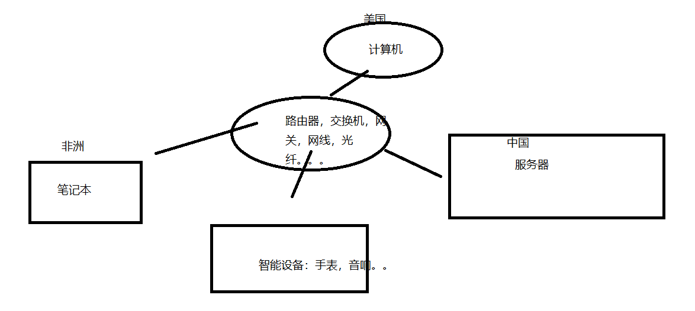

​        网络设备：  路由器，交换机，网关， 双绞线（网线），光纤，网络适配器（网卡）。。。

### 2 网络分类

​	按照地域划分： 局域网（LAN）,城域网（MAN），广域网(WAN)       万维网（互联网，internet网）--全世界都连上的一个网络

​    局域网（LAN）：局部的网络。  内**部相互通讯**，要像上外网，必须通过光猫等设备连出去。

​    城域网（MAN）：城市级别网络

   广域网(WAN)： 没有地域限制

  整体：

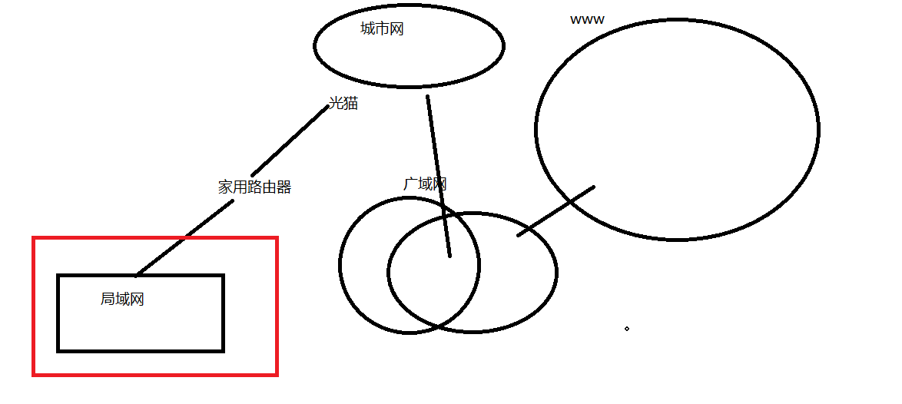


家庭：

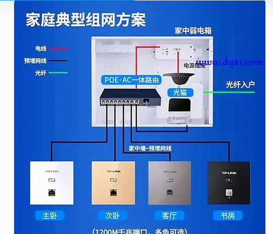


 公司：

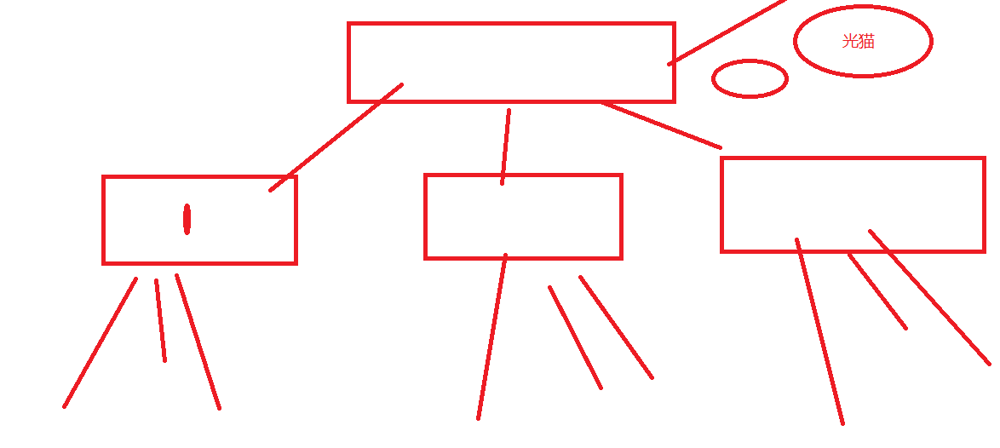


### 3 ip与域名

#### 3.1 ip

​       ip是用来定位计算机。类似与身份证。 公网ip：只要能上外部都通过这个ip找到你。    局域网Ip：局域网内部是唯一。


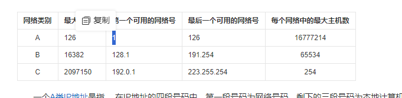


​       外网Ip一般都是A或者b类

​      c类地址给局域网用。


####   3.2 域名

​     要像访问一台计算机，必须知道Ip。 但是ip非常难记。没有规律。  用域名来访问就好。必须登记，dns（域名解析服务）。    以后想用那个域名，必须买域名（租用），绑定ip（外网ip也要花钱租用）。

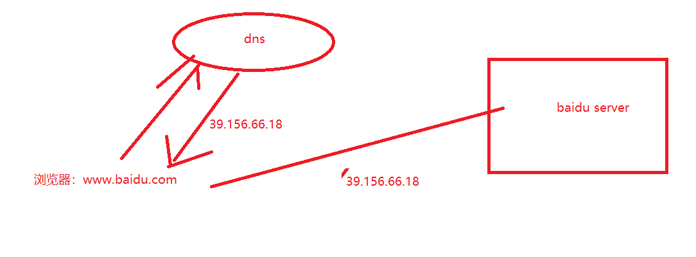


## 三 网络体系结构（分层）

#### 1 体系结构

- 网络体系结构指的是网络的层次结构和每一层所使用的协议的集合
- 实现网络传输的功能非常繁杂，所以采用了分而治之的设计方法，把网络的功能划分为不哦她那个的模 块，以分层的形式有机地组合在一起。 
- 每一层地实现功能和任务是不用的，其内部实现方法对外部其他层来说是透明的。每一层都为上一层提供 服务，同时使用下一层所提供的服务。

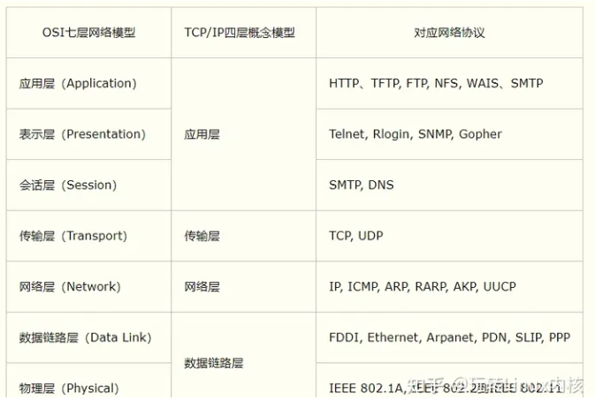


- ### 物理层

物理层（Physical）并不是物理媒体本身，它只是开放系统中利用物理媒体实现物理连接的功能描述和执行连接的规程。物理层提供用于建立、保持和断开物理连接的[机械](https://baike.baidu.com/item/机械/68186?fromModule=lemma_inlink)的、[电气](https://baike.baidu.com/item/电气/2120161?fromModule=lemma_inlink)的、功能的和过程的条件。简而言之，物理层提供有关同**步和比特流在物理媒体上的传输手段**，其典型的协议有EIA-232-D等。 [5]物理层主要负责比特流和电压、光线等传输方式之间建立互换模式，并且依据比特流进行实时性传输，其中比特流记为0或1。 [8]

- ### 数据链路层

数据链路层（DataLink）用于建立、维持和拆除链路连接，实现无差错传输的功能。在点到点或点到多点的链路上，保证信息的可靠传递。该层对连接相邻的通路进行差错控制、数据成帧、同步等控制。检测差错一般采用[循环冗余校验](https://baike.baidu.com/item/循环冗余校验/3219009?fromModule=lemma_inlink)(CRC)，纠正差错采用计时器恢复和[自动请求重发](https://baike.baidu.com/item/自动请求重发/16688232?fromModule=lemma_inlink)(ARQ)等技术。其典型的协议有OSI标准协议集中的[高级数据链路控制](https://baike.baidu.com/item/高级数据链路控制/5927878?fromModule=lemma_inlink)协议HDLC。 [5]

- ### 网络层

网络层（Network）规定了网络连接的建立、维持和拆除的协议。它的主要功能是利用数据链路层所提供的相邻节点间的无差错数据传输功能，通过路由选择和中继功能，实现两个系统之间的连接。在计算机网络系统中，网络层还具有多路复用的功能。 [5]

- ### 传输层

传输层（Transport）完成开放系统之间的数据传送控制。主要功能是开放系统之间的数据的收发确认。同时还用于弥补各种通信网络的质量差异，对经过下三层之后仍然存在的传输差错进行恢复，进一步提高可靠性。另外，还通过复用、分段和组合、连接和分离、分流和合流等技术措施，提高吞吐量和服务质量。 [5]

- ### 会话层

会话层（Session）依靠传输层以下的通信功能使数据传送功能在开放系统间有效地进行。其主要功能是按照在应用进程之间的约定，按照正确的顺序收发数据，进行各种形式的对话。控制方式可以归纳为以下两类：一是为了在会话应用中易于实现接受处理和发送处理的逐次交替变换，设置某一时刻只有一端发送数据。因此需要有交替改变发信端的传送控制。二是在类似文件传送等单方向传送大量数据的情况下，为了防备应用处理中出现意外，在传送数据的过程中需要给数据记上标记。当出现意外时，可以由记标记处重发。例如可以将长文件分页发送，当收到上页的接受确认后，再发下页的内容。 [5]

会话层主要是管理不同主机上不同进程的通信内容，打造更加完整的协调机制，从而确保用户之间无论是建立对话还是释放会话连接，都能最大程度保证数据交换的及时性和规范性。 [8]

- ### 表示层

表示层（Presentation）的主要功能是把应用层提供的信息变换为能够共同理解的形式，提供字符代码、数据格式、控制信息格式、加密等的统一表示。表示层仅对应用层信息内容的形式进行变换，而不改变其内容本身。 [5]表示层更加关注的是数据的表现形式，依据语法和语义评估相关内容传递的科学性。 [8]

- ### 应用层

应用层（Application）是OSI参考模型的最高层。其功能是实现应用进程(如[用户程序](https://baike.baidu.com/item/用户程序/7450916?fromModule=lemma_inlink)、终端操作员等)之间的信息交换。同时，还具有一系列业务处理所需要的服务功能。 [5]

这一层常见的网络协议有：HTTP/FTP/TFTP/SMTP/SNMP/DNS/TELNET/HTTPS/POP3/DHCP。 [7]

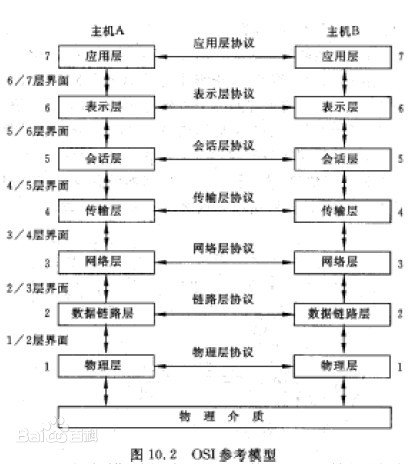

#### 2 网络协议

​	想要实现在两个或多个平台中稳定通信，就需要遵守（**达成）同一个协议。**---规范

​	主要的网络协议及其介绍如下：

- **TCP/IP协议**：这是互联网的核心协议，包括传输控制协议（TCP）和网络协议（IP）。TCP协议提供可靠的、面向连接的字节流传输服务，而IP协议负责为计算机之间的通信提供路由选择。

- **UDP协议**：用户数据报协议，是一种无连接的传输层协议。它主要用于不要求分组顺序到达的传输中，具有传输速度快、开销小的特点。然而，由于UDP协议不保证可靠交付，因此适用于一些对实时性要求较高但可以接受少量数据丢失的应用场景。

- **HTTP协议**：超文本传输协议，是互联网上应用最为广泛的一种网络协议。它用于从万维网服务器传输超文本到本地浏览器，是基于TCP/IP通讯协议之上的应用层协议。HTTP协议报文包括请求行、请求头部、空行、请求数据四个部分，而响应消息则由状态行、消息报头、空行、响应正文组成。

- **ssh协议**：安全外壳协议（Secure Shell，简称SSH）是一种在不安全网络上用于安全远程登录和其他安全网络服务的协议。

  SSH由IETF的网络小组（Network Working Group）所制定；SSH 为建立在应用层基础上的安全协议。SSH 是较可靠，专为[远程登录](https://baike.baidu.com/item/远程登录/1071998?fromModule=lemma_inlink)会话和其他[网络服务](https://baike.baidu.com/item/网络服务/9498645?fromModule=lemma_inlink)提供安全性的协议。利用 SSH 协议可以有效防止远程管理过程中的信息泄露问题。SSH最初是UNIX系统上的一个程序，后来又迅速扩展到其他操作平台。SSH在正确使用时可弥补网络中的漏洞。[SSH客户端](https://baike.baidu.com/item/SSH客户端/7091372?fromModule=lemma_inlink)适用于多种平台。几乎所有UNIX平台—包括HP-UX、Linux、AIX、[Solaris](https://baike.baidu.com/item/Solaris/3517?fromModule=lemma_inlink)、Digital UNIX、Irix，以及其他平台，都可运行SSH。

- **FTP/sftp协议**：文件传输协议，用于文件的传输。它提供交互式的访问，允许客户指明文件类型与格式，并允许文件具有存取权限。FTP协议只提供文件传送的一些基本的服务，它使用TCP可靠的运输方式，主要功能是减少或消除在不同操作系统下处理文件的不兼容性。

- **SMTP协议**：简单邮件传输协议，用于电子邮件的传输。它定义了邮件客户端和邮件服务器之间的通信方式，使得电子邮件可以在不同的系统之间传递。

- **POP3协议**：邮局协议，用于从邮件服务器上下载电子邮件。它定义了邮件客户端如何从邮件服务器接收邮件的过程。

- **DNS协议**：域名系统，用于将域名解析为IP地址。它使得用户可以通过友好的域名来访问网络资源，而不是直接使用难以记忆的IP地址。

- **SSL/TLS协议**：安全套接层/传输层安全协议，用于加密网络通信。它确保了在互联网上传输的数据的机密性和完整性。

  

此外，还有ARP（地址解析协议）、ICMP（因特网控制报文协议）等其他重要的网络协议，它们各自在网络中扮演着不同的角色，共同构成了现代计算机网络的基础。


## 五网络编程储备知识

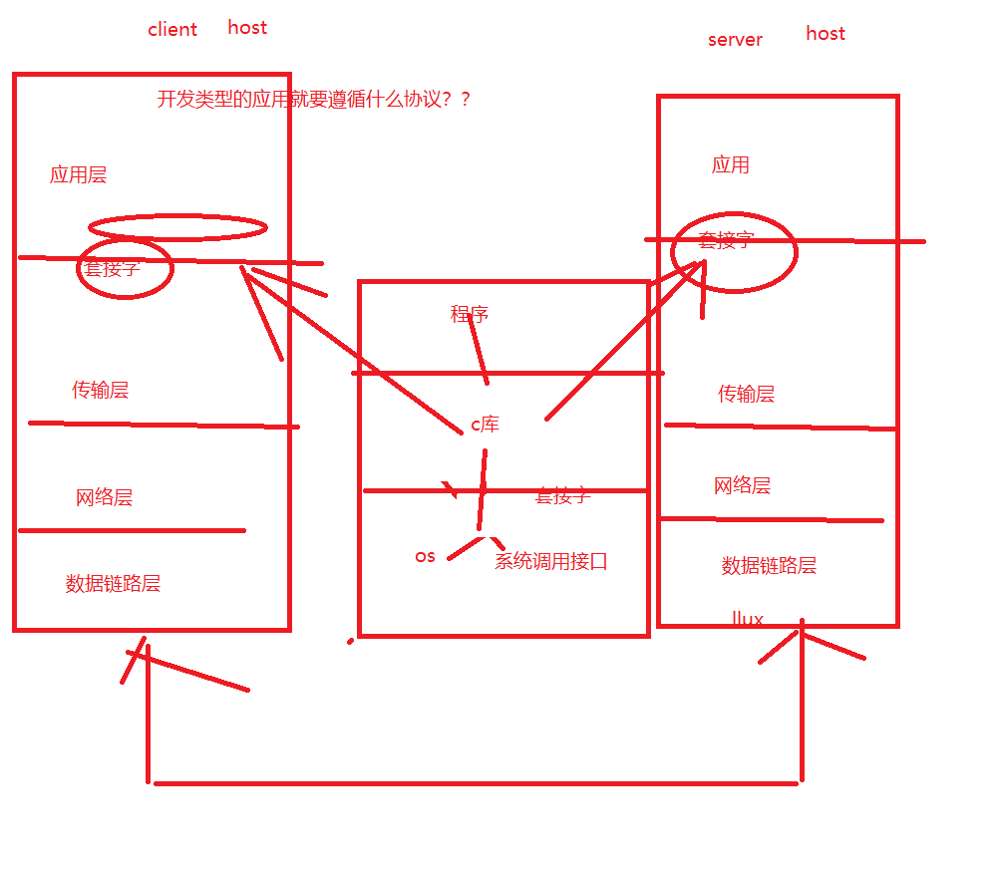

### 1、Socket --- 套接字

#### 1.1、为什么需要

- 普通IO操作的过程： 

打开文件 >> 读/写操作 >> 关闭文件 

- Socket文件的操作： 

  在同一个机器上的两个程序可以简单的通过某一个相同的文件进行数据的交流和传输，但是如 果在网络中两个进程完全不存在统一个机器那需要如何打开？

 网络协议具有多样性，如何进行统一的操作？

#### 1.2、是什么

- 独立于具体协议的网络编程接口 

- 在OSI模型中主要位于会话层和传输层之间 。。在tcp/ip四层模型在应用层和传输层之间

- Socket的类型 

  - 流式套接字 （SOCK_STREAM） TCP  

    提供一个面向**连接**、可靠的数据传输服务，数据无差错、无重复、地发送并按顺序抵达。内设流量控 制，避免数据流淹没前面的数据。数据被查看时字节流，无长度限制。 

  - 数据报套接字（SOCK_DGRAM） UDP 

    提供无连接服务，数据包以独立数据包形式被发送，不提供无差错保证，数据有可能丢失或重复到 达，顺序发送可能会乱序接收 

- 原始套接字（SOCK_RAW） 

  可以直接访问较低层次的协议例如 IP\ICMP。

- Socket的位置

  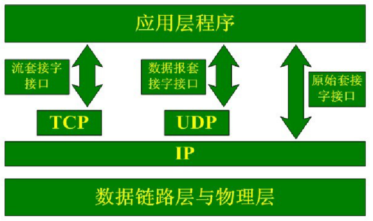

- IP地址

  - IP**地址是网络中主机(电脑)的标**识 
  - 在网络中主机想要与其他机器通信就必须拥有一个自己的IP地址 
  - IP地址为32位（IPV4）或者128位（IPV6） 
  - 每一个数据包都必须携带目的地址IP和源IP地址，路由器依靠此信息为数据包选择最优路由（路线）
  - 表示形式

  点分形式：如 192.168.100.2 在传输过程中都会被转换为一个32位无符号的整数

- 端口号 （用于区分计算机中某一个具体的程序）

  - 用于区分一台主机中接收到的数据包应该转交给哪一个进程进行处理。 

  - TCP端口号与UDP端口号是相互独立的 

  - 端口号一般由IANA(Internet Assigned Numbers Authority) 统一管理 众所周知端口： 1 - 1023 （1-25之间为

  - 众所周知端口 ， 256 - 1023 为UNIX系统占用） 

    何为总所周知端口其实就是早已固定号的端口比如80端口分配给WWW服务，21端口分配给FTP服务等 

  - 注册端口： 1024 -49151 分配给进程或者应用。这些端口号在还没有被服务器资源占用时，可以由用户的APP 动态注册获得。 

  - 动态端口号：49152 - 65535 被称为动态端口号他一般不固定分配某种服务而是动态分配的。一般可以使用 65000 以上的就可以随便用

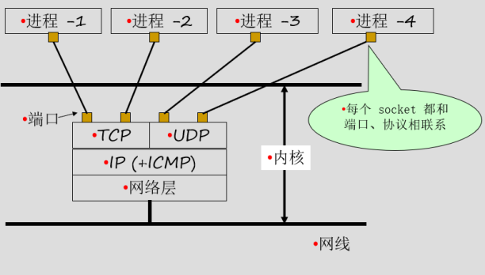

- 字节序

  不同的CPU 主机中，内存存储多个字节的序列分为两种，这个称为主机字节序

  - 小端序（Little-Endian） 

    低序（低有效位）存储在低地址（起始地址），Intel\AMD 等采用的方式 

  - 大端序(Big-Endian) 

    高序（高有效位）存储在低地址 ARM采用的存储方式

为了避免在不同的处理器中收到的数据出现字节序带来的问题，因此网络中传输的数据必须按照网 络字节序来处理，也就是大端序。发送者在发送数据前必须先转换为网络字节序，而接收者需要在收 到网络中的数据时再转换为自己合适的主机字节序。 

例如：0x12345678 在小端序中存放时： 

12 34 56 78

 高地址 --------- 低地址 

在大端序中存放则相反 

78 56 34 12 

高地址 --------- 低地址

- 字节序转换API

  - 端口号的转换：

    ```c
    //头文件：
    #include <arpa/inet.h>
    //函数原型：
    uint32_t htonl(uint32_t hostlong); // 主机字节序到网络字节序 无符号长整型
    uint16_t htons(uint16_t hostshort);// 主机字节序到网络字节序 无符号短整型
    uint32_t ntohl(uint32_t netlong); // 网络字节序转为主机字节序 无符号长整型
    uint16_t ntohs(uint16_t netshort); // 网络字节序转为主机字节序 无符号短整型
    ```

    

  - IP地址转换：

```c
//头文件：
#include <sys/socket.h>
#include <netinet/in.h>
#include <arpa/inet.h>
//函数原型：
// 把cp指向的字符串转换为32位的网络字节序的二进制值存于inp中
// cp 点分十进制的网络地址的字符串 （IP地址）
int inet_aton(const char *cp, struct in_addr *inp);
// 把cp指向的字符串转换为32位的网络字节序的二进制值并返回
in_addr_t inet_addr(const char *cp);
in_addr_t inet_network(const char *cp);
// 把in中的32位网络字节序的二进制地址转换为点分十进制的字符串
char *inet_ntoa(struct in_addr in);

```

### 2、tcp/ip-(三次握手以及四次挥手)

在网络通信中，特别是TCP/IP协议中，三次握手和四次挥手是两个非常重要的概念，它们分别用于建立连接和断开连接。下面分别解释这两个过程：

#### 2.1、三次握手-建立链接

**为什么需要**：

- 防止已失效的连接请求报文段突然又传送到了服务器，而产生错误。
- 三次握手能够确认双方的发送和接收能力都是正常的。

**目的**：建立TCP连接，确保双方都能正常通信。

**过程**：

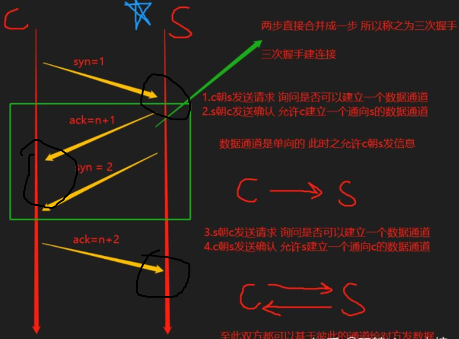

1. **SYN（请求连接）**：客户端向服务器发送一个SYN包，请求建立连接，并等待服务器的确认。SYN包中包含了客户端的初始序列号。
2. **SYN-ACK（确认连接请求并请求确认）**：服务器收到SYN包后，会发送一个SYN-ACK包给客户端，确认收到了客户端的连接请求，并请求客户端再次确认。SYN-ACK包中包含服务器的初始序列号和对客户端初始序列号的确认。
3. **ACK（确认连接）**：客户端收到SYN-ACK包后，会发送一个ACK包给服务器，确认收到了服务器的SYN-ACK包。至此，双方完成了连接的建立。

#### 2.2、四次挥手-断开链接

**为什么需要**：

- TCP连接是全双工的，断开连接时需要双方都要确认。
- 四次挥手可以确保在断开连接时，双方的数据都被完整地发送和接收，避免了数据的丢失。

- **目的**：断开TCP连接，确保双方释放资源。

  **过程**：

  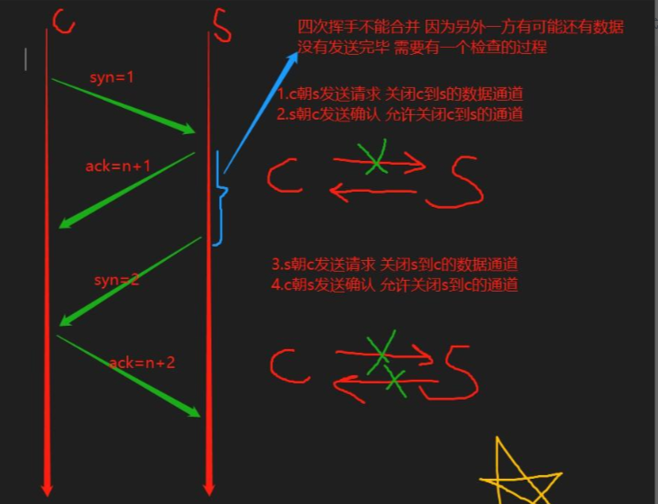
  
  1. **FIN（请求断开连接）**：当客户端或服务器想要断开连接时，会发送一个FIN包给对方，表示自己没有数据要发送了，请求对方关闭连接。
  2. **ACK（确认请求）**：收到FIN包的一方会发送一个ACK包，确认收到了对方的FIN包。此时，连接处于半关闭状态，即一方不再发送数据，但另一方还可以发送。
  3. **FIN（再次请求断开连接）**：当发送FIN包的一方所有数据都发送完毕后，会再次发送一个FIN包，表示自己也完成了数据的发送，请求对方关闭连接。
  4. **ACK（确认断开连接）**：收到第二个FIN包的一方会发送一个ACK包，确认收到了对方的FIN包，并关闭连接。至此，双方完成了连接的断开。

总结来说，三次握手用于建立TCP连接，确保双方都能正常通信；而四次挥手用于断开TCP连接，确保双方释放资源。这两个过程都是TCP协议中非常重要的部分，保证了网络通信的可靠性和稳定性。

### 3、UDP协议通信

- 概念

  UDP（User Datagram Protocol）指的是用户数据报协议，是一种不可靠无连接的协议，在 数据发送前，不需要提前建立连接，所以可以更高效地传输数据。（发邮件）

- 适用场景
  -  发送小尺寸地数据（例如对DNS服务器进行地址查询或路游器更新路由表） 
  - 在收到数据，给出应答比较困难地网络中适用UDP（比如无线网络） 
  - 适用于广播/组播式通信。 
  - QQ/微信等即时通信软件地点对点文件通讯以及音视频通话时。 
  - 流媒体、VoIP、IPTV等网络多媒体服务中（直播间）

- 套接字

```c

int socket(int domain, int type, int protocol);
参数：
domain：域。
    AF_INET/PF_INET： 网际协议
    AF_UNIX/PF_UNIX：本地协议，可写成 AF_LOCAL/PF_LOCAL
type：类型。
    SOCK_STREAM：流式套接字 TCP协议
    SOCK_DGRAM：数据报套接字 UDP协议
protocol：协议。
	一般为 0
返回值：
    成功：待连接套接字
    失败：-1
```

- 绑定地址

```c
int bind(int sockfd, const struct sockaddr *addr, socklen_t addrlen);
参数：
    sockfd：待连接套接字
    addr：包含本地地址（IP+PORT）的通用地址结构体的指针
    addrlen：地址结构体大小
返回值：
    成功：0
    失败：-1
```

- 地址结构体

  ```c
  struct sockaddr // 通用IP信息结构体
  {
      sa_family_t sa_family;
      char sa_data[14];
  }
  struct sockaddr_in // IPV4地址结构体
  {
      u_short sin_family;// 地址族
      u_short sin_port;// 端口
      struct in_addr sin_addr;// IPV4 地址
      char sin_zero[8];
  };
  struct in_addr // IP地址结构体
  {
      in_addr_t s_addr;// 无符号 32 位网络地址
  };
  ```

  

- 发送数据到UDP

  ```c
  ssize_t sendto(int sockfd, const void *buf, size_t len, int flags,const struct sockaddr *dest_addr, socklen_t addrlen);
  参数：
      sockfd：UDP 套接字
      buf：即将发送的数据
      len：数据的长度
      flags：发送标志，与函数 send 的 flags 完全一致
      dest_addr：对端网络地址
      addr_len：地址长度
  返回值：
      成功：已发送字节数
      失败：-1
  
  ```

- 从UDP中接收数据

  ```c
  ssize_t recvfrom(int sockfd, void *buf, size_t len, int flags,struct sockaddr *src_addr, socklen_t *addrlen);
  参数：
      sockfd：UDP 套接字
      buf：储存数据缓冲区
      len：缓冲区大小
      flags：接收标志，与函数 send 的 flags 完全一致
      src_addr：对端网络地址
      addrlen：地址长度
  返回值：
      成功：已接收字节数
  ```

  

### 4、TCP协议通信

- 创建套接字

  ```
  int socket(int domain, int type, int protocol);
  参数：
  domain：域。
      AF_INET/PF_INET： 网际协议
      AF_UNIX/PF_UNIX：本地协议，可写成 AF_LOCAL/PF_LOCAL
  type：类型。
      SOCK_STREAM：流式套接字 TCP协议
      SOCK_DGRAM：数据报套接字 UDP协议
  protocol：协议。
  	一般为 0
  返回值：
      成功：待连接套接字
      失败：-1
  ```

  

- 监听

将待连接套接字设置为监听套接字，并设置最大同时接收连接请求个数:

```c
int listen(int sockfd, int backlog);
参数：
    sockfd：待连接套接字
    backlog：最大同时接收连接请求个数
返回值：
    成功：0，并将 sockfd 设置为监听套接字
    失败：-1
```

- 等待连接

  ```c
  int accept(int sockfd, struct sockaddr *addr, socklen_t *addrlen);
  参数：
      sockfd：监听套接字
      addr：通用地址结构体，用以存储对端地址（IP+PORT）
      addrlen：参数 addr 的存储区域大小
  返回值：
      成功：已连接套接字（非负整数）
      失败：-1
  
  ```

  **注意**：

  ​	该函数是用来等待客户端连接的， 如果有新的客户端连接上来那么该函数会返回一个新的sockfd 作为该客户端的连接套接字。 

  ​	如果把accept 写在循环体内部， 该函数会造成阻塞， 同时如果有多个客户端连接那么该函数会返 回这些客户所对应的多个已连接套接字。

- 向 TCP 套接字发送数据

  ```c
  ssize_t send(int sockfd, const void *buf, size_t len, int flags);
  参数：
      sockfd：已连接套接字
      buf：即将被发送的数据
      len：数据长度
      flags：发送标志。
          MSG_NOSIGNAL：当对端已关闭时，不产生 SIGPIPE 信号
          MSG_OOB：发送紧急（带外）数据，只针对 TCP 连接
   返回值：
      成功：已发送字节数
      失败：-1
  
  ```

  **注意**： 当 flags 为 0 时，send 与 write 作用相同。

- 从 TCP 套接字接收数据

  ```c
  ssize_t recv(int sockfd, void *buf, size_t len, int flags);
  参数：
      sockfd：已连接套接字
      buf：存储数据缓冲区
      len：缓冲区大小
      flags：接收标志
      MSG_OOB：接收紧急（带外）数据
  返回值：
      成功：已接收字节数
      失败：-1
  
  ```

  **注意**：当 flags 为 0 时，recv 与 read 作用相同。

